# 4. Apresentações com o *Beamer*

## 4.1 Pacote *Beamer*

O *Beamer* é o pacote padrão do LaTeX para a produção de apresentações no estilo do *Microsoft PowerPoint*. Assim como os documentos do LaTeX, é possível reconhecer os documentos de apresentações produzidos pelo *Beamer* pela sua qualidade gráfica e pelos seus estilos pré-definidos (embora seja possível criar estilos a partir do zero, esta tarefa não será abordada aqui).

Um documento do *Beamer* é tão simples quanto um documento do LaTeX. O `beamer` é uma classe de documentos, essim como o `article`, `report`, `book` etc. Para criar um documento *Beamer*, basta utilizar esta classe. Veja no [Exemplo 1](#exe:beamer1) a seguir, um exemplo mínimo.

!!! example "<a id="exe:beamer1"></a>Exemplo 1: Um documento *Beamer* mínimo"

    === "Código"

        ```Latex linenums="1"
        \documentclass{beamer}
        \usepackage[utf8]{inputenc}
        \usepackage{lipsum}

        \title{Título}
        \author{Nome}
        \date{September 2019}

        \begin{document}

        \maketitle

        \section{Seção}

        \subsection{Subseção}

        \begin{frame}{Frame}
        \lipsum[1]
        \end{frame}

        \end{document}
        ```

    === "Resultado"

        <figure markdown>
        {width="600"}
        </figure>

Diferente de um documento LaTeX mínimo, como aquele mostrado no [Exemplo 1](./intro_latex.md#exe_doc), um documento do *Beamer* contém *frames*, que são inseridos com o ambiente padrão `frame`. Um *frame* é um como um *slide* do *Microsoft PowerPoint* e dentro dele é possível inserir quaisquer ambientes que normalmente são inseridos dentro de um documento LaTeX comum, e.g., listas, figuras, tabelas, texto, textos em colunas, ambientes especiais como o *minipages*, *listings* e outros.

Nas seções a seguir, são mostrados alguns detalhes de alguns dos elementos principais de um documento *Beamer*.

## 4.2 Estilos

Assim como qualquer outro editor de apresentações, no *Beamer* também é possível utilizar temas e aplicar diferentes estilos e cores nas fontes e elementos da estrutura do documento. O estilo de um documento *Beamer* pode ser definido através do tema, esquema de cores e estilo das fontes. Para isto, utiliza-se o comando `\usetheme{tema}` no preâmbulo de um documento *Beamer* de forma que seja definido um dos 28 temas padrão do *Beamer*. Os nomes dos temas e os seus respectivos esquema de cores, são mostrados no [Exemplo 2](#exe:beamer2_tema) a seguir.

| default | AnnArbor | Antibes |
|---------|----------|---------|
| 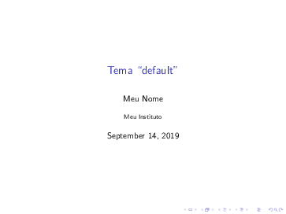 |  | 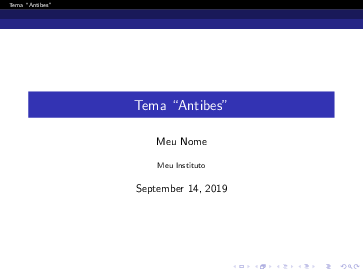 |
| **Bergen** | **Berkeley** | **Berlin** |
|  | 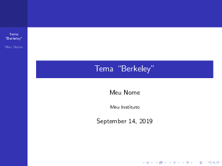 | 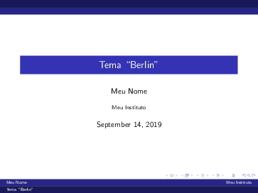 |
| **Boadilla** | **CambridgeUS** | **Copenhagen** | 
| 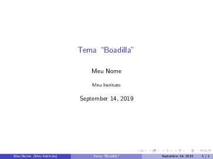 | 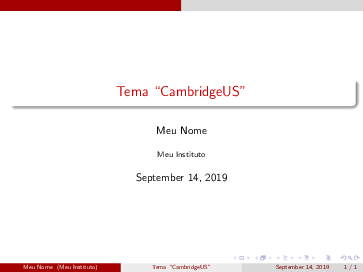 |  |
| **Darmstadt** | **Dresden** | **EastLansing** |
| 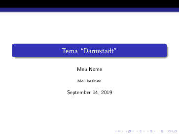 | 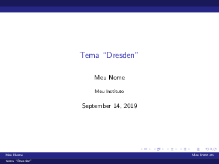 | 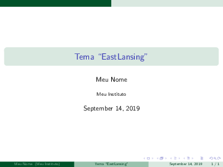 |
| **Frankfurt** | **Goettingen** | **Hannover** |
|  |  |  |
| **Ilmenau** | **JuanLesPins** | **Luebeck** |
|  |  | 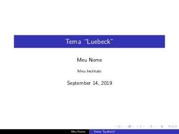 |
| **Madrid** | **Malmoe** | **Marburg** |
| 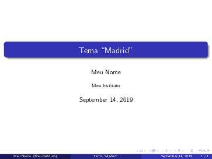 | 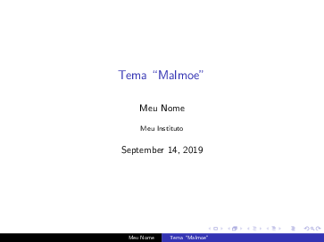 |  |
| **Montpellier** | **PaloAlto** | **Pittsburg** |
| 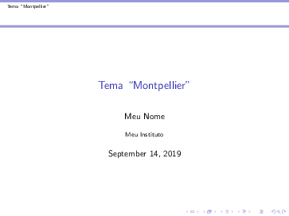 |  | 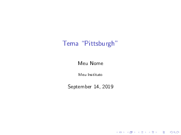 |
| **Rochester** | **Singapore** | **Szeged** | 
|  |  |  |
| **Warsaw** | | |
| 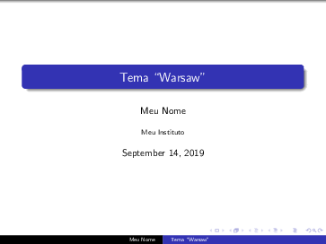 | | |

Para cada um dos temas apresentados no [Exemplo 2](#exe:beamer2_tema), é possível alterar o esquema de cores. Para isso, além de se utilizar o comando `usetheme`, deve-se utilizar o comando `\usecolortheme{esquema}`. Os esquemas de cores disponíveis para cada uma dos temas são os seguintes:

* `default`
* `albatross`
* `beaver`
* `beetle`
* `crane`
* `dolphin`
* `dove`
* `fly`
* `lily`
* `monarca`
* `orchid`
* `rose`
* `seagull`
* `seahorse`
* `spruce`
* `whale`
* `wolverine`

No [Exemplo 2](#exe:beamer2_tema) é mostrado o tema ``AnnArbor'' com o esquema de cores ``beaver''. Observe que este exemplo possui o mesmo código do [Exemplo 1](#exe:beamer1), com a diferença de que foram adicionados os comandos `usetheme` e `usecolortheme`.

!!! example "<a id="exe:beamer2_tema"></a>Exemplo 2: Um documento *Beamer* mínimo com o tema `AnnArbor` e o esquema de cores `beaver`"

    === "Código"

        ```Latex linenums="1"
        \documentclass{beamer}
        \usepackage[utf8]{inputenc}
        \usepackage{lipsum}

        \usetheme{AnnArbor}
        \usecolortheme{beaver}

        \title{Título}
        \author{Nome}
        \date{September 2019}

        \begin{document}

        \maketitle

        \begin{frame}{Frame}
        \lipsum[1]
        \end{frame}

        \end{document}
        ```

    === "Resultado"

        <figure markdown>
        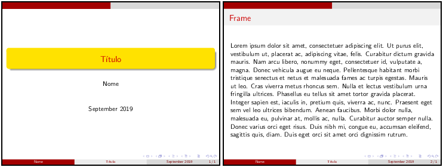{width="600"}
        </figure>

!!! tip "Dica"

    Veja mais opções de temas e as variações dos esquemas de cores do *Beamer* em [https://hartwork.org/beamer-theme-matrix/](https://hartwork.org/beamer-theme-matrix/).

Além da escolha do tema e do esquema de cores, é possível também alterar as cores e estilos de fontes de diferentes elementos visuais dos temas, de forma individual. O comando `\setbeamercolor{tema}{elemento(s)}` define o esquema de cores que será utilizado e quais elementos do tema escolhido deverão ser alterados. O comando `\setbeamerfont{tema}{elemento(s)}`, da mesma forma, permite alterar o estilo das fontes do tema escolhido. São muitos os elementos que podem ser alterados dentro de um *frame* do *Beamer* e, portanto, a apresentação deles foge ao escopo deste material.

!!! tip "Dica"

    Para conhecer mais sobre as possibilidades de customização dos diversos elementos de um *frame* do *Beamer*, recomenda-se a leitura da documentação do pacote em [http://linorg.usp.br/CTAN/macros/latex/contrib/beamer/doc/beameruserguide.pdf](http://linorg.usp.br/CTAN/macros/latex/contrib/beamer/doc/beameruserguide.pdf).

## 4.3 Ambientes especiais

Em um *frame* do *Beamer*, podem ser inseridas listas, tabelas, imagens, equações e outros ambientes que já foram mostrados na [Parte 2](../intro_latex/#2-entendendo-o-latex). Além destes ambientes, o *Beamer* suporta também ambientes especiais que podem ser utilizados para destacar as informações inseridas. Um destes ambientes especiais, é o ambiente `block`. Veja no [Exemplo 3](#exe:beamer_block) a seguir como inserí-lo em um *frame* do *Beamer*:

!!! example "<a id="exe:beamer_block"></a>Exemplo 3: Ambiente `block` em um *frame* do *Beamer*"

    === "Código"

        ```Latex linenums="1"
        \documentclass{beamer}
        \usepackage[utf8]{inputenc}

        \usetheme{Bergen}

        \title{Título}
        \author{Nome}
        \date{September 2019}
        
        \begin{document}
        
        \maketitle
        
        \begin{frame}{Meu Frame}
          \begin{block}{Meu block}
            À noite, vovô Kowalsky vê o ímã cair no pé do pinguim queixoso e vovó põe açúcar no chá de tâmaras do jabuti feliz. 
          \end{block}
        \end{frame}
        
        \end{document}
        ```

    === "Resultado"

        <figure markdown>
        {width="600"}
        </figure>

Além do ambiente `block`, há também os ambientes `exampleblock` e `alertblock`. Cada um deles pode ser utilizado em situações distintas, dando importância ou chamando a atenção para determinadas partes da apresentação. Veja no [Exemplo 4](#exe:beamer_blocks) a seguir, um exemplo do uso destes ambientes.

!!! example "<a id="exe:beamer_blocks"></a>Exemplo 4: Ambiente `block` em um *frame* do *Beamer*"

    === "Código"

        ```Latex linenums="1"
        \documentclass{beamer}
        \usepackage[utf8]{inputenc}
        
        \usetheme{Warsaw}
        
        \title{Título}
        \author{Nome}
        \date{September 2019}
        
        \begin{document}
        
        \maketitle
        
        \begin{frame}{Meu fFrame}
          \begin{block}{Bloco {\tt block}}
            À noite, vovô Kowalsky vê o ímã cair no pé do pinguim queixoso e vovó põe açúcar no chá de tâmaras do jabuti feliz. 
          \end{block}
          \begin{exampleblock}{Bloco {\tt exampleblock}}
            Quem traz CD, LP, fax, engov e whisky JB?
          \end{exampleblock}
          \begin{alertblock}{Bloco {\tt alertblock}}
            Jane quer LP, fax, CD, giz, TV e bom whisky.
          \end{alertblock}
        \end{frame}
        
        \end{document}
        ```

    === "Resultado"

        <figure markdown>
        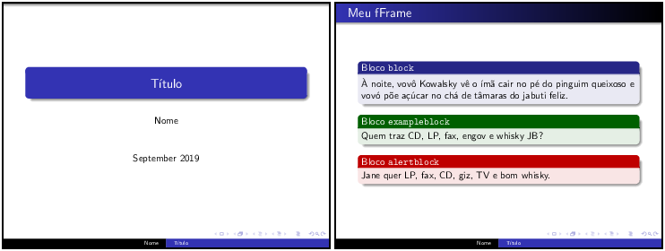{width="600"}
        </figure>

## 4.4 Informações da Capa

Como em toda apresentação, é comum o primeiro *frame* ou *slide* possuir informações como título (`\title{}`), subtítulo (`\subtitle{}`), autor (`\author{}`), afiliação (`\institute{}`), data (`\date{}`), local e, eventualmente, alguma figura com o logo do evento ou da instituição (`\titlegraphic{}`). O [Exemplo 5](#exe:beamer_capa1) mostra o uso destas macros para incluir as informações mais comuns na capa de uma apresentação confeccionada com o *Beamer*. 

!!! example "<a id="exe:beamer_capa1"></a>Exemplo 5: Informações da Capa em uma apresentação do *Beamer*"

    === "Código"

        ```Latex linenums="1"
        \documentclass{beamer}
        \usepackage[utf8]{inputenc}
        
        \usetheme{Luebeck}
        
        \title{Título}
        \subtitle{Subtítulo}
        \author{Nome}
        \institute{Meu Instituto}
        \date{September 2019}
        
        \titlegraphic{\includegraphics[scale=0.25]{docs/figs/logo.eps}}
        
        \begin{document}
        
        \maketitle
        
        \end{document}
        ```

    === "Resultado"

        <figure markdown>
        {width="300"}
        </figure>

Caso seja do interesse do usuário, este poderá manter a data sempre atualizada a partir da utilização da *macro* `\today`, que sempre irá incorpoerar a data do dia em que a apresentação foi compilada. Logo, ao invés de inserir `\date{September 2019}`, insira `\date{\today}`.

## 4.5 Sumário

Assim como em documentos LaTeX, as apresentações escritas com a classe *Beamer* também podem conter um sumário com as seções e subseções. No [Exemplo 1](#exe:beamer1), o código inclui uma seção e uma subseção e os *frames* da apresentação podem ser organizados utilizando estas partições. Para inserir um sumário em uma apresentação *Beamer*, basta inserir a *macro* `\tableofcontents`[^1] no primeiro *frame* da apresentação. O [Exemplo 6](#exe:beamer_sumario1) mostra como inserir um Sumário na apresentação *Beamer*.

[^1]: Quando o sumário é adicionado ao documento *Beamer*, pode ser necessário compilar o documento mais de uma vez.

!!! example "<a id="exe:beamer_sumario1"></a>Exemplo 6: Sumário em um documento *Beamer*"

    === "Código"

        ```Latex linenums="1"
        \documentclass{beamer}
        \usepackage[utf8]{inputenc}
        \usepackage{lipsum}
        
        \usetheme{Madrid}
        
        \title{Título}
        \author{Nome}
        \date{September 2019}
        
        \begin{document}
        
        \maketitle
        
        \begin{frame}[c]{Sumário}
        \tableofcontents
        \end{frame}
        
        \section{Uma Seção}
        
        \subsection{Uma Subseção}
        
        \begin{frame}{Frame 1}
          \lipsum[1]
        \end{frame}
        
        \end{document}
        ```

    === "Resultado"

        <figure markdown>
        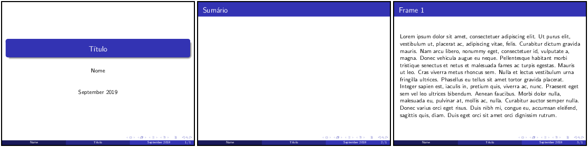{width="600"}
        </figure>

Dependendo da forma como a apresentação é organizada, e dependendo também do tema escolhido, pode ser conveniente alterar a aparência ou o comportamento do sumário. Isto significa que é possível omitir alguns elementos (e.g., subseções) do sumário ou mesmo fazer com que ele se repita toda vez que uma nova seção da apresentação é iniciada. Veja no [Exemplo 7](#exe:beamer_sumario2) como omitir as subseções do sumário, utilizando uma opção `hideallsubsections` da *macro* `\tableofcontents`.

!!! example "<a id="exe:beamer_sumario2"></a>Exemplo 7: Sumário em um documento *Beamer*, omitindo as subseções"

    === "Código"

        ```Latex linenums="1"
        \documentclass{beamer}
        \usepackage[utf8]{inputenc}
        \usepackage{lipsum}
        
        \usetheme{Singapore}
        
        \title{Título}
        \author{Nome}
        \date{September 2019}
        
        \begin{document}
        
        \maketitle
        
        \begin{frame}[c]{Sumário}
        \tableofcontents[hideallsubsections]
        \end{frame}
        
        \section{Uma Seção}
        
        \subsection{Uma Subseção}
        
        \begin{frame}{Frame 1}
          \lipsum[1]
        \end{frame}
        
        \end{document}
        ```

    === "Resultado"

        <figure markdown>
        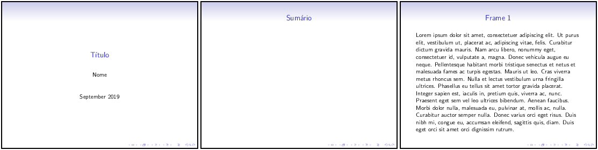{width="600"}
        </figure>

Para alterar o comportamento do sumário em um documento *Beamer*, de forma que ele apareça sempre que uma nova seção for iniciada, pode-se incluir um novo *frame* logo após o início da seção, incluindo a *macro* `\tableofcontents` com a opção `currentsection` e/ou a opção `currentsubsection`. Veja no [Exemplo 8](#exe:beamer_sumario3) a seguir:

!!! example "<a id="exe:beamer_sumario3"></a>Exemplo 8: Alterando o comportamento do sumário em um documento *Beamer*"

    === "Código"

        ```Latex linenums="1"
        \documentclass{beamer}
        \usepackage[utf8]{inputenc}
        \usepackage{lipsum}
        
        \usetheme{Szeged}
        
        \title{Título}
        \author{Nome}
        \date{September 2019}
        
        \begin{document}
        
        \begin{frame}[c]{Sumário}
          \tableofcontents
        \end{frame}
        
        \section{Uma Seção}
        
        \subsection{Uma Subseção}
        
        \begin{frame}{Sumário}
          \tableofcontents[currentsection]
        \end{frame}
        
        \begin{frame}{Frame 1}
          \lipsum[1]
        \end{frame}
        
        \section{Uma Outra Seção}
        
        \subsection{Uma Outra Subseção}
        
        \begin{frame}[c]{Sumário}
          \tableofcontents[currentsection]
        \end{frame}
        
        \begin{frame}{Frame 2}
          \lipsum[2]
        \end{frame}
        
        \end{document}
        ```

    === "Resultado"

        <figure markdown>
        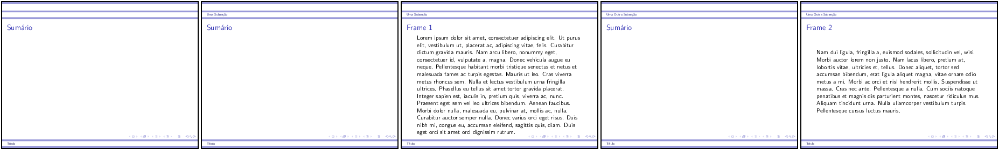{width="700"}
        </figure>

## 4.6 Barra de Navegação

Outro elemento que aparece na capa (e também dos demais *frames*), é a barra de navegação. Essa barra serve para facilitar a navegação entre os *slides* da apresentação, mas requer a utilização do *mouse*, o que pode não ser muito prático. Nos temas pré-definidos do *Beamer*, há uma barra de navegação persistente que é mostrada em detalhes na [Figura 1](#fig:navbar):

<a id="fig:navbar"></a>

<figure markdown>
{width="450"}
<figcaption>Figura 1: A barra de navegação do Beamer sempre aparece em uso com os temas padrão do Beamer. Entretanto, é possível desabilitá-la.</figcaption>
</figure>

Para desabilitar a barra de navegação, basta utilizar um dos comandos a seguir: `\beamertemplatenavigationsymbolsempty` ou `\setbeamertemplate{navigation symbols}{}`.

Veja no [Exemplo 9](#exe:navbar) a seguir o efeito do uso de um destes comandos:

!!! example "<a id="exe:navbar"></a>Exemplo 9: Desabilitando a barra de navegação do *Beamer*"

    === "Código"

        ```Latex linenums="1"
        \documentclass{beamer}
        \usepackage[utf8]{inputenc}
        
        \usepackage{lipsum}
        
        \usetheme{PaloAlto}
        
        \beamertemplatenavigationsymbolsempty
        
        \title{Título}
        \author{Nome}
        \date{September 2019}
        
        \begin{document}
        
        \maketitle
        
        \begin{frame}{Meu frame}
        
        \lipsum[1]
        
        \end{frame}
        
        \end{document}
        ```

    === "Resultado"

        <figure markdown>
        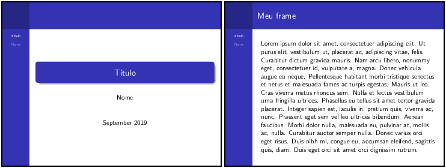{width="600"}
        </figure>

## 4.7 Transições e Animações

Efeitos de transição e animações também podem ser utilizadas em um documento *Beamer*. Entretanto, observe que, diferentemente do *Microsoft PowerPoint*, estes efeitos e animações são como as animações feitas em *flipboards*, i.e., animações quadro-a-quadro. Isso significa que vários *frames* (ou *slides*) são produzidos até que a animação ou o efeito final seja alcançado. Veja no [Exemplo 10](#exe:beamer3) como os itens de uma lista são apresentados de forma que apenas o item atual esteja realçado. Este efeito é muito comum e recebe o nome de pausa e ele é obtido a partir do comando `\pause`.

!!! example "<a id="exe:beamer3"></a>Exemplo 10: Adicionando pausas no *Beamer* com o comando `pause`"

    === "Código"

        ```Latex linenums="1"
        \documentclass{beamer}
        \usepackage[utf8]{inputenc}
        
        \usetheme{CambridgeUS}
        
        \title{Título}
        \author{Nome}
        \date{September 2019}
        
        \begin{document}
        
        \maketitle
        
        \begin{frame}{Meu Frame}
        Minha Lista:
        \begin{itemize}
            \pause
            \item Item 1
            \pause
            \item Item 2
            \pause
            \item Item 3
        \end{itemize}
        \end{frame}
        
        \end{document}
        ```

    === "Resultado"

        <figure markdown>
        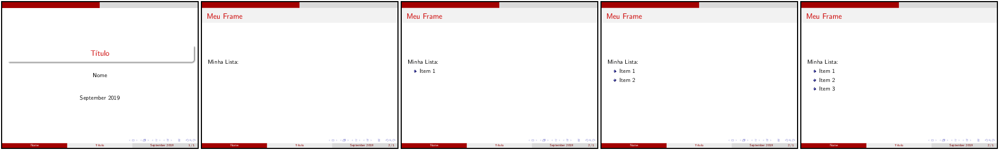{width="700"}
        </figure>

Observe no [Exemplo 10](#exe:beamer3) que os itens da lista são adicionados um após o outro de forma sequencial. Este comportamento pode ser alterado de forma que a ordem em que os itens aparecem possa ser controlada. Compare o [Exemplo 10](#exe:beamer3) com o [Exemplo 11](#exe:beamer4) a seguir:

!!! example "<a id="exe:beamer4"></a>Exemplo 11: Controlando itens em uma lista no *Beamer*"

    === "Código"

        ```Latex linenums="1"
        \documentclass{beamer}
        \usepackage[utf8]{inputenc}
        
        \usetheme{EastLansing}
        
        \title{Título}
        \author{Nome}
        \date{September 2019}
        
        \begin{document}
        
        \maketitle
        
        \begin{frame}{Meu Frame}
        Minha Lista:
        \pause
        \begin{itemize}
            \item<2-> Item 1
            \item<3-> Item 2
            \item<4-> Item 3
        \end{itemize}
        \end{frame}
        
        \end{document}
        ```

    === "Resultado"

        <figure markdown>
        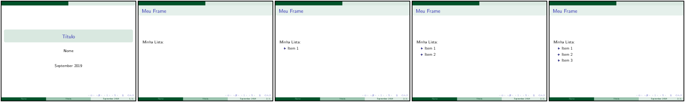{width="700"}
        </figure>

No [Exemplo 11](#exe:beamer4), não foi utilizado o comando `\pause` e, ao invés dele, foram adicionados parâmetros ao comando `\item` de forma que fosse especificado em qual *slide* aquela informação da lista deve aparecer. Dessa forma, o comando `\item<2-> Item 1` deve aparecer apenas no *slide* número 2, o item descrito pelo comando `\item<3-> Item 2` deve aparecer apenas no slide número 3 e assim por diante. Além disso, observe que há um sinal de `-` (menos) após o número do *slide*, indicando que aquele item irá aparecer a partir do número do *slide* indicado em diante. Na [Tabela 1](#tab:beamer1) estão listados alguns dos comandos de controle dos elementos de um *slide* do *Beamer*.

<a id="tab:beamer1"></a>

**Tabela 1:** Alguns comandos de controle dos elementos de um *slide* do *Beamer*.

| Comando | Descrição |
|---------|-----------|
| `\textbf<>{}` | Controla quando um texto deverá ocorrer em negrito |
| `\textit<>{}` | Controle quando um texto deverá ocorrer em itálico |
| `\color<>{}` | Controla quando um texto deverá ocorrer em uma cor diferente |
| `\alert<>{}` | Controla quando um texto deverá ocorrer destacadamente |

Outra *macro* do *Beamer* que permite controlar as ações dos efeitos de pausa e transição, é o `\onslide`. Este comando permite indicar em qual *slide* um determinado item deverá ocorrer. Veja no [Exemplo 12](#exe:beamer_onslide) o seu funcionamento. No exemplo, observe que a capa da apresentação foi suprimida com a exclusão da *maxcro* `maketitle`, Além disso, note quando os itens e elementos permanecem ou não nos *frames* produzidos.

!!! example "<a id="exe:beamer_onslide"></a>Exemplo 12: Controlando itens em uma lista no *Beamer* com o comando `onslide`"

    === "Código"

        ```Latex linenums="1"
        \documentclass{beamer}
        \usepackage[utf8]{inputenc}
        
        \usetheme{Marburg}
        
        \title{Título}
        \author{Nome}
        \date{September 2019}
        
        \begin{document}
        
        \begin{frame}{Meu Frame}
        Minha lista:
        \onslide<1->
        \begin{enumerate}
          \item\onslide<3> Item 1
          \item\onslide<2-> Item 2
          \item\onslide<4-> Item 3
        \end{enumerate}
        \onslide<2> Uma frase
        \end{frame}
        
        \end{document}
        ```

    === "Resultado"

        <figure markdown>
        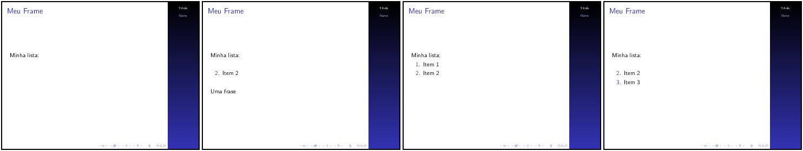{width="600"}
        </figure>

!!! note "Nota"

     No LaTeX há outros pacotes que também podem ser utilizados para a confecção de apresentações e pôsteres no estilo do *Microsoft PowerPoint*. Entre eles, destacam-se a classe [`powerdot`](https://www.ctan.org/pkg/powerdot) que fornece estilos muito semelhantes àqueles que podem ser encontrados no *Microsoft PowerPoint* e o pacote [`tcolorbox`](https://www.ctan.org/pkg/tcolorbox).
