# 2. Entendendo o LaTeX

## 2.17 Citações e Referências

Figuras, tabelas, equações, partes (i.e., capítulos, seções, subseções, etc), além da bibliografia, podem ser citados ao longo do texto. Para os elementos textuais, a forma de se fazer isto é através da utilização da dupla de comandos `\label{nome}` e `\ref{nome}`. Veja como citar estes elementos nos exemplos a seguir.

!!! example "<a id="exe_cite1"></a>Exemplo 1: Citação de uma parte do texto"

    === "Código"

        ```Latex linenums="1"
        \section{Uma Seção}
        \label{sec:minha_secao}

        Este é um exemplo de citação de uma parte do texto. Na Seção \ref{sec:minha_secao}, mostra-se como utilizar os comandos {\tt label} e {\tt ref} para a citação. O mesmo procedimento pode ser aplicado para a citação de partes, capítulos, subseções, anexos, apêndices etc.
        ```

    === "Resultado"

        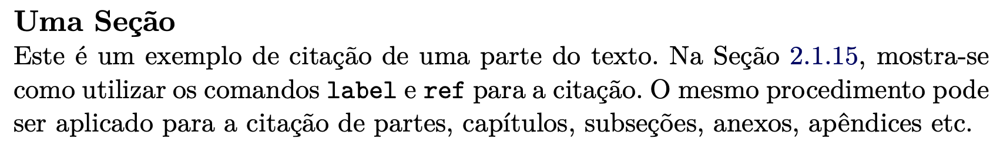

No [Exemplo 1](#exe_cite1), observe que foi utilizado `\section*` ao invés de `\section`. Isto foi feito apenas para que o nome da seção do exemplo não apareça no sumário do documento principal. De forma semelhante ao exposto no exemplo anterior, figuras também podem ser citadas utilizando-se os comandos `\label` e `\ref`. Veja o [Exemplo 2](#exe_cite2) a seguir.

!!! example "<a id="exe_cite2"></a>Exemplo 2: Citação de uma figura"

    === "Código"

        ```Latex linenums="1"
        Na Figura \ref{fig:prop_aurea} a seguir, é mostrada a Proporção Áurea:

        \begin{figure}[H]
            \centering
            \includegraphics[width=0.5\textwidth]{example-image-golden}
            \caption{A Proporção Áurea.}
            \label{fig:prop_aurea}
        \end{figure}
        ```

    === "Resultado"

        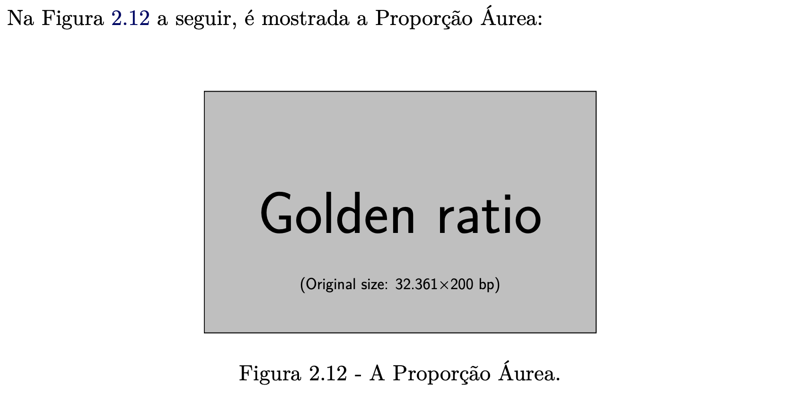

Tabelas também podem ser referenciadas da mesma forma como as figuras. Veja no [Exemplo 3](#exe_cite3) a seguir:

!!! example "<a id="exe_cite3"></a>Exemplo 3: Citação de uma tabela"

    === "Código"

        ```Latex linenums="1"
        Na Tabela \ref{tab:umatabela} a seguir, são mostradas linhas e colunas e algum conteúdo:

        \begin{table}[H]
        \centering
        \caption{Uma tabela com linhas e colunas.}
        \begin{tabularx}{\textwidth}{X X}
            \toprule
            Coluna 1           & Coluna 2           \\
            \midrule
            \lipsumsentence[1] & \lipsumsentence[3] \\
            \midrule
            \lipsumsentence[2] & \lipsumsentence[4] \\
            \bottomrule
        \end{tabularx}
        \label{tab:umatabela}
        \end{table}
        ```

    === "Resultado"

        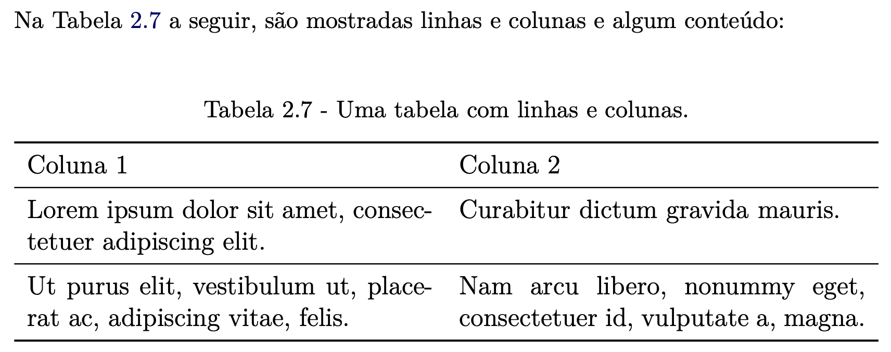

Da mesma forma, equações também podem ser citadas ao longo do texto. Veja o [Exemplo 4](#exe_cite4) a seguir:

!!! example "<a id="exe_cite4"></a>Exemplo 4: A Equação `\ref{eq:euler}` é denominada "Equação de Euler" e nela estão relacionados os números irracionais mais conhecidos: $e$ e $\pi$, além do número imaginário $i$"

    === "Código"

        ```Latex linenums="1"
        \begin{equation}
        \label{eq:euler}
        e^{i\pi} + 1 = 0
        \end{equation}
        ```

    === "Resultado"

        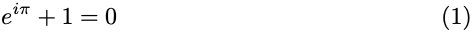

Páginas de um documento também podem ser referenciadas utilizando-se o comando `\pageref{nome}`. Neste caso, o *link* para a referência deverá ser um rótulo (um nome) adicionado à seção ou ambiente em que ocorre o elemento a ser citado (i.e., figura, tabela, equação ou a própria página), desde que ele possa ser numerado. Dessa forma, a página em que o elemento é citado será apresentada, ao invés da numeração do elemento. No [Exemplo 5](#exe_cite5) a seguir, foram adicionados dois rótulos (veja os comandos `\label` inseridos), um logo após o início do documento e o outro logo após a quebra de página (forçada pelo comando `\clearpage`):

!!! example "<a id="exe_cite5"></a>Exemplo 5: Citação de uma página"

    === "Código"

        ```Latex linenums="1"
        \documentclass[17pt]{extarticle}
        \usepackage[utf8]{inputenc}
        \usepackage{lipsum}
        \usepackage{extsizes}

        \begin{document}
        \label{pag1} % Esta é a primeira página

        \lipsum[1]

        A equação a seguir é denominada ``Equação de Euler'' e nela estão relacionados os números irracionais mais conhecidos: $e$ e $\pi$, além do número imaginário $i$:
        \[  
            e^{i\pi} + 1 = 0
        \]

        \clearpage % Aqui será criada uma nova página
        \label{pag2}

        \lipsum[2]

        A série de MacLaurin para $e^{x}$ é dada pela equação abaixo:
        \[  
            e^{x} = \sum_{k=0}^{\infty} \frac{x^{k}}{k!}
        \]
        Na página \pageref{pag1} foi apresentada uma equação que conjuga os números irreacionais $e$ e $\pi$ e o número imaginário $i$. A série de MacLaurin para $e^{x}$ está expressa na página \pageref{pag2}. 
        \end{document}
        ```

    === "Resultado"

        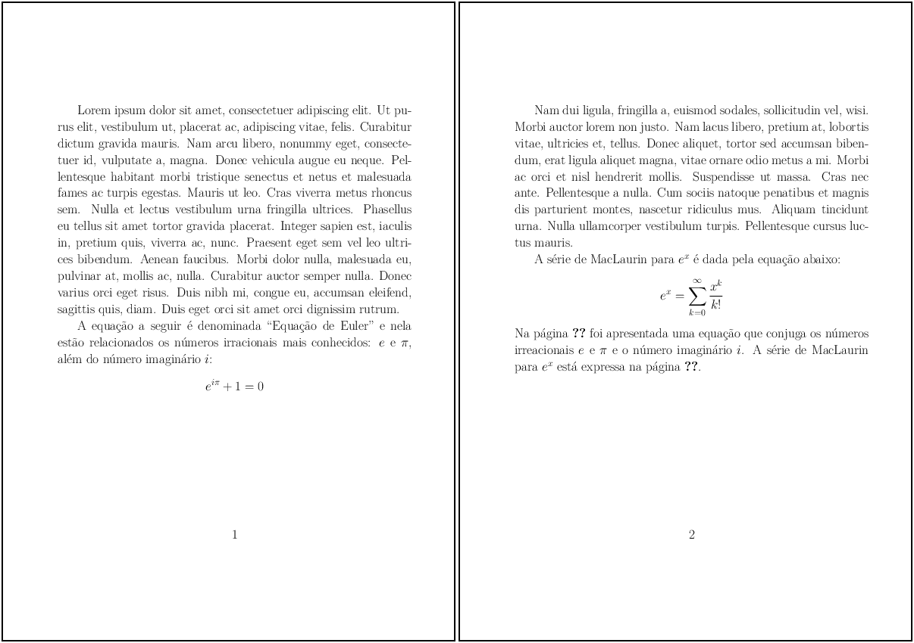

!!! note "Nota"

    Além da dupla de comandos `\label{nome}` e `\ref{nome}`, pode-se utilizar também o comando `\autoref{nome}` (fornecido pelo pacote `autoref`, veja mais sobre este pacote no CTAN em [https://ctan.org/pkg/hyperref](https://ctan.org/pkg/hyperref)) e pelo pacote `cleveref` (veja mais sobre este pacote no CTAN em [https://ctan.org/pkg/cleveref](https://ctan.org/pkg/cleveref)), que facilitam as citações dos elementos do texto e permitem maior controle sobre eles.

Além de citar e referenciar figuras, tabelas, expressões matemáticas e partes de um texto, no LaTeX podem ser citados também os elementos bibliográficos. Para isto, deve-se utilizar um pacote do LaTeX que seja capaz de gerenciar as referências bibliográficas.

O BibTeX é o formato padrão para a manipulação e a inclusão de referências bibliográficas do LaTeX. Outros pacotes como o BibLaTeX e o *Biber* estão disponíveis também para utilização em conjunto com o BibTeX.

O BibLaTeX é uma implementação mais moderna do *software* de gerenciamento de referências, sendo mais flexível do que o BibTeX por já estar no formato UNICODE, além de permitir a utilização de *macros* do próprio LaTeX para a criação de novas classes de referências.

A maioria das revistas científicas indexadas fornecem ferramentas para a exportação das referências de um determinado artigo. Por exemplo, as revistas da \textit{American Meteorological Society}, como a \textit{Monthly Weather Review} permitem que a citação de um artigo seja exportada para o formate BibTeX. Veja na [Figura 1](#fig:exemplo_revista_ams_citacao) a seguir:

<a id="fig:exemplo_revista_ams_citacao"></a>

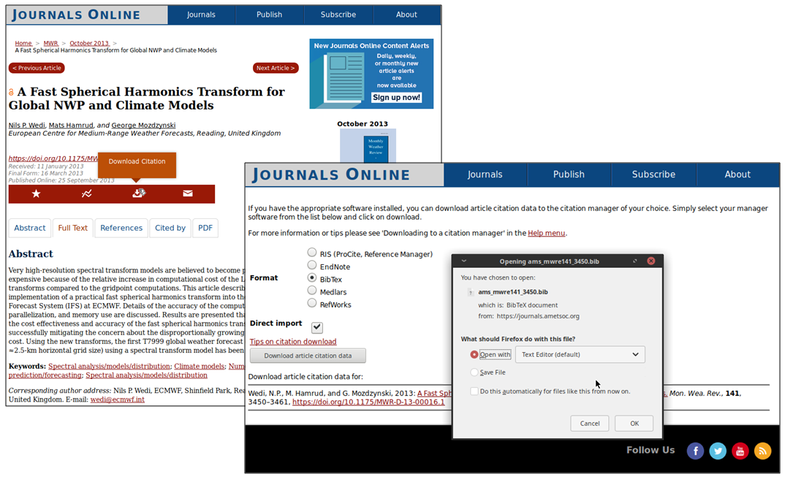

**Figura 1:** *Site* da revista *Monthly Weather Review*.

No exemplo da [Figura 1](#fig:exemplo_revista_ams_citacao), o conteúdo do arquivo com a referência é mostrado a seguir:

```Latex linenums="1"
@article{doi:10.1175/MWR-D-13-00016.1,
author   = {Wedi, Nils P. and Hamrud, Mats and Mozdzynski, George},
title    = {A Fast Spherical Harmonics Transform for Global NWP
            and Climate Models},
journal  = {Monthly Weather Review},
volume   = {141},
number   = {10},
pages    = {3450-3461},
year     = {2013},
doi      = {10.1175/MWR-D-13-00016.1},
URL      = {https://doi.org/10.1175/MWR-D-13-00016.1},
eprint   = {https://doi.org/10.1175/MWR-D-13-00016.1},
abstract = {Abstract Very high-resolution spectral transform models are believed to become prohibitively expensive because of the relative increase in computational cost of the Legendre transforms compared to the gridpoint computations. This article describes the implementation of a practical fast spherical harmonics transform into the Integrated Forecast System (IFS) at ECMWF. Details of the accuracy of the computations, of the parallelization, and memory use are discussed. Results are presented that demonstrate the cost effectiveness and accuracy of the fast spherical harmonics transform, successfully mitigating the concern about the disproportionally growing computational cost. Using the new transforms, the first T7999 global weather forecast (equivalent to \~2.5-km horizontal grid size) using a spectral transform model has been produced.}
}
```

As informações do arquivo de referência baixado, podem ser incorporadas em uma seção apropriada no documento que o usuário estiver editando. No caso do estilo do INPE, o conteúdo do arquivo pode ser copiado para dentro do arquivo `bib/referencias.bib}` (veja mais detalhes na [Seção 3.7](../estilo_inpe/#37-insercao-de-citacoes-e-referencias) da [Parte 3](../estilo_inpe/#3-estilo-do-inpe)).

Observe que o arquivo de referências possui diversas palavras-chave, como por exemplo, `author`, `title`, `journal`, `volume` e outros. Estas são as informações que o BibTeX utiliza para formatar a apresentação das referências no estilo desejado.

!!! note "Nota"

    Recomenda-se a alteração do nome da citação (a qual será usada no texto) para algo que seja mais fácil de lembrar. Isso facilitará a escrita do texto. Por exemplo, ao invés de utilizar `doi:10.1175/MWR-D-13-00016.1} (como na referência do exemplo acima), utilize algo como `wedietal/2013}, que faz referência literal ao artigo de \citeonline{doi:10.1175/MWR-D-13-00016.1}.

A utilização das referências no texto deve ser feita com os seguintes comandos: `\cite{referencia}` ou `\citeonline{referencia}`. Veja o [Exemplo 6](#exe:ref2) a seguir:

!!! example "<a id="exe:ref2"></a>Exemplo 6: Exemplos de citações utilizando os comandos `cite` e `citeonline`"

    === "Código"

        ```Latex linenums="1"
        Segundo \citeonline{wedietal/2013}, a transformada rápida de Legendre torna-se especialmente útil em modelos espectrais cujo número de onda é maior do que 2047.

        A transformada rápida de Legendre torna-se especialmente útil em modelos espectrais cujo número de onda é maior do que 2047 \cite{wedietal/2013}.
        ```

    === "Resultado"

        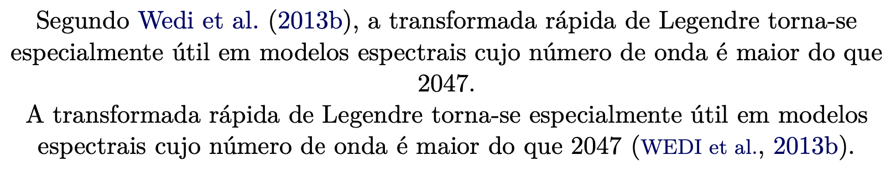

!!! tip "Dica"

    Se você estiver utilizando o estilo de publicações específico de alguma revista científica, é possível que exista outro(s) estilo(s) de citação, como exemplo, dado pelo comando `\citep{referencia}`.

No [Exemplo 6](#exe:ref2), observe que o comando `\cite` marca a citação com a primeira letra em caixa alta, enquanto que com o comando `\citeonline`, a citação aparece delimitada por parênteses e com todas as letras em caixa alta. 

Grandes bases de referências podem ser gerenciadas com o auxílio de software como o *BibDesk* (apenas para o Mac OS), *JabRef*, *Mendeley* e *Zotero*. Estes *softwares* são bastante úteis pois permitem a organização das referência e dos seus metadados e é uma boa ideia tê-las sempre organizadas. Um arquivo BibTeX (com extensão `.bib`) pode ser importado para dentro destes software. Nas Figuras [2](#fig:exe_bibdesk), [3](#fig:exe_mendeley) e [4](#fig:exe_zotero), são mostrados como uma base de dados é carregada neste *softwares*.

No *BibDesk*, clique no menu "Arquivo > Abrir..." e selecione o arquivo `.bib` com as referências. Depois de importado o arquivo, todas as referências serão mostradas em lista na janela principal. Se houver alguma referência com algum tipo de problema (e.g., caracteres não permitidos ou codificação não reconhecida), o *BibDesk* irá abrir uma caixa de diálogo perguntando ao usuário se ele quer parar a importação ou continuar. Uma outra opção é revisar e editar o arquivo antes de iniciar a importação.

<a id="fig:exe_bibdesk"></a>

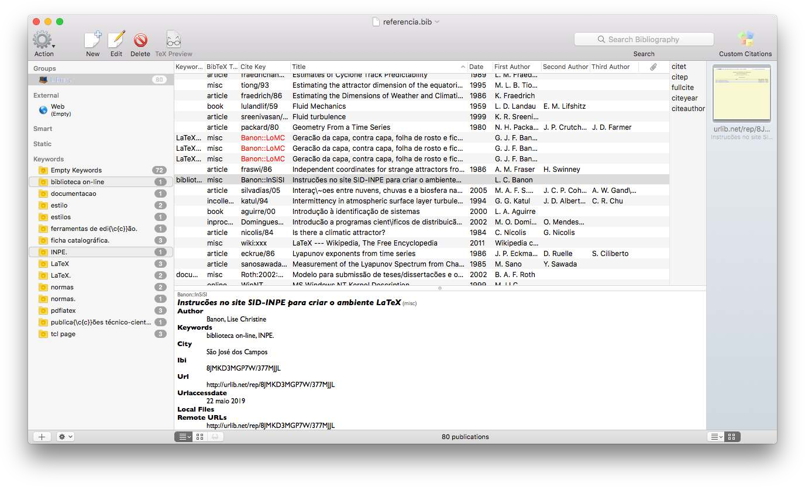

**Figura 2:** *Software BibDesk*.

Com o *software* *Mendeley*, também é possível importar um arquivo de referências `.bib`, a partir do qual é possível inserir e editar entradas existentes ou então remover as entradas que não são mais necessárias. Veja a [Figura 3](#fig:exe_mendeley) a seguir.

<a id="fig:exe_mendeley"></a>

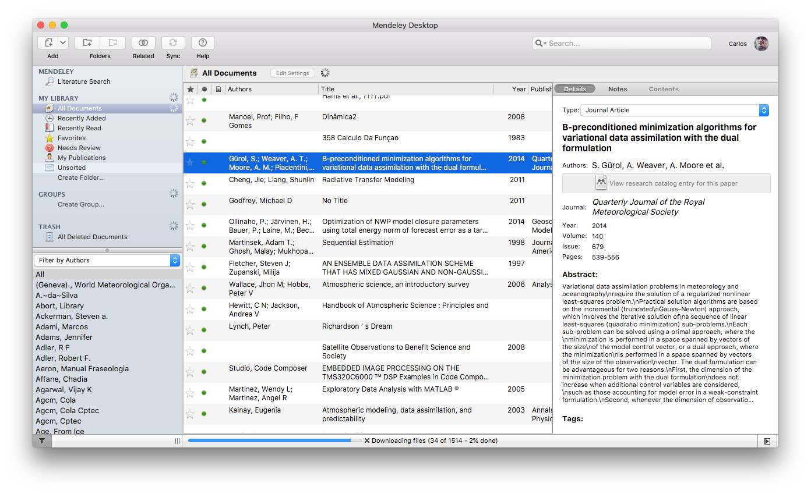

**Figura 3:** *Software Mendeley*.

Análogo aos *softwares* *BibDesk* e *Mendeley*, pode-se também utilizar o *software* *Zotero* para a mesma finalidade ([Figura 4](#fig:exe_zotero)). Note que com excessão do *software* *BibDesk*, os *softwares* *Mendeley* e *Zotero* estão disponíveis para os sistemas operacionais Linux e \textit{Microsoft Windows}.

<a id="fig:exe_zotero"></a>

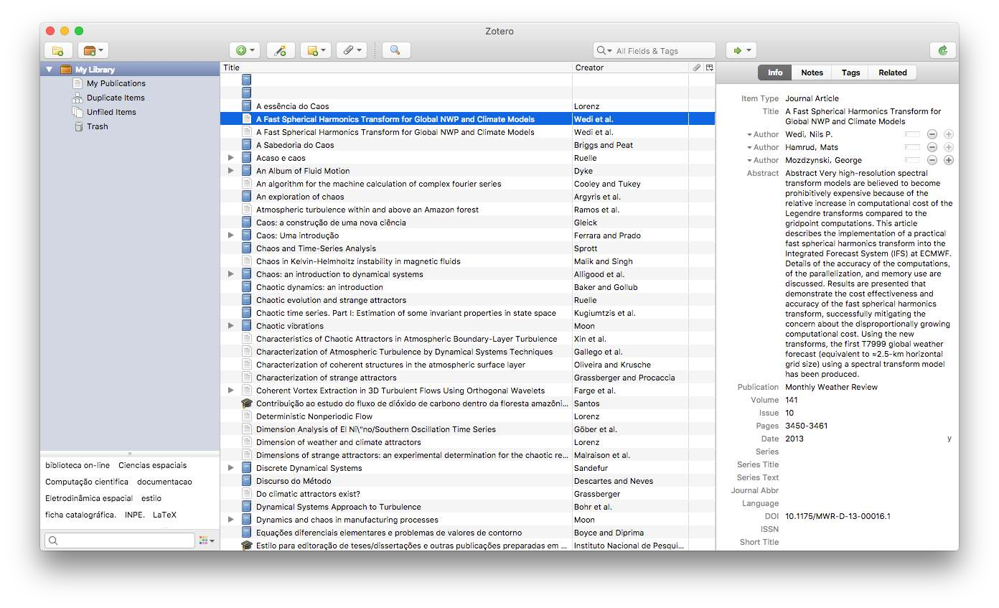

**Figura 4:** *Software Zotero*.

### 2.17.1 Tipos de Referências

O BibTeX possui diversos tipos de referências, os quais devem ser adequadamente utilizados a fim de que sejam mostradas as informações corretas para cada citação que se fizer no texto.

A [Tabela 1](#tab:refs) a seguir descreve os tipos de referências padrão do BibTeX.

<a id="tab:refs"></a>

**Tabela 1:** Tipos de referências padrão do BibTeX.

| Tipo | Descrição |
|------|-----------|
| `article`       | Artigo de jornal ou revista                                                                     |
| `book`          | Livro publicado                                                                                 |
| `booklet`       | Compilação de trabalhos em formato de livro com vários autores, mas sem editora ou patrocinador |
| `inbook`        | Parte ou capítulo de um livro, sem o título do livro ao qual pertence                           |
| `incollection`  | Parte ou capítulo de um livro, com o título do livro ao qual pertence                           |
| `inproceedings` | Artigo em anais de congresso ou conferência                                                     |
| `conference`    | Idem a `inproceedings`                                                                          |
| `manual`        | Manual técnico                                                                                  |
| `masterthesis`  | Dissertação de mestrado                                                                         |
| `phdthesis`     | Tese de doutorado                                                                               |
| `misc`          | Modelo útil para outros tipos de referências                                                    |
| `proceedings`   | Anais de congresso ou conferência                                                               |
| `techreport`    | Relatório técnico                                                                               |
| `unpublished`   | Artigo, livro ou outro tipo de trabalho não publicado                                           |

!!! note "Nota"

    Os tipos de referências descritos na [Tabela 1](#tab:refs) possuem campos que são obrigatórios e outros que são opcionais. Veja mais detalhes sobre os campos obrigatórios de cada tipo em [https://en.wikibooks.org/wiki/LaTeX/Bibliography_Management](https://en.wikibooks.org/wiki/LaTeX/Bibliography_Management).

No *site* da biblioteca do INPE, todas as referências já se encontram classificadas no tipo correto. Para obtê-las, basta procurar pelo trabalho no *site* e clicar no link "BibTeX". O arquivo aberto na janela *popup* poderá ser copiado para o arquivo de refrências do BibTeX (arquivo com extensão `.bib`). Veja um exemplo na [Figura 5](#fig:bibliotex) a seguir.

<a id="fig:bibliotex"></a>

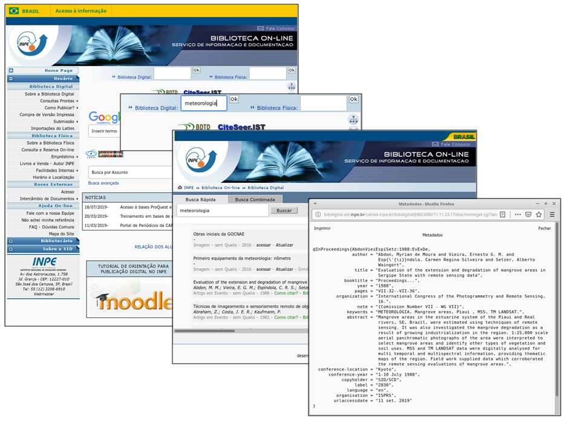

**Figura 5:** Site da biblioteca do INPE.

!!! tip "Dica"

    Se uma referência de um trabalho no formato BibTeX não puder ser encontrada nos *sites* das revistas indexadas, pode-se utilizar o serviço do *site* [*DOI2Bib*](https://doi2bib.org) para se obter a referência com os campos corretos.