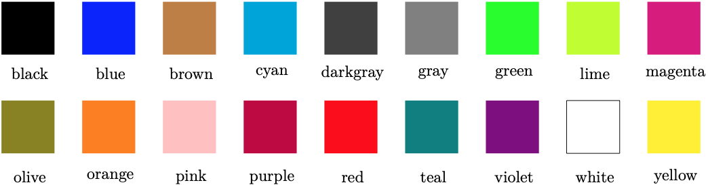
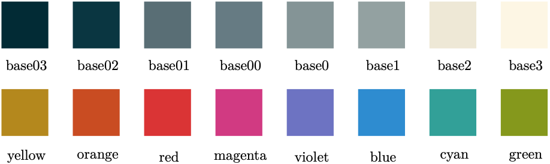
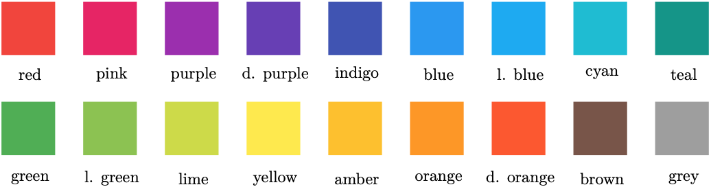
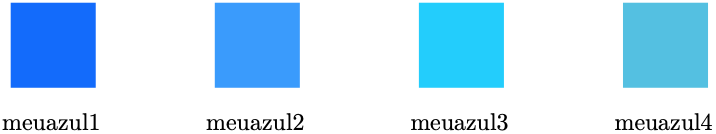

# 2. Entendendo o LaTeX

## 2.6 Cores e Paletas de Cores

Em um documento LaTeX, é possível utilizar cores predefinidas ou definir cores seguindo um determinado padrão. As cores padrão que geralmente são utilizadas em um documento LaTeX, i.e., aquelas que não dependem de pacotes extras, são apresentadas a seguir, com os nomes das cores anotadas abaixo das suas respectivas caixas.



Cores podem ser utilizadas de formas diferentes em um documento LaTeX. Mas assim como em qualquer editor de textos WYSIWYG, as cores do texto podem ser aplicadas em palavras individuais, frases ou parágrafos. Veja o [Exemplo 1](#exe_cor1) a seguir.

!!! exemple "<a id="exe_cor1"></a>Exemplo 1: Texto com fonte colorida, paleta padrão"

    === "Código"

        ```Latex linenums="1"
        \textit{\color{pink}{Quem} \color{cyan}{traz} \color{green}{CD}, \color{olive}{LP}, \color{violet}{fax}, \color{blue}{engov} \color{red}{e} \color{lime}{whisky} \color{orange}{JB?}}
        ```

    === "Resultado"

        

Além de modificar a cor das fontes, é possível também marcá-las de forma que o fundo fique colorido, como mostrado no [Exemplo 2](#exe_cor3).

!!! exemple "<a id="exe_cor3"></a>Exemplo 2: Texto com fundo colorido, paleta padrão"

    === "Código"

        ```Latex linenums="1"
        \textit{\colorbox{pink}{Quem} \colorbox{cyan}{traz} \colorbox{green}{CD}, \colorbox{olive}{LP}, \colorbox{violet}{\color{white}{fax}}, \colorbox{blue}{\color{white}{engov}} \colorbox{red}{e} \colorbox{lime}{whisky} \colorbox{orange}{JB?}}
        ```

    === "Resultado"

        

É possível também escolher uma paleta de cores diferente, e.g., a patela de cores do projeto [*Solarized*](https://ethanschoonover.com/solarized/). Para utilizá-la, basta carregar o pacote `\usepackage{solarized}` no preâmbulo do documento e aplicar as cores conforme o [Exemplo 3](#exe_corsol) adiante. A paleta de cores do "Solarized" possui as seguintes cores básicas:



Para utilizar as novas cores, basta utilizar um dos nomes definidos pela paleta, precedido por `solarized-nome-da-cor`. Veja o [Exemplo 3](#exe_corsol) a seguir.

!!! exemple "<a id="exe_corsol"></a>Exemplo 3: Texto com fundo colorido, paleta *Solarized*"

    === "Código"

        ```Latex linenums="1"
        \textit{\colorbox{solarized-magenta}{Quem} \colorbox{solarized-cyan}{traz} \colorbox{solarized-green}{CD}, \colorbox{solarized-red}{LP}, \colorbox{solarized-violet}{\color{solarized-base3}{fax}}, \colorbox{solarized-base1}{\color{solarized-base2}{engov}} \colorbox{solarized-red}{e} \colorbox{solarized-yellow}{whisky} \colorbox{solarized-orange}{JB?}}
        ```

    === "Resultado"

        

!!! tip "Dica"

    Mais informações sobre o pacote `xcolor-solarized` podem ser encontradas em [https://www.ctan.org/pkg/xcolor-solarized](https://www.ctan.org/pkg/xcolor-solarized).

Outra paleta de cores harmoniosa, é provida pelo pacote `xcolor-material`. Esta é a paleta de cores do [Material Design* do Google](https://material.io/). Para utilizá-la, basta carregar o pacote `\usepackage{xcolor-material}` no preâmbulo do documento. 

As cores básicas do pacote `xcolor-material` são as seguintes (além do branco e preto):



Na paleta de cores mostrada acima, "d." foi utilizado para abreviar a palavra *deep* (como em *deep purple*) e "l." foi utilizada para abreviar a palavra *light* (como em *light green*). Para utilizar as cores do pacote `xcolor-material`, deve-se referenciar as cores da seguinte forma: a cor \textit{Deep Purple} deve ser referenciada como "MaterialDeepPurple", ou seja, a palavra reservada "Material" deve preceder o nome da cor, que por sua vez, deve ser indicada com a primeira letra em caixa alta. Veja no [Exemplo 4](#exe_cormaterial) como utilizar as cores deste pacote.

!!! exemple "<a id="exe_cormaterial"></a>Exemplo 4: Texto com fundo colorido, paleta *Material Design*"

    === "Código"

        ```Latex linenums="1"
        \textit{\colorbox{MaterialRed}{Quem} \colorbox{MaterialPink}{traz} \colorbox{MaterialPurple}{CD}, \colorbox{MaterialDeepPurple}{LP}, \colorbox{MaterialIndigo}{\color{white}{fax}}, \colorbox{MaterialLightBlue}{\color{white}{engov}} \colorbox{MaterialTeal}{e} \colorbox{MaterialGreen}{whisky} \colorbox{MaterialLightGreen}{JB?}}
        ```

    === "Resultado"

        

!!! note "Nota"

    Pode ser necessário incluir o arquivo `xcolor-material.sty` à sua distribuição LaTeX. Veja a página do pacote para mais informações ([https://www.ctan.org/pkg/xcolor-material](https://www.ctan.org/pkg/xcolor-material)).

Além da utilização de paletas de cores pré-definidas, é possível também definir qualquer cor utilizando códigos *Hypertext Markup Language* (HTML), *Red Green Blue* (RGB) ou *Cyan Magenta Yellow Black* (CMYK) utilizando o comando `\definecolor`. Veja no [Exemplo 5](#exe_cor4) como definir cores personalizadas.

!!! exemple "<a id="exe_cor4"></a>Exemplo 5: Definindo cores personalizadas"

    === "Código"

        ```Latex linenums="1"
        \definecolor{meuazul1}{HTML}{0066ff}
        \definecolor{meuazul2}{rgb}{0.2,0.6,1}
        \definecolor{meuazul3}{RGB}{0,204,255}
        \definecolor{meuazul4}{cmyk}{0.6,0,0,0}

        \begin{tikzpicture}
        \fill [meuazul1] (0,0) rectangle ++(1.25,1.25);
        \draw (0.6,-0.5) node {meuazul1};
        \fill [meuazul2] (3,0) rectangle ++(1.25,1.25);
        \draw (3.6,-0.5) node {meuazul2};
        \fill [meuazul3] (6,0) rectangle ++(1.25,1.25);
        \draw (6.6,-0.5) node {meuazul3};
        \fill [meuazul4] (9,0) rectangle ++(1.25,1.25);
        \draw (9.6,-0.5) node {meuazul4};
        \end{tikzpicture}
        ```

    === "Resultado"

        

!!! tip "Dica"

    Veja outras opções de paletas e cores personalizadas em [LaTeXColor](http://latexcolor.com).