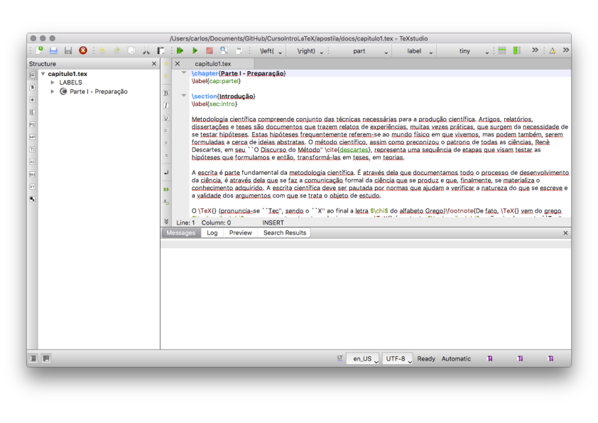
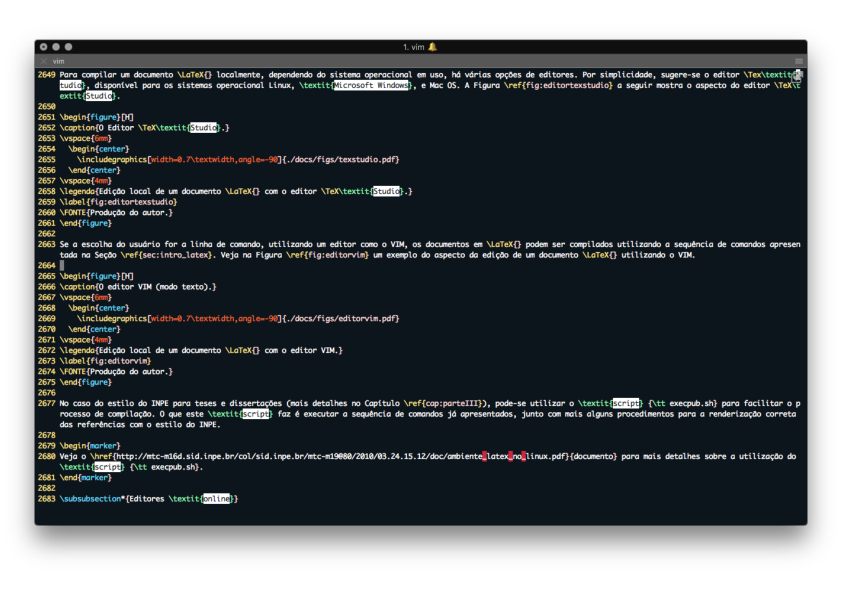
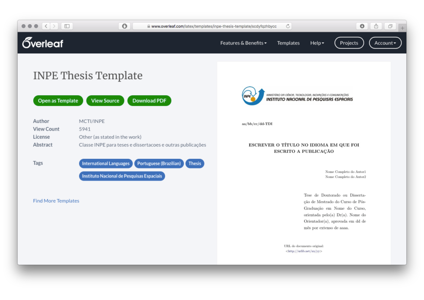
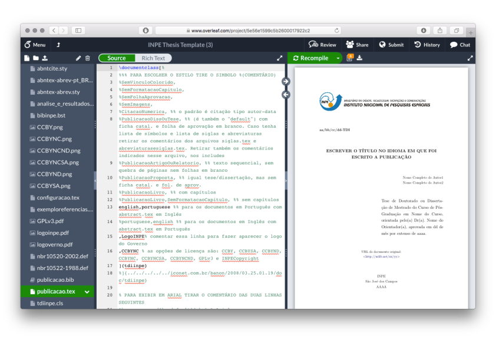

# 2. Entendendo o LaTeX

## 2.19 Editores

Muitos editores podem ser utilizados para editar documentos LaTeX. A escolha de um editor é particular, mas pode ser associada à forma como o usuário está mais habituado a digitar. Por exemplo, se o usuário gosta de utilizar o editor [VIM](https://www.vim.org) (disponível para os sistemas operacionais Linux, *Microsoft Windows* e Mac OS), pode escolher instalar algumas extensões para este editor, a fim de torná-lo mais eficiente para a edição de documentos LaTeX. Editores locais podem variar de acordo com o sistema operacional em uso, embora muitos projetos *open source* forneçam executáveis para os sistemas operacionais mais utilizados. Em relação aos editores *online*, estes podem ser mais vantajosos por não dependerem do tipo de sistema operacional, mas apenas de uma conexão com a internet e um navegador compatível. Outra vantagem dos editores *online*, é o fato de que estes podem ser integrados a outros serviços, como o [Dropbox](https://dropbox.com) ou o [GitHub](https://github.com).

Nas duas seções a seguir, são apresentados alguns editores selecionados para a edição de documentos LaTeX.

### 2.19.1 Editores locais

Para compilar um documento LaTeX localmente, dependendo do sistema operacional em uso, há várias opções de editores. Por simplicidade, sugere-se o editor TeX*Studio*, disponível para os sistemas operacional Linux, *Microsoft Windows*, e Mac OS. A [Figura 1](#fig:editortexstudio) a seguir mostra o aspecto do editor TeX*Studio*.

<figure markdown>
{width="650"}
<figcaption>Figura 1: Edição local de um documento LaTeX com o editor TeXStudio.</figcaption>
</figure>

Se a escolha do usuário for a linha de comando, utilizando um editor como o VIM, os documentos em LaTeX podem ser compilados utilizando a sequência de comandos apresentada na [Seção 2.1](../intro_latex/#21-introducao-ao-latex). Veja na [Figura 2](#fig:editorvim) um exemplo do aspecto da edição de um documento LaTeX utilizando o VIM.

<figure markdown>
{width="650"}
<figcaption>Figura 2: Edição local de um documento LaTeX com o editor VIM.</figcaption>
</figure>

No caso do estilo do INPE para teses e dissertações (mais detalhes na [Parte 3](../estilo_inpe/#3-estilo-do-inpe)), pode-se utilizar o *script* `execpub.sh` para facilitar o processo de compilação. O que este *script* faz é executar a sequência de comandos já apresentados, junto com mais alguns procedimentos para a renderização correta das referências com o estilo do INPE. 

!!! tip "Dica"

    Veja o [documento](http://mtc-m16d.sid.inpe.br/col/sid.inpe.br/mtc-m19@80/2010/03.24.15.12/doc/ambiente_latex_no_linux.pdf) para mais detalhes sobre a utilização do *script* `execpub.sh`.

### 2.19.2 Editores online

O *Overleaf* é um editor LaTeX *online* que pode ser utilizado para escrita colaborativa. O estilo do INPE está disponível na plataforma *online* e pode ser carregado para a escrita de teses e dissertações a partir de endereço [https://www.overleaf.com/latex/templates/inpe-thesis-template/scdyfqzhbycc#.Wrj8gH8h2Uk](https://www.overleaf.com/latex/templates/inpe-thesis-template/scdyfqzhbycc#.Wrj8gH8h2Uk). Para acessar, é necessário que o usuário crie uma conta para o acesso. Esta é a forma recomendada para a criação de documentos LaTeX, especialmente se o usuário ainda não está familiarizado com documentos mais complexos como o estilo do INPE. 

O estilo para teses e dissertações do INPE pode ser aberto para edição *online* com o editor *Overleaf*. Para isso, acesso o *link* [https://www.overleaf.com/latex/templates/inpe-thesis-template/scdyfqzhbycc](https://www.overleaf.com/latex/templates/inpe-thesis-template/scdyfqzhbycc) e abra o estilo como um template para a edição, assim como mostrado na [Figura 3](#fig:overleaf1).

<figure markdown>
{width="650"}
<figcaption>Figura 3: Escolha do estilo do INPE para edição online com o editor Overleaf.</figcaption>
</figure>

Na [Figura 4](#fig:overleaf2) é mostrada a interface principal do editor *Overleaf* com o estilo do INPE carregado para edição.

<figure markdown>
{width="650"}
<figcaption>Figura 4: Edição online do estilo do INPE com o editor Overleaf.</figcaption>
</figure>

!!! tip "Dica"

    Ao utilizar o editor *Overleaf*, o usuário irá perceber que a compilação do documento pode levar mais tempo quando muitas figuras são incluídas. Recomenda-se comentar as seções do texto que já foram revisadas para acelerar a compilação. Outra dica útil é realizar a compilação do documento no modo *FAST*. Desta forma, as figuras são removidas do documento e apenas a marcadação e a estrutura do texto são compiladas.
