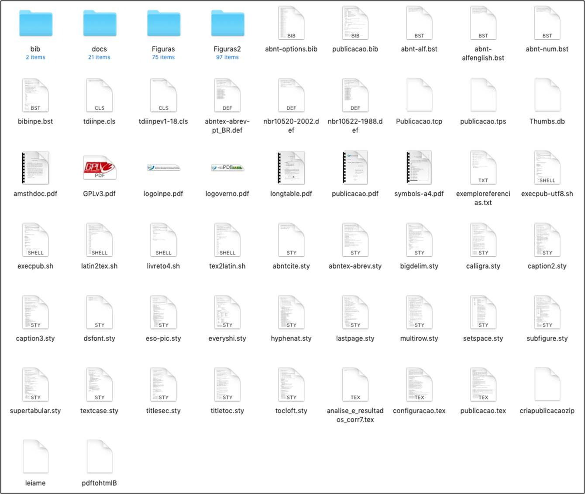
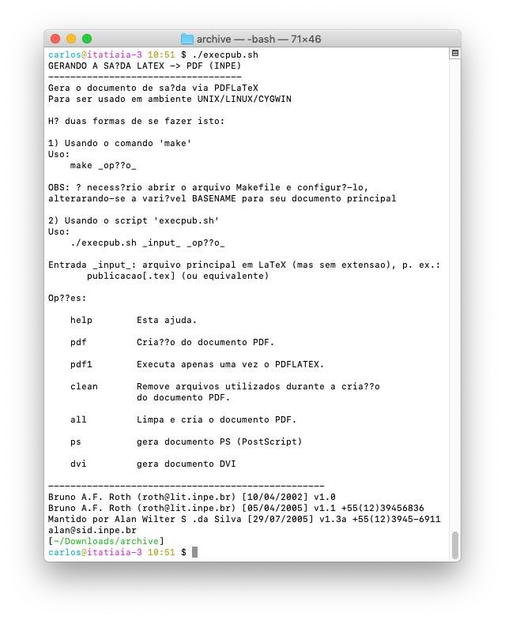
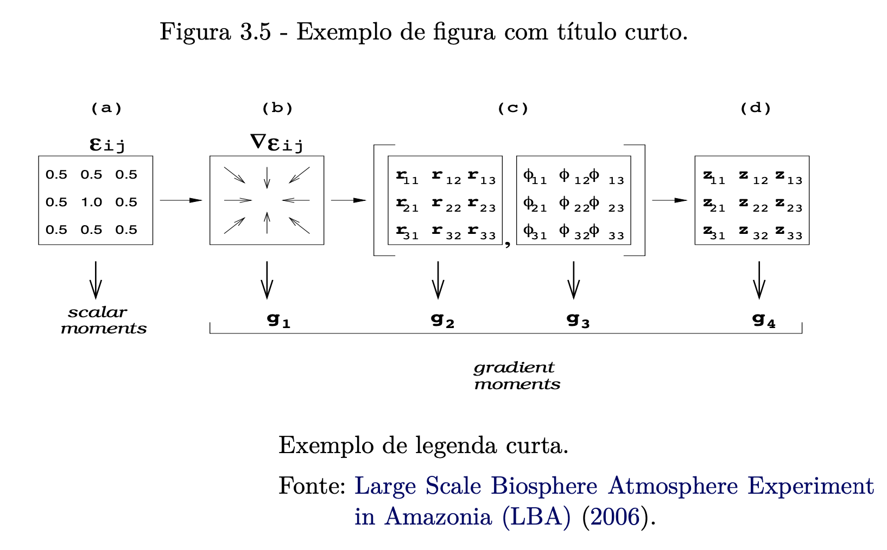
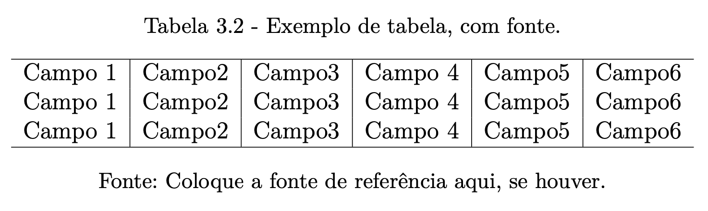
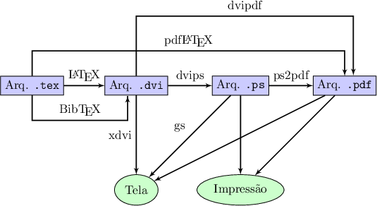

# 3. Estilo do INPE

O INPE desenvolveu um estilo próprio para a publicação de teses, dissertações e relatórios. Este estilo está disponível para edição na linguagem de marcação LaTeX, além de possuir também estilos que podem ser utilizados com os editores WYSIWYG *Microsoft Word* e *LibreOffice*. Este capítulo trata da aplicação do estilo do INPE no ambiente da linguagem de marcação LaTeX.

## 3.1 Estilo do INPE para Dissertações e Teses

O estilo do INPE compreende um conjunto de arquivos que contém instruções e imagens, que permitem que os documentos escritos dentro do seu escopo, sejam montados segundo as normas de publicação do Serviço de Informação e Documentação (SESID) do INPE. O estilo do INPE foi originalmente criado por [Roth (2002)](#roth/2002), e tem sido mantido e atualizado desde 2002 por diversos colaboradores do INPE. Veja na seção a seguir como obter uma cópia do estilo do INPE.

## 3.2 Obtendo o Estilo

É possível obter uma cópia do estilo do INPE a partir de duas formas distintas. A primeira, é entrar no *site* da biblioteca do INPE, a partir do endereço [http://www.inpe.br/biblioteca/](http://www.inpe.br/biblioteca/). Na página, no menu lateral, clique em "Como Publicar?" e depois em "em LaTeX" ([Figura 1](#fig:biblio_pub_latex)). Na página, no *frame* da direita, uma outra página irá se abrir com as instruções "Publicar usando estilo em LaTeX". A página contém instruções sobre todo o processo de publicação de documentos submetidos à revisão pelo SESID. Para obter uma cópia *offline* do pacote com o estilo do INPE em LaTeX, clique no *link* [download](http://mtc-m16c.sid.inpe.br/archive.cgi/sid.inpe.br/iris@1905/2005/08.25.14.01) do estilo baixando o arquivo archive.zip"} que está na "OPÇÃO 3 (compilação no próprio computador)". Na mesma página, há instruções sobre a instalação de um compilador LaTeX, que também podem ser encontradas na [Parte 1](../preparacao/#1-preparacao).

<a id="fig:biblio_pub_latex"></a>

<figure markdown>
{width="650"}
<figcaption>Figura 1: Site do biblioteca do INPE.</figcaption>
</figure>

Com o arquivo `archive.zip` no seu computador, descompacte-o em um local apropriado para poder ter acesso aos arquivos que compõem o estilo do INPE.

A outra forma de se obter o estilo do INPE para a edição de teses e dissertações, é a partir do *site* do editor *Overleaf*, assim como já foi apresentado na [Seção 2.19.2](../editores/#2192-editores-online) da [Parte 2](../editores/#219-editores).

## 3.3 Estrutura e Organização

O estilo do INPE é fornecido pelo arquivo principal `tdiinpe.cls`. Dentro deste arquivo há uma série de instruções da linguagem LaTeX que determinam o estilo das referências, dos capítulos, dos títulos, tabelas, imagens etc ([Figura 2](#fig:estrut)).

<a id="fig:estrut"></a>

<figure markdown>
{width="650"}
<figcaption>Figura 2: Arquivos do estilo LaTeX do INPE.</figcaption>
</figure>

Na [Figura 2](#fig:estrut), os arquivos da estrutura do estilo do INPE estão misturados aos arquivos do documento em si. Outros arquivos são resultados do processo de compilação do documento principal. 

* **Diretórios**
* `bib/`
* `Figuras/`
* `docs/`

* **Arquivos do Estilo**
* `leiame`
* `GPLv3.pdf`
* `CCBY.png`
* `CCBYNC.png`
* `CCBYNCND.png`
* `CCBYNCSA.png`
* `CCBYND.png`
* `CCBYSA.png`
* `logoverno.pdf`
* `logoinpe.pdf`
* `tdiinpe.cls`
* `abntex-abrev-pt_BR.def`
* `abntex-abrev.sty`
* `nbr10520-2002.def`
* `nbr10522-1988.def`
* `abnt-alf.bst`
* `abnt-alfenglish.bst`
* `bibinpe.bst`
* `eso-pic.sty`
* `abnt-num.bst`
* `abnt-options.bib`
* `abntcite.sty`

* **Outros Pacotes Fornecidos**
* `caption2.sty`
* `calligra.sty`
* `caption3.sty`
* `hyphenat.sty`
* `multirow.sty`   
* `dsfont.sty`
* `supertabular.sty`
* `tocloft.sty`
* `setspace.sty`
* `titlesec.sty`   
* `textcase.sty`
* `lastpage.sty`     
* `bigdelim.sty`
* `everyshi.sty`
* `subfigure.sty`
* `titletoc.sty`

* **Arquivos de Configuração**
* `configuracao.tex`

* **Arquivos de Documentos**
* `publicacao.tex`

* **Scripts**
* `tex2latin.sh`
* `criapublicacaozip`
* `latin2tex.sh`
* `pdftohtmlB`
* `livreto4.sh`
* `execpub.sh`

* **Documento Final**
* `publicacao.pdf`

Na lista de arquivos acima, observe que a lista "Arquivos do Estilo", há arquivos destacados nas cores azul e vermelho. Os arquivos destacados na cor azul, representam os arquivos do estilo do INPE, enquanto que os arquivos destacados na cor vermelha, representam os arquivos do estilo de citação da ABNT. O arquivo final gerado é o arquivo `publicacao.pdf`. O documento principal do pacote, também chamado de *master*, é o arquivo `publicacao.tex`; o arquivo que contém as configurações principais do documento (e.g., título, autor, banca e datas) é o arquivo `configuracao.tex` e o arquivo que contém as diretivas do estilo do INPE é o `tdiinpe.cls`. Em geral, não é necessário editar o arquivo de estilo, a não ser que exista algum conflito em relação a pacotes e versões (veja um exemplo na [Seção 3.8](../estilo_inpe/#38-orientacoes-especiais)). 

## 3.4 Compilação do Documento

Para compilar o documento é necessário ter algum compilador o LaTeX instalado localmente ou utilizar algum serviço *online* como o [*Overleaf*](https://www.overleaf.com/). No *Overleaf*, o *link* para a edição do estilo em sua versão atual é [https://www.overleaf.com/latex/templates/inpe-thesis-template/scdyfqzhbycc#.Wrj8gH8h2Uk](https://www.overleaf.com/latex/templates/inpe-thesis-template/scdyfqzhbycc#.Wrj8gH8h2Uk). Para a compilação local, recomenda-se a utilização dos *scripts* que se encontram na distribuição do estilo do INPE:

* `criapublicacaozip`: *script* que empacota o documento final (`publicacao.pdf`) para publicação;
* `latin2tex.sh`: *script* que converte acentos latinos para a marcação da linguagem LaTeX[^1];
* `tex2latin.sh`: *script* que converte acentos com marcação LaTeX para acentos latinos[^2];
* `pdftohtmlB`: converte um documento PDF em HTML;
* `livreto4.sh`: gera um livreto de quatro folhas no formato A4[^3];
* `execpub.sh`: gera o documento de saída (`publicacao.pdf`) utilizando o compilador LaTeX[^4]. 

[^1]: Não obrigatório dependendo da opção do pacote `inputenc`.
[^2]: Idem comentário anterior.
[^3]: O formato livreto pode ser útil para prova de impressão.
[^4]: Veja mais detalhes sobre o processo de compilação de um documento LaTeX na [Seção 2.1](../intro_latex/#21-introducao-ao-latex) da [Parte 2](../intro_latex/#2-entendendo-o-latex).

Para compilar um documento utilizando o estilo do INPE e o conjunto de *scripts* fornecidos, siga os seguintes passos:

1. Abra um terminal[^5], recomenda-se a utilização de qualquer distribuição Linux, instalada através do Subsistema *Windows* para Linux (SWL, ou *Windows Subsystem for Linux* WSL, na sigla em inglês). Veja como instalar em [https://docs.microsoft.com/pt-br/windows/wsl/install-win10](https://docs.microsoft.com/pt-br/windows/wsl/install-win10).} e navegue até o diretório onde se encontra o *script* `execpub.sh`;
1. Altere a permissão de execução do *script* `execpub.sh` com o comando:

    === "Comando"

        ```Bash linenums="1"
        chmod +x execpub.sh
        ```

1. Execute o *script* `execpub.sh` sem argumentos. Na [Figura 3](#fig:execpub) são mostrados as opções do *script* `execpub.sh`: 

    <a id="fig:execpub"></a>

    <figure markdown>
    {width="650"}
    <figcaption>Figura 3: O script execpub.sh.</figcaption>
    </figure>

1. Execute o *script* `execpub.sh`, com dois argumentos:

    === "Comando"

        ```Bash linenums="1"
        ./execpub.sh <arquivo> <opcao>
        ```
 
    No comando acima, observe que o nome do arquivo a ser compilado deve ser informado sem a extensão `.tex`.

    Para finalmente compilar o documento principal `publicacao.tex`, siga o exemplo abaixo. Observe que apenas este comando é necessário para gerar o arquivo PDF final (`publicacao.pdf`).

1. Execute o *script* `execpub.sh`, com dois argumentos:

    === "Comando"

        ```Bash linenums="1"
        ./execpub.sh publicacao pdf
        ```

[^5]: No sistema operacional *Microsoft Windows* 10.    

Na *internet* há muitos exemplos de documentos e códigos escritos na linguagem LaTeX que podem ter sido escritos há muito tempo e que podem fazer uso de codificações diferentes. Isso pode acarretar na representação incorreta de caracteres especiais, como acentos. Na [Figura 4](#fig:leiame1) o arquivo `leiame` do estilo do INPE (assim como vários dos outros arquivos), foram criados e salvos na codificação ISO-8859-2 (frequentemente utilizado pelos sistemas operacionais até poucos anos atrás). Com a padronização do sistema \textit{Portable Operating System Interface} (POSIX) para UTF-8, pode tornar-se necessário abrir estes arquivos com algum editor de textos (como o *Gedit* no Linux ou o *Textedit* no Mac OS) e utilizar a opção "Salvar como..." para salvar os arquivos no formato UTF-8. A [Figura 5](#fig:leiame2) a seguir, mostra as diferenças entre a representação de arquivos salvos com estas codificações, em um sistema POSIX. 

<a id="fig:leiame1"></a>

<figure markdown>
{width="650"}
<figcaption>Figura 4: Exemplo das codificação ISO8859-2.</figcaption>
</figure>

<a id="fig:leiame2"></a>

<figure markdown>
{width="650"}
<figcaption>Figura 5: Exemplo da codificação UTF-8.</figcaption>
</figure>

Outra forma de converter um arquivo ISO-8859-2 para o formato de codificação UTF-8, é através da utilização do comando `iconv` do Linux (o qual também pode ser instalado no *Microsoft Windows* através do SWL).Para converter um arquivo salvo na codificação ISO-8859-2 para UTF-8, pode-se utilizar o seguinte comando:

=== "Comando"

    ```Bash linenums="1"
    iconv -f ISO-8859-9 -t UTF-8 arquivo.tex > novo_arquivo.tex
    ```

!!! tip "Dica"

    Para mais informações sobre como utilizar o comando `iconv`, digite o comando `iconv --help`.

## 3.5 Arquivos de Configuração

No estilo do INPE, há basicamente dois arquivos que devem ser configurados para que o usuário possa definir o nome do(s) autor(es) e o título do documento. São eles: `cofiguracao.tex` e `publicacao.tex`.

No arquivo `publicacao.tex`, são definidos o estilo da publicação, i.e., se o documento terá o estilo de dissertação ou tese (`PublicacaoDissOuTese`, é o padrão), artigo ou relatório (`PublicacaoArtigoOuRelatorio`), proposta de tese ou dissertação (`PublicacaoProposta`), livro com ou sem a formatação de capítulos (`PublicacaoLivro`). Além disso, deve-se ajustar também o idioma: se o idioma principal do documento for o Português, então o *abstract* será no idioma Inglês (`english, portuguese`), além do tipo de logo do governo e do tipo de licença *Creative Commons* (CC) a ser utilizada (veja mais informações sobre os diferentes tipos de Licenças *Creative Commons* em [https://pt.wikipedia.org/wiki/Licenças_Creative_Commons](https://pt.wikipedia.org/wiki/Licenças_Creative_Commons). Veja no exerto a seguir, um trecho do arquivo `publicacao.tex`.

```Latex linenums="1"
documentclass[
% PARA ESCOLHER O ESTILO TIRE O SIMBOLO (COMENTÁRIO)
%SemVinculoColorido,
%SemFormatacaoCapitulo,
%SemFolhaAprovacao,
%SemImagens,
%CitacaoNumerica, 
%PublicacaoDissOuTese,
%PublicacaoArtigoOuRelatorio,
%PublicacaoProposta, 
%PublicacaoLivro, 
%PublicacaoLivro,SemFormatacaoCapitulo,
english,portuguese, 
%portuguese,english, 
LogoINPE,
CCBYNC,
]{tdiinpe}

% PARA EXIBIR EM ARIAL TIRAR O COMENTÁRIO DAS DUAS LINHAS SEGUINTES
%\renewcommand{\rmdefault}{phv}} % Arial
%\renewcommand{\sfdefault}{phv}} % Arial

% PARA PUBLICAÇÕES EM INGLÊS:
%renomear o arquivo: abnt-alf.bst para abnt-alfportuguese.bst
%renomear o arquivo: abnt-alfenglish.bst para abnt-alf.bst
...
```

A [Tabela 1](#tab:arq_publicacao) a seguir, sumariza as principais opções encontradas no arquivo `publicacao.tex`.

<a id="tab:arq_publicacao"></a>

**Tabela 1:** Configurações principais do arquivo `publicacao.tex`.

| Opção | Descrição |
|-------|-----------| 
| `SemVinculoColorido`                       | Remove o realce das referências e *links*          |
| `SemFormatacaoCapitulo`                    | Não aplica a formatação de capítulos               |
| `SemImagens`                               | Compila o documento sem as imagens[^6]             |
| `CitacaoNumerica`                          | Altera o estilo das citações                       |
| `PublicacaoDissOuTese`                     | Aplica o estilo de Dissertação ou Tese             |
| `PublicacaoArtigoOuRelatorio`              | Aplica o estilo de Artigo ou Relatório             |
| `PublicacaoProposta`                       | Aplica o estilo de Proposta (Tese ou Dissertação)  |
| `PublicacaoLivro`                          | Aplica o estilo de Livro                           |
| `PublicacaoLivro`, `SemFormatacaoCapitulo` | Idem anterior, mas sem a formatação de capítulos   |
| `english,portuguese`                       | Texto em Português, *Abstract* em Inglês           |
| `portuguese,english`                       | Texto em Inglês, Resumo em Português               |
| `LogoINPE`                                 | Utiliza o logo do INPE ao invés do logo do governo |
| `CCBYNC`                                   | Aplica o tipo de licença                           |
| `\renewcommand{\rmdefault}{phv}`           | Aplica a fonte Arial (sem serifa) como padrão      |

[^6]: Esta opção pode ser útil quando se tem muitas imagens e o tempo de compilação do documento for muito grande.

No arquivo `configuracao.tex`, o usuário poderá inserir o título do documento, bem como o(s) nome(s) do(s) autor(es) do documento. Outras configurações, são normalmente revisadas e alteradas oportunamente pelo SESID quando o documento de tese ou dissertação é entregue para revisão do estilo.

```Latex linenums="1"
% CAPA
\titulo{Escrever o t\'{i}tulo no idioma em que foi escrito a
publicaç\~{a}o}
\title{Escrever o t\'{i}tulo em Ingl\^{e}s para publicaç\~{o}es
escritas em Portugu\^{e}s e em Portugu\^{e}s para publicaç\~{o}es
escritas em Ingl\^{e}s} 
\author{Nome Completo do Autor}
\descriccao{Tese de Doutorado ou Dissertaç\~{a}o de Mestrado do
Curso de P\'{o}s-Graduaç\~{a}o em Nome do Curso, orientada pelo(a)
Dr(a). Nome do Orientador(a), aprovada em dd de m\^{e}s por extenso
de aaaa.}
\repositorio{aa/bb/cc/dd}
\tipoDaPublicacao{TDI}
\IBI{xx/yy} 
\date{AAAA}
...
```

!!! note "Nota"

    Recomenda-se atenção especial para os caracteres que são inseridos no arquivo `configuracao.tex`. Neste arquivo, os acentos devem ser marcados, e.g., a palavra `publicação`, deve ser marcada como `publicaç\~{a}o}`.

As seções a seguir são dedicadas aos detalhes referentes à inserção de conteúdo nos documentos que farão uso do estilo do INPE.

## 3.6 Inserção de Figuras e Tabelas

Na [Seção 2.12](../figuras/#212-figuras) da [Parte 2](.../intro_latex/#2-entendendo-o-latex) foram apresentadas diferentes formas de se incluir figuras em um documento LaTeX. Com a utilização do estilo do INPE, entretanto, alguns cuidados devem ser tomados, pois há detalhes que devem ser respeitados. Uma imagem típica com todos os seus elementos de referência é apresentada no [Exemplo 1](#figestinpe).

!!! example "<a id="figestinpe"></a>Exemplo 1: Inserção de uma figura no estilo do INPE"

    === "Código"

        ```Latex linenums="1"
        \begin{figure}[H]
        \caption{Exemplo de figura com título curto.}
        \vspace{6mm} % acrescentar o espaçamento vertical apropriado entre o título e a borda superior da figura
        \begin{center}
            \includegraphics[width=12cm]{./docs/figs/gpa.pdf}  
        \end{center}
        \vspace{4mm} % acrescentar o espaçamento vertical apropriado entre a borda inferior da figura e a legenda ou a fonte quando não há legenda (o valor pode ser negativo para subir)
        \legenda{Exemplo de legenda curta.} % legenda - opcional
        \label{figgpa1}
        \FONTE{\citeonline{lba/06}.} % fonte consultada (elemento obrigatório, mesmo que seja produção do próprio autor)
        \end{figure}
        ```

    === "Resultado"

        <figure markdown>
        {width="500"}
        </figure>

No [Exemplo 2](#figestinpe), observe que espaçamentos especiais são aplicados utilizando-se os comandos `vspace` que aplicam um espaçamento de `6mm` entre o *caption* (que fica em cima da figura) da figura e um espaçamento de `4mm` entre a figura e a legenda (que fica embaixo da figura). Esta segunda legenda é opcional e geralmente se constitui de uma frase curta sobre a imagem mostrada. Um elemento obrigatório é a incorporação do marcador `FONTE` (em caixa alta), o qual deve conter a fonte consultada ou, se a produção for do autor, deve conter a frase "Produção do autor". Para mais exemplos de inserção de figuras de estilos diferentes, verifique o Anexo B de \citeonline{estiloinpe}.

Tabelas também devem seguir a formatação estipulada pelo estilo do INPE. Veja o [Exemplo 2](#tabestinpe) a seguir.

!!! example "<a id="tabestinpe"></a>Exemplo 2: Inserção de uma tabela no estilo do INPE"

    === "Código"

        ```Latex linenums="1"
        \begin{table}[H] % [htbp] opções de posicionamento da tabela no texto
        \begin{center} % use sempre um ambiente para as tabelas
        % (opções: center (recomendado), flushright, flushleft)
        % NÃO USE \centering com TABELAS se houver \FONTE!	
        \caption{Exemplo de tabela, com fonte.}
        \begin{tabular}{l|l|c|c|r|r}
        \hline % desenha uma linha horizontal
        Campo 1 & Campo2 & Campo3 & Campo 4 & Campo5 & Campo6 \\
        Campo 1 & Campo2 & Campo3 & Campo 4 & Campo5 & Campo6 \\
        Campo 1 & Campo2 & Campo3 & Campo 4 & Campo5 & Campo6 \\
        \hline % desenha uma linha horizontal
        \end{tabular}
        \end{center}
        \FONTE{Coloque a fonte de referência aqui, se houver.}
        \end{table}
        ```

    === "Resultado"

        <figure markdown>
        {width="650"}
        </figure>

No caso das tabelas, sempre que for utilizado o estilo do INPE, deve-se utilizar o ambiente `table` (veja mais detalhes na [Seção 2.14](../tabelas/#214-tabelas) da [Parte 2](../intro_latex/#2-entendendo-o-latex)). Recomenda-se também a utilização dos ambientes de posição (para centralizar, alinhar à direita ou esquerda). Da mesma forma como as figuras, as tabelas também devem vir acompanhadas do marcador `FONTE`, sempre que a citação da fonte for permitente. Neste caso, ao invés da utilização do marcador `centering`, deve-se utilizar o ambiente `center`. Mais detalhes sobre a inserção de tabelas utilizando-se o estilo do INPE, podem ser encontradas no Anexo B de \citeonline{estiloinpe}.

Tanto para figuras quanto para tabelas, deve-se ter especial atenção quanto ao posicionamento destes corpos flutuantes. Os ambientes `figure` e `table`, devem ter suas posições relativas ajustadas conforme as opções mostradas na [Tabela 1](./figuras.md#tab:ambfig) da [Seção 2.12](../figuras/#212-figuras) da [Parte 2](../intro_latex/#2-entendendo-o-latex).

## 3.7 Inserção de Citações e Referências

Assim como apresentado na [Seção 2.17](../citacoes_referencias/#217-citacoes-e-referencias) da [Parte 2](../intro_latex/#2-entendendo-o-latex), citações a elementos do texto como figuras, tabelas e equações podem ser feitas com a utilização do par de comandos `\label{nome}` e `\ref{nome}`. Referências bibliográficas, dentro do estilo do INPE, são gerenciadas utilizando o BibTeX e a sua inserção em um documento com o estilo do INPE é simples. Antes de apresentar os detalhes de como as referências são armazenadas e incluídas no corpo do texto, é necessário antes, voltar à [Seção 2.1](../intro_latex/#21-introducao-ao-latex) da [Parte 2](../intro_latex/#2-entendendo-o-latex) e acrescentar alguns passos extras ao processo de compilação. Isso se faz necessário porque as referências bibliográficas precisam também ser interpretadas pelo BibTeX. Nesse processo, o estilo de referências da ABNT é então aplicado e apresentado da forma correta no corpo do texto.

Na [Figura 6](#fig:compbibtex) é apresentado um diagrama semelhante aquele apresentada na [Figura 1](./intro_latex.md#fig:complatex), com a diferença de que os procedimentos necessários para a inclusão do BibTeX estão adicionados.

<a id="fig:compbibtex"></a>

<figure markdown>
{width="650"}
<figcaption>Figura 6: Compilação de um documento LaTeX. Fonte: Adaptado de http://www.texample.net/tikz/examples/tex-workflow/.
</figure>

O processo de compilação de um documento LaTeX com referências BibTeX, inclui a utilização do programa `bibtex`. Em sequência, uma compilação manual completa (i.e., gerando o arquivo PDF no final), tem a seguinte ordem:

=== "Comando"

    ```Latex linenums="1"
    latex documento.tex
    bibtex documento
    latex documento
    latex documento
    dvips documento.dvi
    ps2pdf documento.ps
    ```

Na sequência de comandos acima, observe que foram utilizados o comando `latex documento` duas vezes seguida após o comando `bibtex documento`. Isso se faz necessário porque o BibTeX processa as informações de referências e escreve algumas informações em disco, em arquivos auxiliares. Depois, o LaTeX lê esta informação e formata as referências, que são incorporadas finalmente ao documento, apenas após a segunda vez em que o comando é executado.

No estilo do INPE, existe um arquivo de nome `referencia.bib` que fica dentro do diretório `bib/`. Este arquivo possui uma estrutura específica e tem o seguinte aspecto:

```Latex linenums="1"
%% NOTA: em vez de usar as letras e vogais com acento ou sinais gr\'aficos (como o c cedilhado -- \c c), algo normal agora no texto em LaTeX, use aqui suas formas no padrão LaTeX, p. ex.:
%% \'a = a agudo (mesmo para outras vogais)
%% \^a = a circunflexo  
%% \`a = a craseado
%% \"a = a tremado
%% {\c c} = c cedilhado
%% Isto ainda é necessário para evitar inconsistências na geração da lista de referências bibliográficas.

@string{cs =      "Complex Systems"}
@string{pl =      "Physics Letters"}
@string{prl =     "Physical Review Letters"}
@string{pra =     "Physical Review A"} 
@string{pla =     "Physics Letters A"} 
@string{pre =     "Physical Review E"} 
@string{pd =      "Physica D"} 
@string{jcsc =    "Journal of Circuits, Systems and Computers"}
@string{jsv =     "Journal of Sound and Vibration"}
@string{ijbc =    "International Journal of Bifurcation and Chaos"}
@string{ijc =     "International Journal of Control"}
@string{ieeecas = "IEEE Transactions on Circuits and Systems"}
@string{jrssb =   "Journal of the Royal Statistical Society B"} 
@string{n =       "Nature"}
@string{zn =      "Z. Naturforsch"}
@string{jfi =     "Zeitschrift fuer Naturforschung A"} 
@string{actaam =  "ACTA Amaz\^onica"}

@ARTICLE{nobre/2005,
  author    = {Luizao, F. J. and Nobre, C. A. and Manzi, A. O.},
  title     = {Projeto LBA: Estudando as Complexas Intera{\c c}\~oes da Biosfera com a Atmosfera na Amaz\^onia},
  journal   = actaam,
  year      = {2005},
  volume    = {35},
  number    = {1-2},
  pages     = {109--110},
}
...
```

Neste arquivo, observe que está indicado com um comentário no topo do arquivo, que o usuário deve insirir os acentos de forma explícita, tal como foi explicado na [Seção 2.3](../acentos_local/#23-acentos-e-localizacao) da [Parte 2](../intro_latex/#2-entendendo-o-latex). Isto se faz necessário porque o BibTeX não aceita a localização tal como pode-se fazer com o LaTeX quando se utiliza o pacote `inputenc`. No segundo bloco, observe as instruções que se iniciam com a palavra-chave `@string`. Com estas *strings* pode-se criar atalhos (*aliases*) para nomes que podem ser expandidos depois na montagem das referências, feitas pelo BibTeX. Repare que a *string* que define o *alias* `actaam` foi utilizado no campo `journal` da referência de `\citeonline{nobre/2005}`. Como o arquivo `referencia.bib` pode se tornar muito grande, pode ser interessante utilizar algum gerenciador de referências, tal como o *BibDesk*, *Mendeley* ou *Zoteroy* (entre outros). Veja algumas destas opções na [Seção 2.17](../citacoes_referencias/#217-citacoes-e-referencias) da [Parte 2](../intro_latex/#2-entendendo-o-latex). 

!!! note "Nota"

    Deve-se ter cautela na edição manual do arquivo `referencia.bib` do estilo do INPE. Este arquivo não aceita acentos naturais, i.e., acentos latinos devem ser marcados no estilo do LaTeX (veja mais detalhes na [Seção 2.3](../acentos_local/#23-acentos-e-localizacao)). Além disso, é recomendável que o usuário edite a referência, removendo espaços em branco e remarcando os acentos, quando necessário.

As referências bibliográficas, dentro da norma ABNT adotada pelo estilo do INPE, podem ser inseridas no corpo do texto com os marcadores sumarizados na [Tabela 1](#tab:estiloscit). As definições destes marcadores podem ser encontradas em [Araujo (2018)][#araujo/2018] e também no arquivo `abntcite.sty` do estilo do INPE.

Na [Tabela 1](#tab:estiloscit) a seguir, as duas referências utilizadas nos exemplos são as seguintes:

```Latex linenums="1"
@article{fulano/1964,
  author = {Fulano, Sicrano},
  title = {Um Exemplo de Refer{\^e}ncia Bibliogr{\'a}fica do tipo article.},
  journal = {Revista Mensal de Ci{\^e}ncia},
  volume = {12},
  number = {11},
  pages = {340-346},
  year = {1964},
}

@article{ciclanoetal/1975,
  author = {Ciclano, Beltrano and Fulano, Sicrano},
  title = {Mais um exemplo de Refer{\^e}ncia Bibliogr{\'a}fica do tipo article.},
  journal = {Revista Mensal de Ci{\^e}ncia},
  volume = {2},
  number = {21},
  pages = {430-436},
  year = {1975},
}
```

<a id="tab:estiloscit"></a>

**Tabela 2:** Estilos de citação segundo as normas ABNT no estilo do INPE.

| Opção | Uso | Exemplo |
|-------|-----|---------|                                                                                                           
| `cite`             | `\cite{fulano/1964}`                                  | (FULANO, 1964)                                    |
| `citeonline`       | `\citeonline{fulano/1964}`                            | Fulano (1964)                                     |
| `citeyear`         | `\citeyear{fulano/1964}`                              | 1964                                              |
| `citeauthor`       | `\citeauthor{ciclanoetal/1975}`                       | CICLANO; FULANO                                   |
| `citeauthoronline` | `\citeauthoronline{fulano/1964}`                      | Fulano                                            |
| `apud`             | `\apud[p.~2--3]{fulano/1964}{ciclanoetal/1975}`       | (FULANO, 1964 apud CICLANO; FULANO, 1975, p. 2-3) |
| `apudonline`       | `\apudonline[p.~2--3]{fulano/1964}{ciclanoetal/1975}` | Fulano (apud CICLANO; FULANO, 1975, p. 2-3)       |
| `Idem`             | `\Idem[p.~2--3]{ciclanoetal/1975}`                    | Id., 1975, p. 2-3                                 |
| `Ibidem`           | `\Ibidem[p.~2--3]{ciclanoetal/1975}`                  | Ibid., p. 2-3                                     |
| `opcit`            | `\opcit[p.~2--3]{ciclanoetal/1975}`                   | CICLANO; FULANO, op. cit., p. 2-3                 |
| `passim`           | `\passim{ciclanoetal/1975}`                           | CICLANO; FULANO, 1975, passim                     |
| `loccit`           | `\loccit{ciclanoetal/1975}`                           | CICLANO; FULANO, 1975, loc. cit.                  |
| `cfcite`           | `\cfcite[p.~2--3]{ciclanoetal/1975}`                  | Cf. CICLANO; FULANO, 1975, p. 2-3                 |
| `etseq`            | `\etseq{fulano/1964}`                                 | FULANO, 1964, et seq.                             |

A aplicação dos estilos mostrados na [Tabela 2](#tab:estiloscit), deve ser feita em ocasiões específicas. Os marcadores `cite` e `citeonline` são mais frequentemente utilizados, mas observe que dependendo do estilo de escrita do autor, pode ser necessário apenas citar ou o ano (com o marcador `citeyear`), ou apenas o autor (com os marcadores `citeauthor` ou `citeauthoronline`). Os marcadores `apud` e `apudonline` devem ser utilizados para citar referências que são encontradas em outras referências. Neste caso, a utilização do *apud* (uma expressão latina que indica uma intermediação) pode não ser muito elegante, pois pode passar a impressão de que o autor ou não leu, ou não teve acesso à referência original. Citações com os marcadores `Idem` e `Ibidem` indicam, respectivamente, "mesmo autor" e "mesma obra", e seu uso parece ser mais claro. O marcador `opcit`, representa a expressão latina *opus citatum*, que significa "obra citada", ao passo que o marcador `cfcite`, representa a expressão latina *confira*, o marcador `passim`, representa a expressão latina *passim*, equivalente a "aqui e ali", enquanto que o marcador `etseq` representa a expressão latina *et sequentia*, equivalente a "e sequência".

De forma geral, as referências em um documento LaTeX escrito com o estilo do INPE, devem seguir as mesmas orientações indicadas na [Seção 2.17](../citacoes_referencias/#217-citacoes-e-referencias) da [Parte 2](../intro_latex/#2-entendendo-o-latex). Para mais informações sobre a elaboração de referências bibliográficas seguindo as normas ABNT, consulte [Barbedo e Fernandes (2018a)](#barbedo/2018a), [Barbedo e Fernandes (2018b)](#barbedo/2018b).

## 3.8 Orientações Especiais

O estilo de teses e dissertações do INPE possui uma série de pacotes pré-carregados, os quais podem ser verificados no arquivo do estilo `tdiinpe.cls`. Além da informação sobre os pacotes, há também uma extensa lista de mudanças que foram realizadas.

Dependendo das necessidade do usuário, pode ser necessária a inclusão de outros pacotes, os quais podem ser facilmente adicionados ao arquivo `publicacao.tex` ou ao final do arquivo `configuracao.tex`. Porém, uma orientação é criar um novo arquivo, e.g., `meus_pacotes.tex` e incluir a sua leitura no arquivo `publicacao.tex`. Isso pode ser feito da seguinte maneira:

1. Crie um arquivo de nome `meus_pacotes.tex`;
1. Dentro deste arquivo, inclua os pacotes que forem necessários, e.g., `\usepackage[most]{tcolorbox}`;
1. No arquivo `publicacao.tex`, inclua o comando `\input{./meus_pacotes}` antes do comando `makeindex`.

Observe que o caminho para o arquivo `meus_pacotes.tex` deve ser indicado. Dessa forma, o `./` indica que o arquivo encontra-se na raiz do documento, i.e., no local onde o arquivo `publicacao.tex` está. Além disso, observe que não é necessário indicar a extensão do arquivo dentro do comando `\input`.

Uma situação um pouco diferente pode ocorrer quando um pacote pré-carregado é incompatível com o pacote que o usuário deseja carregar. Um exemplo, assim como foi apontado na [Seção 2.12](../figuras/#212-figuras) da [Parte 2](../intro_latex/#2-entendendo-o-latex), está relacionado aos pacotes `subfigure` (que é pré-carregado no estilo do INPE) e o pacote `subfig`. O pacote `subfig` é mais moderno e está em pleno desenvolvimento, e por isso o usuário poderá achar útil a sua utilização. Para corretamente carregar o pacote `subfig` e evitar conflitos e mensagens de erro durante a compilação do documento, é necessário, antes comentar a linha que carrega o pacote `subfigure` no arquivo de estilo `tdiinpe.cls`. Para isto, basta realizar as seguintes etapas:

1. Abrir o arquivo `tdiinpe.cls` com o seu editor de textos preferido;
1. Procurar pela linha `\RequirePackage{subfigure}` e inserir um comentário no início desta linha;
1. Procurar pela linha `\RequirePackage[subfigure]{tocloft}` e inserir um comentário no início desta linha;
1. Salvar o arquivo `tdiinpe.cls`;
1. Certificar-se de que o pacote `subfig` está carregado no arquivo `publicacao.tex` ou `configuracao.tex` (ou ainda no arquivo `meus_pacotes.tex`);
1. Recompilar o documento.

Após estas modificações o arquivo `tdiinpe.cls` terá o seguinte aspecto:

```Latex linenums="1"
...
\RequirePackage[hang,small]{caption2}
\RequirePackage{amsmath,amssymb,amsthm} %% essencial %% para linguagem matemática
%\RequirePackage{subfigure} %% essencial %% fazer subfiguras
%\RequirePackage[subfigure]{tocloft} %% faz sumários e listas - needed for \cftchapindent
\RequirePackage{makeidx} %% essencial %% faz o ÍNDICE
\RequirePackage{eso-pic}
...
```

O aspecto do arquivo `meus_pacotes.tex` será:

```Latex linenums="1"
...
\usepackage{subfig}
...
```

O aspecto do arquivo `publicacao.tex` será:

```Latex linenums="1"
...
\input{./meus_pacotes}

\input{./configuracao} 

\input{./minhas_macros}

\makeindex  

\begin{document} 
...
```

!!! note "Nota"

    Ressalta-se, entretanto, que este tipo de modificação pode acarretar em resultados indesejáveis e deve ser feito com cautela. 

Outra orientação especial, está relacionada com a utilização do compilador XeLaTeX e o estilo do INPE. No arquivo de estilo `tdiinpe.cls` é carregado por padrão o pacote `inputenc`, que em conjunto com o compilador XeLaTeX, pode acerretar em alguns problemas e inconsistências relacionadas à forma como caracteres especiais são apresentados. Isso ocorre, porque o compilador XeLaTeX (que é um compilador moderno baseado no formato UTF-8) já carrega o pacote `inputenc` internamente, e a utilização de ambos pode acarretar em mensagens de aviso desnecessárias, o que é bastante inconveniente. Para compilar o estilo do INPE utilizando o compilador XeLaTeX, é necessário comentar a seguinte linha no arquivo de estilo `tdiinpe.cls`:

```Latex linenums="1"
\RequirePackage[latin1]{inputenc}
```

Após a modificação, o arquivo de estilo `tdiinpe.cls` terá o seguinte aspecto:

```Latex linenums="1"
...
\RequirePackage{color} %% essencial %% aplicar cores no texto

%\RequirePackage[latin1]{inputenc} %% essencial

\RequirePackage{float} %% acrescentado por gjfb em 2012-10-19 seguindo recomendação do Fabio Dall Cortivo
...
```

!!! note "Nota"

    Ressalta-se, entretanto, que esta modificação pode acarretar em resultados indesejados, sendo a sua utilização experimental com o estilo do INPE na sua versão atual.

## Referências

* <a id="araujo/2018"></a>Araujo, L. C.: **O pacote abntex2cite: tópicos específicos da ABNT NBR 105020:2002 e o estilo bibliográfico alfabético (sistema autor-data)**, *Instituto Nacional de Pesquisas Espaciais (INPE)*, 2018.
* <a id="barbedo/2018a"></a>Barbedo, S. A. D. D. e Fernandes, A. L. D.: **Como elaborar referências bibliográficas em ABNT**, *Instituto Nacional de Pesquisas Espaciais (INPE)*, 2018.
* <a id="barbedo/2018b"></a>Barbedo, S. A. D. D. e Fernandes, A. L. D.: **Como formatar teses e dissertações do INPE**, *Instituto Nacional de Pesquisas Espaciais (INPE)*, 2018.
* <a id="roth/2002"></a>Roth, B. A. F.: **Modelo para submissão de teses/dissertações e outras publicações preparadas em LaTeX**, *Instituto Nacional de Pesquisas Espaciais (INPE)*, 2002.
