# 2. Entendendo o LaTeX

## 2.20 Exercícios

Para colocar em prática os comandos de marcação do LaTeX, sugere-se a realização dos exercícios a seguir. Cada exercício contém um link para o Anexo A, onde estão as repostas de cada exercício. Para fazer os exercícios, você pode utilizar um editor local (instalado em seu computador) ou um editor *online*, [*Overleaf*](https://pt.overleaf.com/project).

Para a realização dos exercícios, utilize os exemplos dados ao longo das seções da [Parte 2](../intro_latex/). Utilize também as tabelas do Anexo B para consultar os símbolos matemáticos pertinentes.

### 2.20.1 Marcação de Texto

Os exercícios desta seção utilizam as marcações de texto mais comuns apresentadas na [Seção 2.4](../tipos_letras/#24-tipos-tamanhos-e-estilos-de-letras).

!!! example "Exercício 1: Formate a frase abaixo utilizando os estilos `\underline`, `\textit` e `\sout`"

    === "Resultado"

        

    === "Código"

        ```Latex linenums="1"
        A \textbf{famosa} \underline{Kelly} comeu \textit{pão infestado}
        com arroz que o \textbf{Barriga} jantou \underline{vendo} o 
        filme da \textit{Wehrmacht} \sout{xexelenta}.
        ```

!!! example "Exercício 2: Formate a frase abaixo utilizando as cores *blue*, *green*, *red* e *magenta*"

    === "Resultado"

        


    === "Código"

        ```Latex linenums="1"
        A \color{blue}{famosa} \color{green}{Kelly} comeu 
        \color{red}{pão infestado} com arroz que o \color{magenta}{Barriga}
        jantou \color{blue}{vendo} o filme da \color{green}{Wehrmacht}
        \color{red}{xexelenta}.
        ```

!!! example "Exercício 3: Formate a frase abaixo utilizando as cores de fundo *blue*, *green*, *red* e *magenta*. Observe quando a cor do texto for diferente também"

    === "Resultado"

        

    === "Código"

        ```Latex linenums="1"
        A \colorbox{blue}{\color{white}{famosa}} \colorbox{green}{Kelly}
        comeu \colorbox{red}{\color{white}{pão infestado}} com arroz que
        o \colorbox{magenta}{Barriga} jantou 
        \colorbox{blue}{\color{yellow}{vendo}}
        o filme da \colorbox{green}{Wehrmacht} 
        \colorbox{red}{\color{white}{xexelenta}}.
        ```

### 2.20.2 Listas

Nos exercícios a seguir, utilize os exemplos mostrados na [Seção 2.11](../listas/#211-listas).

!!! example "Exercício 4: Crie a lista a seguir utilizando o ambiente `itemize`"

    === "Resultado"

        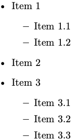

    === "Código"

        ```Latex linenums="1"
        \begin{itemize}
            \item Item 1
            \begin{itemize}
                \item Item 1.1
                \item Item 1.2
            \end{itemize}
            \item Item 2
            \item Item 3
            \begin{itemize}
                \item Item 3.1
                \item Item 3.2
                \item Item 3.3
            \end{itemize}
        \end{itemize}
        ```

!!! example "Exercício 5: Criando listas simples}\textit{Crie a lista a seguir utilizando o ambiente `enumerate`"

    === "Resultado"

        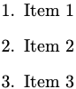

    === "Código"

        ```Latex linenums="1"
        \begin{enumerate}
            \item Item 1
            \item Item 2
            \item Item 3
        \end{enumerate}
        ```

!!! example "Exercício 6: Criando listas compostas}\textit{Crie a lista a seguir utilizando os ambientes `enumerate` e `itemize`"

    === "Resultado"

        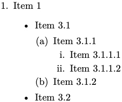

    === "Código"

        ```Latex linenums="1"
        \begin{enumerate}
            \item Item 1
            \begin{itemize}
                \item Item 3.1
                \begin{enumerate}
                    \item Item 3.1.1
                    \begin{enumerate}
                        \item Item 3.1.1.1
                        \item Item 3.1.1.2
                    \end{enumerate}
                    \item Item 3.1.2
                \end{enumerate}
                \item Item 3.2
            \end{itemize}
        \end{enumerate}
        ```

!!! example "Exercício 7: Criando listas compostas com estilo}\textit{Crie a lista a seguir utilizando os ambientes `enumerate` e `itemize` e os estilos `arabic`, `alph`, `roman` e `Alph`"

    === "Resultado"

        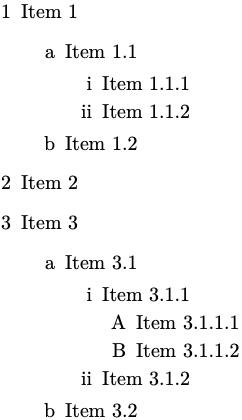    

    === "Código"

        ```Latex linenums="1"
        \renewcommand{\labelenumi}{\arabic{enumi}}
        \renewcommand{\labelenumii}{\alph{enumii}}
        \renewcommand{\labelenumiii}{\roman{enumiii}}
        \renewcommand{\labelenumiv}{\Alph{enumiv}}
        \begin{enumerate}
            \item Item 1
            \begin{enumerate}
                \item Item 1.1
                \begin{enumerate}
                    \item Item 1.1.1
                    \item Item 1.1.2
                \end{enumerate}
                \item Item 1.2
            \end{enumerate}
            \item Item 2
            \item Item 3
            \begin{enumerate}
                \item Item 3.1
                \begin{enumerate}
                    \item Item 3.1.1
                    \begin{enumerate}
                        \item Item 3.1.1.1
                        \item Item 3.1.1.2
                    \end{enumerate}
                    \item Item 3.1.2
                \end{enumerate}
                \item Item 3.2
            \end{enumerate}
        \end{enumerate}
        ```

### 2.20.3 Tabelas

Nos exercícios a seguir, utilize os exemplos apresentados na [Seção 2.14](../tabelas/#214-tabelas).

!!! example "Exercício 8: Crie a seguinte tabela utilizando o ambiente `tabular`"

    === "Resultado"

        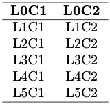

    === "Código"

        ```Latex linenums="1"
        \begin{tabular}{c c}
        \hline
        \textbf{L0C1} & \textbf{L0C2} \\
        \hline
        L1C1 & L1C2 \\
        L2C1 & L2C2 \\
        L3C1 & L3C2 \\
        L4C1 & L4C2 \\
        L5C1 & L5C2 \\
        \hline
        \end{tabular}
        ```

!!! example "Exercício 9: Criando tabelas simples}\textit{Crie a seguinte tabela utilizando o ambiente `tabular` e o pacote `lipsum`"

    === "Resultado"

        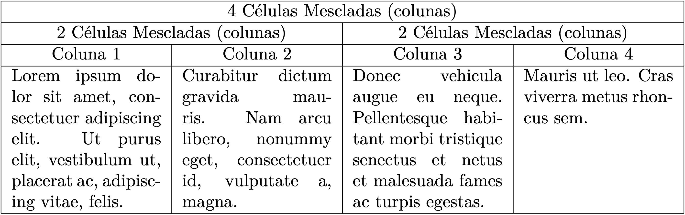

    === "Código"

        ```Latex linenums="1"
        \begin{tabular}{|p{3cm}|p{3cm}|p{3cm}|p{3cm}|}
        \hline
        \multicolumn{4}{|c|}{4 Células Mescladas (colunas)} \\
        \hline
        \multicolumn{2}{|c|}{2 Células Mescladas (colunas)} &
        \multicolumn{2}{c|}{2 Células Mescladas (colunas)} \\
        \hline
        \multicolumn{1}{|c|}{Coluna 1} &
        \multicolumn{1}{c|}{Coluna 2} &
        \multicolumn{1}{c|}{Coluna 3} & \multicolumn{1}{c|}{Coluna 4} \\
        \hline
        \lipsumsentence[1-2] & \lipsumsentence[3-4] & \lipsumsentence[5-6] &
        \lipsumsentence[7-8] \\
        \hline
        \end{tabular}
        ```

!!! example "Exercício 10: Crie a seguinte tabela utilizando o ambiente `tabular`"

    === "Resultado"

        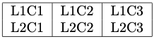

    === "Código"

        ```Latex linenums="1"
        \begin{tabular}{|l|c|r|}
        \hline
        L1C1 & L1C2 & L1C3 \\
        L2C1 & L2C2 & L2C3 \\
        \hline
        \end{tabular}
        ```

!!! example "Exercício 11: Crie a seguinte tabela utilizando o ambiente `tabular*` e a macro `textwidth`"

    === "Resultado"

        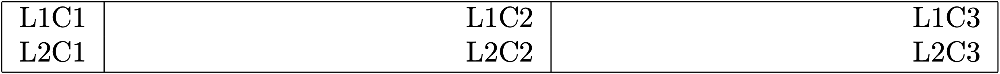

    === "Código"

        ```Latex linenums="1"
        \begin{tabular*}{\textwidth}{@{\extracolsep{\fill}}|l|c|r|}
        \hline
        L1C1 & L1C2 & L1C3 \\
        L2C1 & L2C2 & L2C3 \\
        \hline
        \end{tabular*}
        ```

!!! example "Exercício 12: Crie a seguinte tabela utilizando o ambiente `tabular` e os separadores especiais `toprule`, `midrule` e `bottomrule`"

    === "Resultado"

        

    === "Código"

        ```Latex linenums="1"
        \begin{tabular}[t]{lcc}
        \toprule
            & L1C2 & L1C3 \\
        \midrule
        L2C1 & L2C2 & L2C3 \\
        L3C1 & L3C2 & L3C3 \\
        L4C1 & L4C2 & L4C3 \\
        \bottomrule
        \end{tabular}
        ```

### 2.20.4 Matemática e Equações

Nos seguintes exercícios, utilize os exemplos apresentados na [Seção 2.13](../matematica/#213-matematica-e-equacoes) e as tabelas da [Parte 7](../simbolos/#7-outros-simbolos).

!!! example "Exercício 13: Uma matriz sem delimitadores (`matrix`)"

    === "Resultado"

        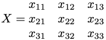

    === "Código"

        ```Latex linenums="1"
        \begin{equation*}
            X = 
            \begin{matrix} 
                x_{11} & x_{12} & x_{13} \\ 
                x_{21} & x_{22} & x_{23} \\ 
                x_{31} & x_{32} & x_{33} 
            \end{matrix}
        \end{equation*}
        ```

!!! example "Exercício 14: Uma matriz com delimitadores quadrados (`bmatrix`)"

    === "Resultado"

        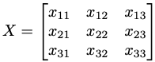

    === "Código"

        ```Latex linenums="1"
        \begin{equation*}
            X =
            \begin{bmatrix} 
                x_{11} & x_{12} & x_{13} \\ 
                x_{21} & x_{22} & x_{23} \\ 
                x_{31} & x_{32} & x_{33} 
            \end{bmatrix}
        \end{equation*}
        ```

!!! example "Exercício 15: Uma matriz com delimitadores curvos (`pmatrix`)"

    === "Resultado"

        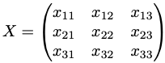

    === "Código"

        ```Latex linenums="1"
        \begin{equation*}
            X =
            \begin{pmatrix} 
                x_{11} & x_{12} & x_{13} \\ 
                x_{21} & x_{22} & x_{23} \\ 
                x_{31} & x_{32} & x_{33} 
            \end{pmatrix}
        \end{equation*}
        ```

!!! example "Exercício 16: Uma matriz com delimitadores verticais simples (`vmatrix`)"

    === "Resultado"

        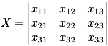

    === "Código"

        ```Latex linenums="1"
        \begin{equation*}
            X =
            \begin{vmatrix} 
                x_{11} & x_{12} & x_{13} \\ 
                x_{21} & x_{22} & x_{23} \\ 
                x_{31} & x_{32} & x_{33} 
            \end{vmatrix}
        \end{equation*}
        ```

!!! example "Exercício 17: Uma matriz com delimitadores verticais duplos (`Vmatrix`)"

    === "Resultado"

        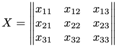

    === "Código"

        ```Latex linenums="1"
        \begin{equation*}
            X =
            \begin{Vmatrix} 
                x_{11} & x_{12} & x_{13} \\ 
                x_{21} & x_{22} & x_{23} \\ 
                x_{31} & x_{32} & x_{33} 
            \end{Vmatrix}
        \end{equation*}
        ```

!!! example "Exercício 18: Uma matriz delimitada por chaves (`Bmatrix`)"

    === "Resultado"

        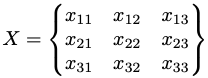

    === "Código"

        ```Latex linenums="1"
        \begin{equation*}
            X =
            \begin{Bmatrix} 
                x_{11} & x_{12} & x_{13} \\ 
                x_{21} & x_{22} & x_{23} \\ 
                x_{31} & x_{32} & x_{33} 
            \end{Bmatrix}
        \end{equation*}
        ```

!!! example "Exercício 19: A derivada $f'(a)$ da função $f(x)$ no ponto $x=a$ é o limite"

    === "Resultado"

        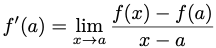

    === "Código"

        ```Latex linenums="1"
        \begin{equation*}
            f'(a) = \lim_{x \to a} \frac{f(x) - f(a)}{x - a}
        \end{equation*}
        ```

!!! example "Exercício 20: A função $f(x)$ é contínua no ponto $x=a$ se"

    === "Resultado"

        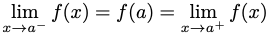

    === "Código"

        ```Latex linenums="1"
        \begin{equation*}
            \lim_{x \to a^{-}} f(x) = f(a) = \lim_{x \to a^{+}} f(x)
        \end{equation*}
        ```

!!! example "Exercício 21: A série de MacLaurin para $e^{x}$ é"

    === "Resultado"

        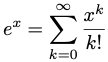

    === "Código"

        ```Latex linenums="1"
        \begin{equation*}
            e^{x} = \sum_{k=0}^{\infty} \frac{x^{k}}{k!}
        \end{equation*}
        ```

!!! example "Exercício 22: Identidade da soma de dois ângulos é"

    === "Resultado"

        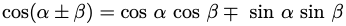

    === "Código"

        ```Latex linenums="1"
        \begin{equation*}
            \text{cos}(\alpha \pm \beta) = 
            \text{cos }\alpha \text{ cos }\beta \mp 
            \text{ sin }\alpha \text{ sin }\beta
        \end{equation*}
        ```

!!! example "Exercício 23: A integral indefinida de $\frac{1}{a+x^{2}}$ é"

    === "Resultado"

        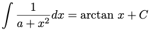

    === "Código"

        ```Latex linenums="1"
        \begin{equation*}
            \int \frac{1}{a+x^{2}}dx = \text{arctan } x + C
        \end{equation*}
        ```

!!! example "Exercício 24: Equação de Navier-Stokes para um fluxo incompressível é"

    === "Resultado"

        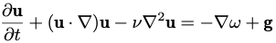

    === "Código"

        ```Latex linenums="1"
        \begin{equation*}
            \frac{\partial{\mathbf{u}}}{\partial{t}} + 
            (\mathbf{u} \cdot \nabla)\mathbf{u} - 
            \nu \nabla^2 \mathbf{u} = - \nabla \omega + \mathbf{g}
        \end{equation*}
        ```

!!! example "Exercício 25: O Teorema de Green é dado por"

    === "Resultado"

        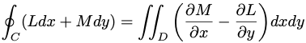

    === "Código"

        ```Latex linenums="1"
        \begin{equation*}
            \oint_C (Ldx + Mdy) = \iint_D \bigg(\frac{\partial{M}}
            {\partial{x}} - \frac{\partial{L}}{\partial{y}}\bigg)dxdy
        \end{equation*}
        ```

!!! example "Exercício 26: A Equação de Poisson é"

    === "Resultado"

        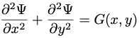

    === "Código"

        ```Latex linenums="1"
        \begin{equation*}
            \frac{\partial^{2}\Psi}{\partial x^{2}} +
            \frac{\partial^{2}\Psi}{\partial y^{2}} = G(x,y)
        \end{equation*}
        ```

!!! example "Exercício 27: A Equação de Laplace é"

    === "Resultado"

        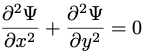    

    === "Código"

        ```Latex linenums="1"
        \begin{equation*}
            \frac{\partial^{2}\Psi}{\partial x^{2}} + 
            \frac{\partial^{2}\Psi}{\partial y^{2}} = 0
        \end{equation*}
        ```

!!! example "Exercício 28: A Equação de Fourier (ou da condução do calor) é"

    === "Resultado"

        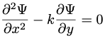

    === "Código"

        ```Latex linenums="1"
        \begin{equation*}
            \frac{\partial^{2}\Psi}{\partial x^{2}} -
            k\frac{\partial\Psi}{\partial y} = 0
        \end{equation*}
        ```

!!! example "Exercício 29: A Equação de D'Alembert (ou da onda) é"

    === "Resultado"

        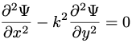

    === "Código"

        ```Latex linenums="1"
        \begin{equation*}
            \frac{\partial^{2}\Psi}{\partial x^{2}} - 
            k^{2}\frac{\partial^{2}\Psi}{\partial y^{2}} = 0
        \end{equation*}
        ```

!!! example "Exercício 30: O Teorema dos Números Primos é dado por"

    === "Resultado"

        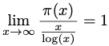

    === "Código"

        ```Latex linenums="1"
        \begin{equation*}
            \lim_{x \to \infty} 
            \frac{\pi(x)}{\frac{x}{\text{log}(x)}} = 1
        \end{equation*}
        ```

!!! example "Exercício 31: A fórmula geral da série de Taylor é"

    === "Resultado"

        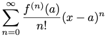

    === "Código"

        ```Latex linenums="1"
        \begin{equation*}
            \sum_{n=0}^{\infty} \frac{f^{(n)}(a)}{n!}(x-a)^n
        \end{equation*}
        ```

!!! example "Exercício 32: O Teorema de Stokes é dado por"

    === "Resultado"

        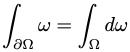

    === "Código"

        ```Latex linenums="1"
        \begin{equation*}
            \int_{\partial{\Omega}} \omega = \int_{\Omega} d\omega
        \end{equation*}
        ```

!!! example "Exercício 33: A propriedade adjunta do produto tensorial é"

    === "Resultado"

        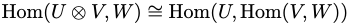

    === "Código"

        ```Latex linenums="1"
        \begin{equation*}
            \text{Hom}(U \otimes V, W) \cong 
            \text{Hom}(U, \text{Hom}(V,W))
        \end{equation*}
        ```

!!! example "Exercício 34: A definição da transformada de Laplace é dada por"

    === "Resultado"

        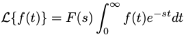

    === "Código"

        ```Latex linenums="1"
        \begin{equation*}
            \mathcal{L} \lbrace f(t) \rbrace = 
            F(s) \int_{0}^{\infty} f(t) e^{-st} dt
        \end{equation*}
        ```
  
!!! example "Exercício 35: A fórmula da inversa de uma matriz é"

    === "Resultado"

        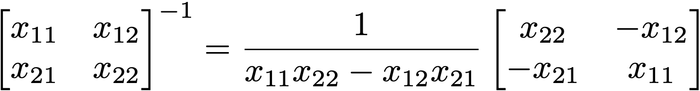

    === "Código"  

        ```Latex linenums="1"
        \begin{equation*}
            \begin{bmatrix}
                x_{11} & x_{12} \\
                x_{21} & x_{22} \\
            \end{bmatrix}^{-1} 
            = \frac{1}{x_{11}x_{22} - x_{12}x_{21}} 
            \begin{bmatrix}
                x_{22} & -x_{12}  \\
                -x_{21} &  x_{11} \\
            \end{bmatrix}
        \end{equation*}
        ```
  
!!! example "Exercício 36: A fórmula do produto infinito pode ser escrita como"

    === "Resultado"

        

    === "Código"

        ```Latex linenums="1"
        \begin{equation*}
            \text{sin }x = x \prod^{\infty}_{n=1} 
            \bigg(1 - \frac{x^2}{\pi^{2} n^{2}} \bigg)
        \end{equation*}
        ```