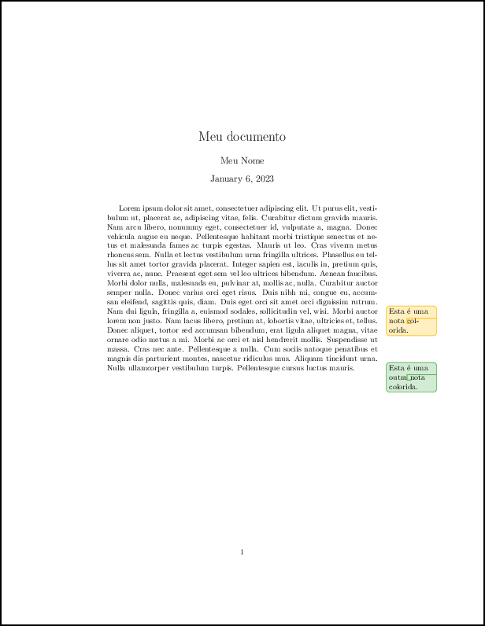
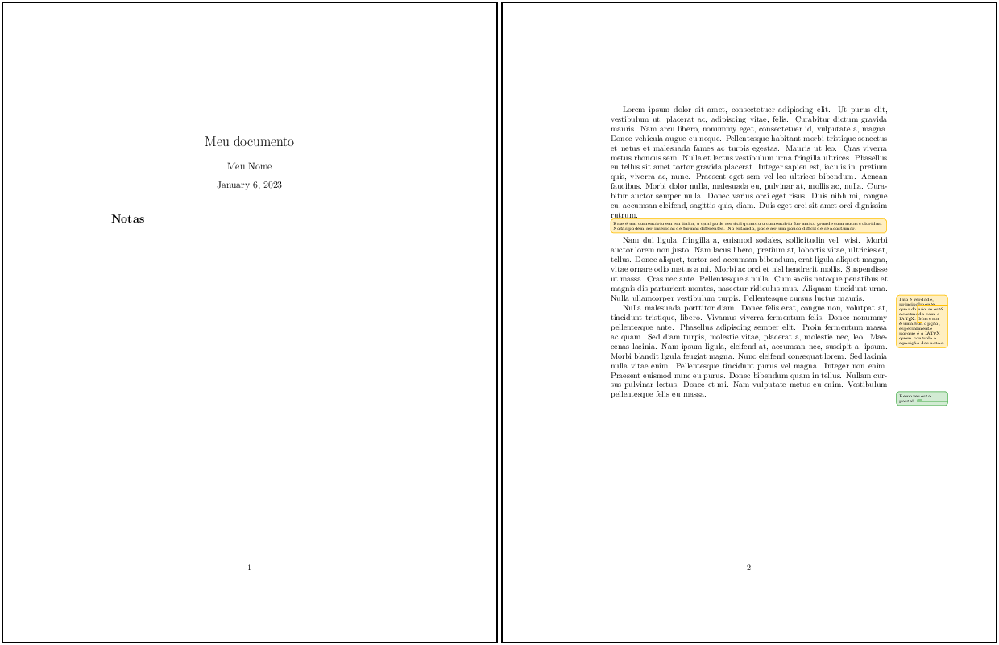

# 2. Entendendo o LaTeX

## 2.15 Ferramentas de revisão

A colaboração entre várias pessoas na escrita de um documento, pode mostrar-se como um verdadeiro desafio. Mesmo utilizando editores do tipo WYSIWYG, como o *Microsoft Word*, unificar as diferentes versões de um documento por ser uma tarefa confusa e que certamente irá consumir muito tempo. Para isto, pode-se recorrer a ferramentas de revisão mais elaboradas como o *track changes*, que permite rastrear as modificações feitas em um documento. Mas para a escrita com a linguagem LaTeX, esta tarefa não é exatamente igual. Editores *online*, como o [*Overleaf*](https://www.overleaf.com/), são muito úteis e eficientes quanto à revisão, histório do documento e escrita colaborativa. Mas para editores locais, é possível utilizar alguns pacotes que irão habilitar a utilização da linguagem para a revisão, de forma semelhante ao que ocorre com editores WYSIWYG.

O pacote `todonotes`, pode ser utilizado nesta tarefa. Com ele é possível inserir notas coloridas no documento de forma que se possa chamar a atenção para alguma parte do texto. Veja o [Exemplo 1](#todo1) a seguir com a sua utilização.

!!! example "<a id="todo1"></a>Exemplo 1: Inserindo notas coloridas no texto com o pacote `todonotes`"

    === "Código"

        ```Latex linenums="1"
        \documentclass{article}

        \usepackage[utf8]{inputenc}
        \usepackage{xargs}
        \usepackage{xcolor-material}
        \usepackage{lipsum}

        \usepackage{todonotes}

        \newcommandx{\minhanotaA}[2][1=]{
          \todo[linecolor=MaterialAmber,
          backgroundcolor=MaterialAmber!25,
          bordercolor=MaterialAmber,#1]{#2}
        }

        \newcommandx{\minhanotaV}[2][1=]{
          \todo[linecolor=MaterialGreen,
          backgroundcolor=MaterialGreen!25,
          bordercolor=MaterialGreen,#1]{#2}
        }

        \title{Meu documento}
        \author{Meu Nome}
        \date{\today}

        \begin{document}

        \maketitle

        \lipsum[1]\minhanotaA{Esta é uma nota colorida.}
        \lipsum[2]\minhanotaV{Esta é uma outra nota colorida.}

        \end{document}
        ```

    === "Resultado"

                

No [Exemplo 1](#todo1), observe que, além dos pacotes `inputenc` e `xcolor-material` (os quais fornecem suporte à acentuação e a paleta de cores *Material Design* do Google, respectivamente), foi necessário também carregar os pacotes `xargs` e `todonotes`. O pacote `xargs` permite a definição de comandos utilizando-se múltiplos argumentos. O pacote `todonotes` é o que fornece a interface necessária para a inserção das notas personalizadas. Além disso, observe também que forma definidos dois comandos (duas *macros*) de nomes `minhanotaA` e `minhanotaB`, os quais recebem um argumento que, de fato, é a nota que será inserida no texto. Na definição do comando `minhanota`, foram ajustadas as seguintes opções: `linecolor`, `backgroundcolor` e `bordercolor`. Estas opções fazem referência ao aspecto que as notas inseridas terão. Neste caso, escolheu-se a cor *MaterialAmber* para a nota (uma variação da cor Ambar), fornecida pelo pacote `xcolor-material`. Observe também que a cor atribuída à opção `backgroundcolor` está definida como `backgroundcolor=MaterialAmber!25`, i.e., da saturação total (100%) da cor natural, removeu-se 25%. Logo, o modificador `!25`, indica a transparência de 25% na aplicação da cor escolhida (mais opções de cores e paletas de cores podem ser encontradas na [Seção 2.6](../cores/#26-cores-e-paletas-de-cores)).

O pacote `todonotes` permite a criação alguns tipos diferentes de notas. Pode-se, por exemplo, inserir notas que ocupam toda a largura do texto ou mesmo notas que não aparecem no texto. Pode-se também inserir um sumário com as notas, o que pode ser especialmente útil quando muitas notas de diferentes tipos são adicionadas. Veja o [Exemplo 2](#todo2) a seguir com várias notas diferentes e um sumário de notas (este exemplo é baseado no exemplo encontrado [https://tex.stackexchange.com/questions/9796/how-to-add-todo-notes](https://tex.stackexchange.com/questions/9796/how-to-add-todo-notes)).

!!! example "<a id="todo2"></a>Exemplo 2: Inserindo notas coloridas no texto com o pacote `todonotes`"

    === "Código"

        ```Latex linenums="1"
        \documentclass{article}

        \usepackage[utf8]{inputenc}
        \usepackage{xargs}
        \usepackage{lipsum}

        \usepackage{xcolor-material}
        \usepackage[colorinlistoftodos,
                    prependcaption,
                    textsize=tiny]{todonotes}
            
        \newcommandx{\comentario}[2][1=]{
          \todo[linecolor=MaterialAmber,
          backgroundcolor=MaterialAmber!25,
          bordercolor=MaterialAmber,#1]{#2}
        }
        \newcommandx{\remover}[2][1=]{
          \todo[linecolor=MaterialGreen,
          backgroundcolor=MaterialGreen!25,
          bordercolor=MaterialGreen,#1]{#2}
        }

        \title{Meu documento}
        \author{Meu Nome}
        \date{\today}

        \begin{document}
        \maketitle
        \listoftodos[Notas]
        \newpage
        \lipsum[1]\comentario[inline]{Este é um comentário em em linha, o qual pode ser útil quando o comentário for muito grande com notas coloridas. Notas podem ser inseridas de formas diferentes. No entando, pode ser um pouco difícil de se acostumar.}

        \lipsum[2]\comentario{Isso é verdade, principalmente quando não se está acostmado com o \LaTeX{}. Mas esta é uma boa opção, especialmente porque é o \LaTeX{} quem controla a aparição das notas.}

        \lipsum[3]\remover{Remover esta parte!}
        \end{document}
        ```

    === "Resultado"

        

No [Exemplo 2](#todo2), observe que foram passadas opções para o pacote `todonotes`. Estas opções foram fornecidas junto com o comando `usepackage`. A primeira opção, `colorlistoftodos`, permite a criação de uma lista de notas, tal como um sumário; a segunda opção, `textsize=tiny`, ajusta o tamanho do texto dentro da nota para o tamanho `tiny` (veja mais opções de tamanho de fontes na [Seção 2.4](../tipos_letras/#24-tipos-tamanhos-e-estilos-de-letras)). A inserção das notas criadas é simples, bastando digitar o comando definido junto com o texto que será inserido na nota, e.g., `\comentario{Meu comentário.}`. Para inserir uma nota em linha, i.e., uma nota que ocupa toda a largura do texto (especialemnte útil quando o texto da nota ocupar várias linhas), pode-se usar a opção `inline` junto com o comando definido, e.g., `\comentatio[inline]{Meu comentário muito longo escrito em linha.}`. Por fim, uma lista com as notas pode ser inserida com o comando `\listoftodos[Nome da Lista]`. Este comando pode ser inserido em qualquer parte do texto. Conheça mais sobre o pacote `todonotes` no site do CTAN em [https://www.ctan.org/pkg/todonotes](https://www.ctan.org/pkg/todonotes).

!!! tip "Dica"

    Veja também o pacote `cooltooltips` no site do CTAN em [https://ctan.org/pkg/cooltooltips](https://ctan.org/pkg/cooltooltips). Este pacote fornece uma forma diferente de inserir comentários dentro de um documento LaTeX.