# 2. Entendendo o LaTeX

## 2.12 Figuras

Figuras podem ser incluídas em um documento LaTeX de formas variadas. Dependendo da complexidade da informação apresentada, ambientes específicos devem ser utilizados para organizar não apenas a apresentação, mas também a redação do documento.

Uma figura pode ser incluída de forma simples utilizando o comando `\includegraphics[]{}`.

!!! example "<a id="exe_fig1"></a>Exemplo 1: Incluindo figura com o comando `includegraphics`"

    === "Código"

        ```Latex linenums="1"
        \includegraphics[width=3cm]{example-image-a}
        \includegraphics[width=3cm]{example-image-golden}
        \includegraphics[width=3cm]{example-grid-100x100pt}
        \includegraphics[height=5cm]{example-image-b} 
        \includegraphics[scale=0.5]{example-image-c} 
        \includegraphics[width=3cm]{example-image}
        ```

    === "Resultado"

        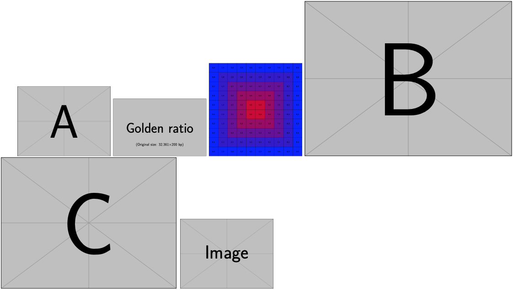

No [Exemplo 1](#exe_fig1), observe que o marcador `\includegraphics` aceita algumas opções que são delimitadas por um par de `[]`'s (conchetes). Pode-se especificar, por exemplo, o tamanho da figura com as opções `width`, `height` ou `scale`. Além disso, pode-se também utilizar as macros da [Tabela 2](./medidas.md#tab:meds_padrao). Para isto, veja o [Exemplo 1](./medidas.md#exe_meds1).

!!! tip "Dica"

    As imagens do [Exemplo 1](#exe_fig1) acima foram incluídas com o pacote `graphicx` que possui diversas imagens de exemplos. Veja mais sobre este pacote em [https://www.ctan.org/pkg/graphicx](https://www.ctan.org/pkg/graphicx).

### 2.12.1 Ambientes de figuras

Assim como mostrado no [Exemplo 1](#exe_fig1), a forma mais simples de incluir figuras em um documento LaTeX, é a partir do comando `\includegraphics[]{}`. Observe que este comando (assim como a maioria dos comandos e marcadores da linguagem) possui uma seção de opções (ou argumentos) que são indicados entre os colchetes e o caminho para a imagem em si, que é informada entre as chaves. Veja o [Exemplo 2](#exe_incgraphs) a seguir:

!!! example "<a id="exe_incgraphs"></a>Exemplo 2: Incorporando uma figura com o comando `includegraphics`"

    === "Código"

        ```Latex linenums="1"
        \includegraphics[width=3cm]{example-image-a}
        ```

    === "Resultado"

        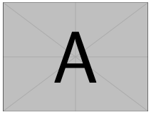

Entretanto, observe que apenas inserimos uma figura, mas não definimos uma posição relativa ao parágrafo ou à página e que também não há uma legenda atribuída à figura. Para isso, é necessário incorporar o comando `\includegraphics[]{}` dentro de um ambiente específico que permita o seu posicionamento relativo, além da edição de outros atributos referentes à figura. Este ambiente, é o ambiente `figure`. O [Exemplo 3](#exe_ambfig) a seguir, mostra como o ambiente `figure` é utilizado:

!!! example "<a id="exe_ambfig"></a>Exemplo 3: Incorporando uma figura com o comando `includegraphics` dentro do ambiente `figure`"

    === "Código"

        ```Latex linenums="1"
        \begin{figure}[H]
            \includegraphics[width=3cm]{example-image-a}
            \caption{Esta é uma imagem de exemplo com a letra ``A''no meio.}
        \end{figure}
        ```

    === "Resultado"

        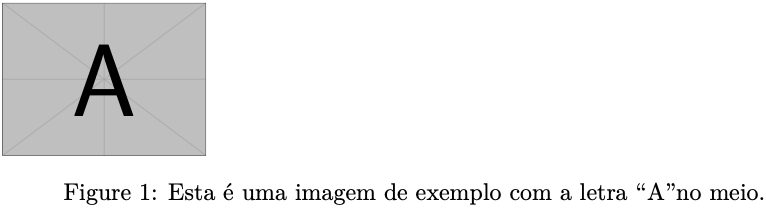

No [Exemplo 3](#exe_ambfig), note que foi utilizado também o comando `caption`, utilizado para inserir a legenda da figura.

O ambiente `figure` deve ser configurado para possuir uma das seguintes posições relativas:

<a id="tab:ambfig"></a>

**Tabela 1:** Opções de posicionamento relativo do ambiente `figure`. **Fonte:** Adaptado de [https://www.overleaf.com/learn/latex/Positioning_of_Figures](https://www.overleaf.com/learn/latex/Positioning_of_Figures).

| Opção | Descrição |
|-------|-----------|
| `h` | Posiciona o ambiente "aqui" (`h` vem do inglês *here*). A posição exata pode variar dependendo dos outros elementos textuais |
| `t` | Posiciona o ambiente no "topo" da página (`t`} vem do inglês *top*)                                                          |
| `b` | Posiciona o ambiente na "base" da página (`b` vem do inglês *bottom*)                                                        |
| `p` | Posiciona o ambiente em uma "página" separada (`p` vem do inglês *page*)                                                     |
| `!` | Força o LaTeX a usar a posição textual onde o ambiente se encontra (e.g., `h!`)                                              |
| `H` | Posiciona o ambiente precisamente no local em que se encontra (depende do pacote `float` e é equivalente a `h!`)             |

As opções de posicionamento relativo apresentados na [Tabela 1](#tab:ambfig), também servem para o posicionamento de ambientes de tabelas, como apresentado na [Seção ](../tabelas/#214-tabelas). No [Exemplo 4](#exe_ambfig_H) é mostrado o posicionamento de uma figura utilizando a posição relativa `H`:

!!! example "<a id="exe_ambfig_H"></a>Exemplo 4: Incorporando uma figura com o comando `includegraphics` dentro do ambiente `figure` com a posição relativa `H`"

    === "Código"

        ```Latex linenums="1"
        \lipsum[1]
        \begin{figure}[H]
            \includegraphics[width=3cm]{example-image-a}
            \caption{Esta é uma imagem de exemplo com a letra ``A'' no meio.}
        \end{figure}
        \lipsum[2]
        ```

    === "Resultado"

        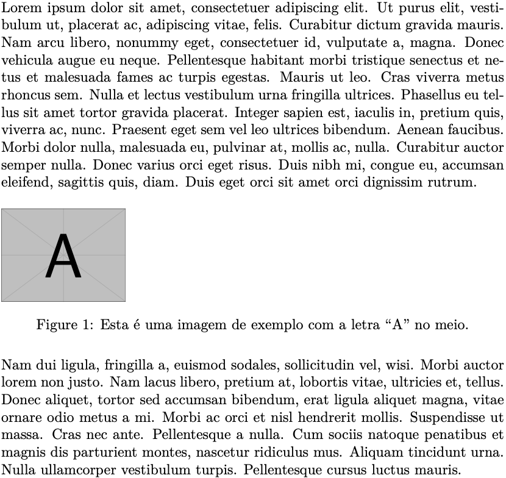

!!! note "Nota"

    No estilo do INPE (apresentado na [Parte 3](../estilo_inpe/#3-estilo-do-inpe)), o ambiente padrão para o posicionamento do ambiente `figure` é `H`.

Uma vez definido o posicionamento relativo (i.e., relativo ao parágrafo ou página), pode-se centralizar a figura utilizando-se o marcador `\centering` ou o ambiente `center`. O [Exemplo 5](#exe_ambfig_center) mostra estas duas opções:

!!! example "<a id="exe_ambfig_center"></a>Exemplo 5: Centralizando figuras dentro do ambiente `figure`"

    === "Código"

        ```Latex linenums="1"
        \lipsum[1]
        \begin{figure}[H]
        \centering
        \includegraphics[width=3cm]{example-image-a}
        \caption{Esta é uma imagem de exemplo com a letra ``A'' no meio.}
        \end{figure}
        \lipsum[2]
        \begin{figure}[H]
            \begin{center}
                \includegraphics[width=3cm]{example-image-b}
                \caption{Esta é uma outra imagem de exemplo com a letra ``B'' no meio.}
            \end{center}
        \end{figure}
        ```

    === "Resultado"

        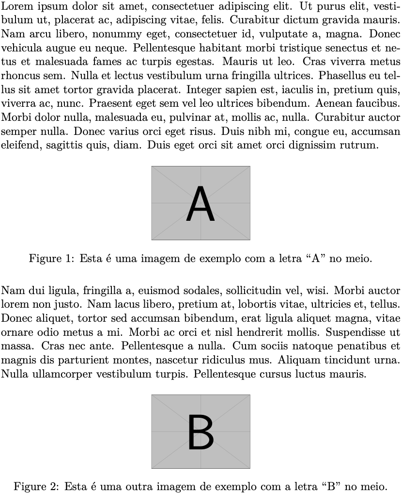

No [Exemplo 5](#exe_ambfig_center), observe que ambos, o marcador `centering` e o ambiente `center`, devem ser colocados dentro do ambiente `figure`.

O ambiente `figure` permite também que figuras sejam posicionadas lado-a-lado. Para isso, pode-se utilizar o comando `subfigure`. O comando `subfigure` tem a sintaxe `\subfigure[]{}`. Veja o [Exemplo 6](#exe:subfigure1) a seguir:

!!! example "<a id="exe:subfigure1"></a>Exemplo 6: Inserindo uma ou mais figuras lado-a-lado com o comando `subfigure`"

    === "Código"

        ```Latex linenums="1"
        \begin{figure}[H]
            \begin{center}
                \subfigure[Figura ``A'']
                {\includegraphics[width=0.45\textwidth]{example-image-a}}
                \subfigure[Figura ``B'']
                {\includegraphics[width=0.45\textwidth]{example-image-b}}
                \caption{Um exemplo de duas imagens lado-a-lado.}
            \end{center}
        \end{figure}
        ```

    === "Resultado"

        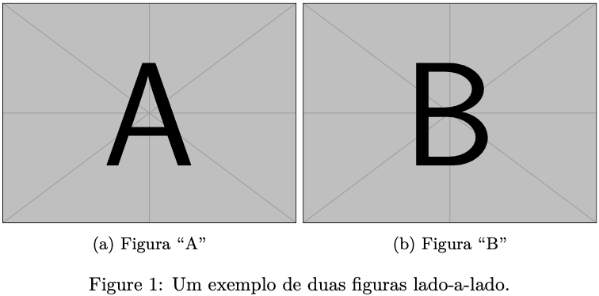

No [Exemplo 6](#exe:subfigure1), observe que o comando `caption` foi inserido como legenda da figura, enquanto que as imagens "A" e "B" possuem legendas separadas.

Dependendo do tamanho ajustado para cada figura dentro do ambiente `subfigure`, o LaTeX tentará posicionar as figuras ou lado-a-lado, ou empilhadas. Veja no [Exemplo 7](#exe:subfigure2) a seguir e compare com o anterior:

!!! example "<a id="exe:subfigure2"></a>Exemplo 7: Inserindo uma ou mais figuras empilhadas com o comando `subfigure`"

    === "Código"

        ```Latex linenums="1"
        \begin{figure}[H]
            \begin{center}
                \subfigure[Figura ``A'']
                {\includegraphics[width=0.5\textwidth]{example-image-a}}
                \subfigure[Figura ``B'']
                {\includegraphics[width=0.5\textwidth]{example-image-b}}
                \caption{Um exemplo de duas imagens empilhadas.}
            \end{center}
        \end{figure}
        ```

    === "Resultado"

        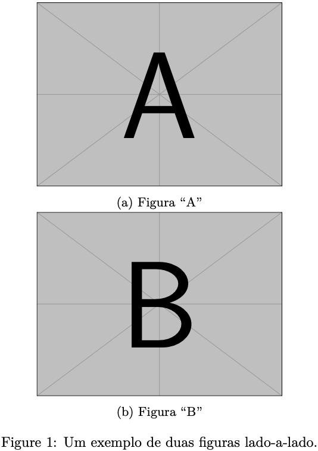

Nos Exemplos [6](#exe:subfigure1) e [7](#exe:subfigure2), observe que para cada figura inserida dentro do ambiente `figure`, uma legenda foi inserida. Esta legenda é informada como um parâmetro do comando `subfigure`, sendo este inserido dentro dos colchetes (como em `subfigure[Figura "A"]`). 

Outros pacotes também estão disponíveis para a inserção de figuras lado-a-lado (ou empilhadas). Para estas situações, recomenda-se a utilização de um dos pacotes a seguir: `subfig`, `subfloat` ou `subcaption`. Segundo a página do pacote `subfig` no CTAN (disponível em [https://www.ctan.org/pkg/subfig](https://www.ctan.org/pkg/subfig)), o pacote `subfigure` é obsoleto e por esta razão, o seu uso não é mais recomendado. Porém, o estilo para teses e dissertações do INPE ainda utiliza o pacote `subfigure`. A utilização de ambos os pacotes é possível, mas deverão ocorrer alguns efeitos indesejados, como o aparecimento de parênteses duplos na indexação das subfiguras que forem geradas com o pacote `subfloat`. Portanto, a melhor opção é não misturar a utilização destes pacotes. Se for necessário utilizar um desses pacotes (ao invés do pacote `subfigure`), verifique as instruções na [Parte 3](../estilo_inpe/#3-estilo-do-inpe). 

!!! tip "Dica"

    Para saber mais sobre o pacote `subfig` e as suas aplicações, tenha como referência a página do pacote no CTAN em [https://www.ctan.org/pkg/subfig](https://www.ctan.org/pkg/subfig).

### 2.12.2 Formatos de Figuras

Figuras podem ser incorporadas a partir de diferentes formatos em um documento LaTeX. Os formatos preferenciais, entretanto, são o *Portable Document Format* (PDF) e o *Encapsulated PostScript* (EPS). Estes formatos são vetoriais e permitem, por exemplo, a impressão em alta resolução das figuras. Outra vantagem que se adquire com a incorporação de figuras nestes formatos, é a capacidade de *zoom* do documento, i.e., um documento no formato PDF com imagem PDF embutidas, pode ser aumentado no visualizador de documentos sem perda de qualidade.

É possível converter formatos como o *Portable Network Graphics* (PNG), *Graphics Interchange Format* (GIF) e *Joint Photographic Experts Group* (JPEG) para os formatos PDF e EPS. Para tanto, recomenda-se a utilização do programa [*Imagemagick*](https://imagemagick.org/index.php) para esta conversão (disponível para os sistemas *Microsoft Windows*, Linux e Mac OS). Conversores *online* também podem ser utilizados para esta finalidade.

O *Imagemagick* possui um *script* chamado `convert`[^5] que pode ser utilizado para realizar a conversão entre estes formatos. A utilização básica do comando `convert`, é a seguinte:

[^5]: Este *script* é nativo, i.e., uma vez instalado no computador, ele estará disponível através da linha de comando.

=== "Comando"

    ```Bash linenums="1"
    convert -i figura.ext1 -o figura.ext2
    ```

Onde `ext1` e `ext2` são dois formatos de figuras distintos.

Para converter imagens em lotes utilizando o comando `convert`, pode-se utilizar o comando a seguir (em linguagem *Bash*):

=== "Comando"

    ```Bash linenums="1"
    for i in $(ls *.png); do j=$(echo $i | sed 's,.png,.pdf,g'); convert -i $i -o $j; done
    ```

Em outras situações, pode ser necessário remover os espaços em branco nas margens das figuras. Isso pode ser útil especialmente quando deseja-se incluir figuras lado a lado. Para isso, pode-se utilizar o *script* [`autotrim`](http://www.fmwconcepts.com/imagemagick/autotrim/index.php) (que faz uso do comando `convert`). A utilização básica do *script* `autotrim` é a seguinte:

=== "Comando"

    ```Bash linenums="1"
    autotrim -i figura.png -o figura_crop.png
    ```

É possível também utilizar o comando `autotrim` para processar imagens em lotes. Para isto, pode-se utilizar o comando a seguir (em linguagem *Bash*):

=== "Comando"

    ```Bash linenums="1"
    for i in $(ls *.png); do j=$(echo $i | sed 's,.png,.-crop.png,g'); autotrim -i $i -o $j; done
    ```

!!! tip "Dica"

    Veja a página [http://www.fmwconcepts.com/imagemagick/index.php](http://www.fmwconcepts.com/imagemagick/index.php) com diversos exemplos e *scripts* úteis do *Imagemagick*.

Outro fator que pode impactar significativamente no tempo de compilação de um documento LaTeX, além da quantidade de figuras, é o formato. Dependendo do compilador utilizado, é preferível utilizar imagens no formato PDF. Se este for o caso, pode-se utilizar o programa `gs` (*Ghostview*) para reduzir ao máximo o tamanho das imagens em PDF. Isso pode ser feito da seguinte forma (em linguagem *Bash*):

=== "Comando"

    ```Bash linenums="1"
    for i in $(ls *pdf); do echo $i; j=$(echo $i | sed "s,.pdf,,g"); gs -sDEVICE=pdfwrite -dCompatibilityLevel=1.4 -dPDFSETTINGS=/screen -dNOPAUSE -dQUIET -dBATCH -sOutputFile=${j}_c.pdf $i; done
    ```

!!! tip "Dica"

    Para mais exemplos sobre a incorporação e conversão entre formatos de arquivos de imagens, tenha como referência a página [https://en.wikibooks.org/wiki/LaTeX/Importing_Graphics](https://en.wikibooks.org/wiki/LaTeX/Importing_Graphics).

### 2.12.3 Construindo figuras

Figuras no LaTeX podem ser desenhadas utilizando pacotes específicos. As figuras podem ser incorporadas a partir de arquivos `.tex` separados ou desenhadas em ambientes apropriados. O pacote TikZ é um pacote do LaTeX orientado para a construção de diagramas. Com ele pode-se criar diferentes tipos de gráficos, grafos, diagramas etc, que são compatíveis com o formato *Scalable Vector Graphics* (SVG). Com o pacote PS*Tricks*, é possível criar imagens vetoriais complexas utilizando o interpretador do *GhostScript*. A diferença entre estes dois pacotes está relacionada com a forma como os seus resultados são interpretados e as suas imagens compiladas dentro de um documento LaTeX.

Para facilitar o desenho de diagramas, recomenda-se a utilização do programa [LaTeX*Draw*](http://latexdraw.sourceforge.net) (em Java), disponível para os sistemas operacionais mais populares. A vantagem deste programa está na possibilidade de exportar o diagrama criado para o formato LaTeX puro, PS*Tricks*, PNG, JPEG ou PDF. Na [Figura 1](#fig:ciclo), apresenta-se um diagrama construído no programa LaTeX*Draw*, contendo elementos geométricos e equações embutidas.

<a id="fig:ciclo"></a>

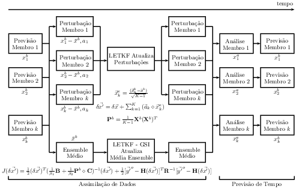

**Figura 1:** Um diagrama complexo com elementos geométricos e equações. **Fonte:** Adaptado de \citeonline{bastarz/2017}.

!!! tip "Dica"

    A página [https://tug.org/PSTricks/main.cgi?file=index](https://tug.org/PSTricks/main.cgi?file=index) apresenta muitos exemplos de desenhos feitos com o PS*Tricks*.

A utilização do programa LaTeX*Draw* é bastante simples. Na [Figura 2](#fig:interld) mostra-se a interface principal do programa, onde pode-se ver o menu principal, a barra de ferramentas e a área em que os desenhos e diagramas podem ser feitos.

<a id="fig:interld"></a>

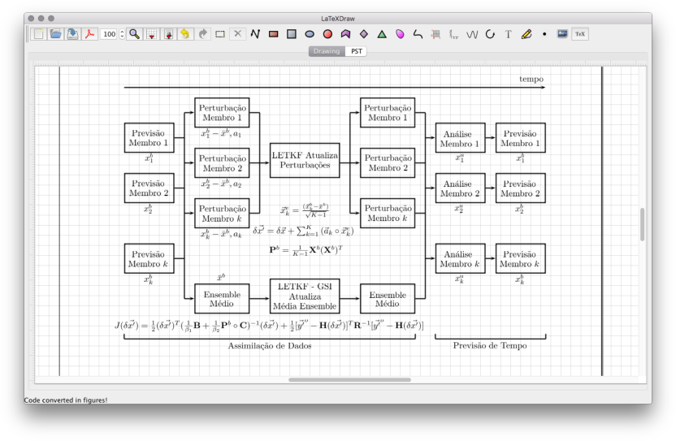

**Figura 2:** Um programa para criação e diagramas e figuras simples.

Na [Figura 2](#fig:interld), observe que há duas abas: *Drawing* e "PST". Na aba *Drawing*, é onde são feitos os desenhos. Utilizam-se as ferramentas de desenho disponíveis na barra de ferramentas, onde podem ser utilizadas as ferramentas de inserção de figuras geométricas e texto, incluindo equações (modo matemático do LaTeX).

<a id="fig:ldraw2"></a>

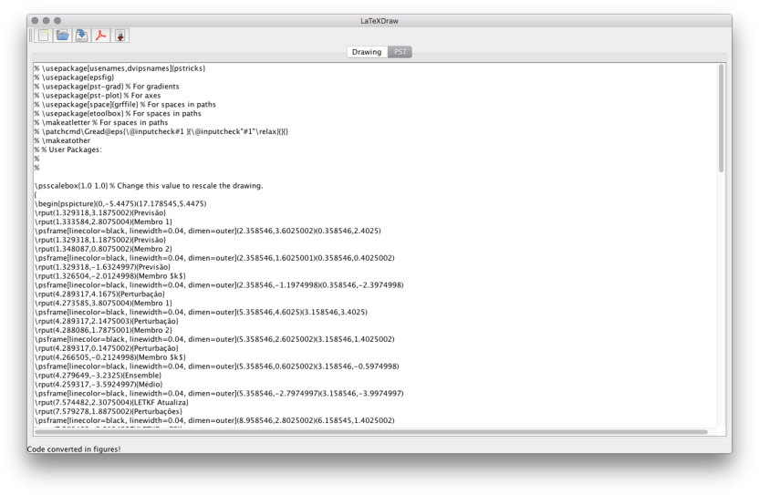

**Figura 3:** Aba "PST".

Na aba "PST", uma vez que algum desenho é inserido na aba *Drawing*, pode-se obter o código PS*Tricks* que gera o desenho inserido. Este código pode ser copiado para um arquivo LaTeX (dentro de um ambiente apropriado), que pode então ser utilizado como fonte. A compilação do documento LaTeX irá compilar e apresentar o desenho também dentro do corpo do texto. De forma convencional, pode-se exportar o desenho para um formato apropriado (e.g., PDF, PNG etc) e então inserir o desenho utilizando os ambientes apresentados na [Seção 2.12](../figuras/#212-figuras).

<a id="fig:ldraw3"></a>

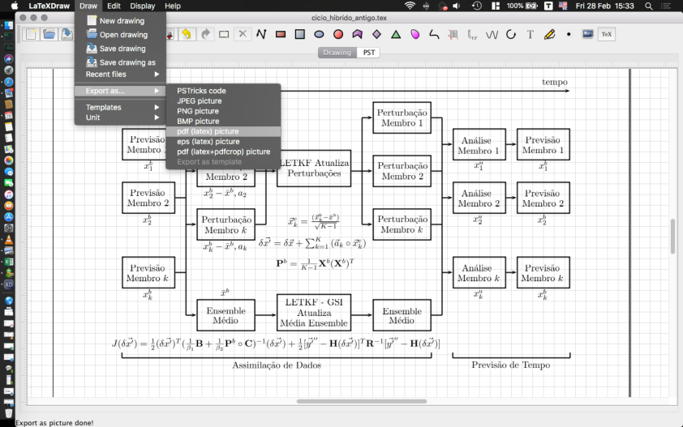

**Figura 4:** Exportando uma figura para o formato PDF.

!!! tip "Dica"

    Outro programa que também pode ser utilizado para a construção de figuras e diagramas é o Dia. Este programa também permite exportar os desenhos para os formatos PNG, PDF, EPS entre outros, além do próprio LaTeX (como uma figura *PSTricks*). Veja mais informações sobre o Dia em [http://dia-installer.de/](http://dia-installer.de/).