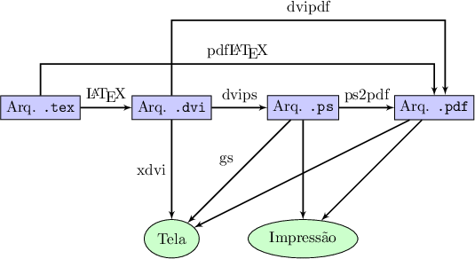
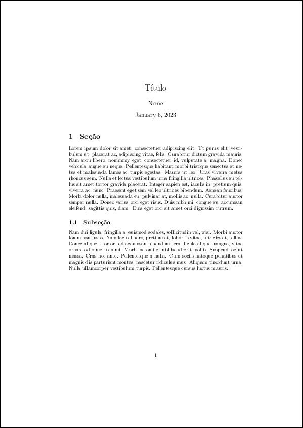

# 2. Entendendo o LaTeX

## 2.1 Introdução ao LaTeX

Com o interpretador do LaTeX instalado no computador, ao longo das seções deste capítulo, serão dados os primeiros passos no aprendizado da linguagem. Vale ressaltar que o objetivo não é aprender ou treinar de forma exaustiva a linguagem, mas levar o leitor a compreender como e quando utilizar a linguagem. Dessa forma, serão introduzidos os comandos e estruturas principais da linguagem que são mais frequentemente utilizados.

Antes de iniciar com a utilização da linguagem, é necessário compreender como o LaTeX funciona e de que maneira ele é utilizado. A escrita de um documento em linguagem LaTeX, independente do tipo de editor utilizado (e.g., em linha de comando ou utilizando um editor do tipo WYSIWYG), o usuário estará sempre escrevendo o código fonte do que virá a ser o seu documento, no formato escolhido com suas tabelas, imagens, equações etc.

No LaTeX as palavras são marcadas a partir da utilização de instruções especiais que constituem as *macros* da linguagem. *Macros* são um conjunto de instruções que podem ser resumidas por um mnemônico (um nome) e que simplificam o uso daquele conjunto de instruções. Pode-se separar estas *macros* em **marcadores** e **comandos**. Ambas as instruções são *macros* da linguagem, mas esta separação é útil para que o leitor possa aprender a identificar de forma mais rápida as estruturas da linguagem. Sendo assim, em geral um marcador tem o seguinte aspecto `\marcador{}`, e um comando, tem em geral, o seguinte aspecto `\comando[]{}`. As diferenças entre estes dois tipos de *macros* é sutil, mas observe que um comando possui dois espaços delimitados por um par de `[]`'s (colchetes) e por um par de `{}`'s (chaves), que servem para ajustar as opções e as instruções do comando, respectivamente. No caso dos marcadores, o argumento é a própria palavra que se deseja marcar.

Um documento LaTeX contém, portanto, as instruções que marcam e formatam o texto puro inserido. Esta formatação é feita a partir de um interpretador da linguagem que se encarrega de formatar e apresentar o arquivo final no formato adequado. A [Figura 1](#fig:complatex) mostra um diagrama com as etapas envolvidas na compilação[^1] de um documento LaTeX até a sua apresentação final.

[^1]: A palavra "compilação" está sendo utilizada no sentido de que todas as partes de um documento LaTeX são reunidas e formatadas, a partir do que se obtém o documento final.

<a id="fig:complatex"></a>



**Figura 1:** Compilação de um documento LaTeX. **Fonte:** Adaptado de [http://www.texample.net/tikz/examples/tex-workflow/](http://www.texample.net/tikz/examples/tex-workflow/).

Na [Figura 1](#fig:complatex), observe que o compilador puro `latex` da linguagem, cria um documento na extensão `.dvi`. Esta extensão, *Device Independent Format* (DVI), é o formato original dos documentos compilados pela linguagem e faz parte apenas do ecossistema do LaTeX/LaTeX. Por outro lado, é muito comum obter documentos no formato *Portable Document Format* (PDF), o qual suporta mais cores, permite melhores níveis de compressão e é formato padrão de documento eletrônicos. Para isto, a partir do compilador `latex`, pode-se utilizar algum tipo de conversor (e.g., `dvi2ps`) e então, converter para o formato PDF a partir do documento *PostScript* (PS). Nesta etapa, também pode-se utilizar outro conversor (eg., `ps2pdf`) para então se obter o documento PDF final. Por outro lado, o compilador `pdflatex` realiza estas etapas intermediárias de forma direta, i.e., a partir de um documento LaTeX (`.tex`), pode-se obter o documento PDF (`.pdf`) diretamente. 

O compilador `pdflatex` é o compilador mais popular. Apesar disso, ele não suporta algumas características mais modernas, como o suporte ao formato *OpenType*[^2]. O `pdflatex` não suporta nativamente a codificação *8-bit Unicode Transformation Format* (UTF-8, veja mais detalhes na [Seção 2.3](../acentos_local/#23-acentos-e-localizacao) adiante). Para amenizar estas deficiências, compiladores mais modernos foram desenvolvidos. Entre eles, pode-se citar o XeLaTeX (pronuncia-se "QueLaTec" ou "QuiLaTec") e o LuaTeX. Ambos suportam a codificação UTF-8 nativamente, além de permitirem a utilização de formatos de fontes mais modernas como *OpenType*.

[^2]: Um formato de fontes escalável, tal como uma imagem vetorial.

!!! exemple "<a id="exe_doc"></a>Exemplo 1: Um documento LaTeX mínimo"

    === "Código"

        ```Latex linenums="1"
        \documentclass{article}
        \usepackage[utf8]{inputenc}
        \usepackage{lipsum}
    
        % Este é um comentário
    
        \title{Título}
        \author{Nome}
        \date{\today}
    
        \begin{document}
    
        \maketitle
    
        \section{Seção}
    
        % Este é um outro comentário
    
        \lipsum[1]
    
        \subsection{Subseção}
    
        \lipsum[2]
    
        \end{document}
        ```

    === "Resultado"

        

No [Exemplo 1](#exe_doc) acima, observe que um documento LaTeX possui uma estrutura específica. Esta estrutura é iniciada com uma descrição do tipo de documento dado pelo comando `documentclass` (no [Exemplo 1](#exe_doc) indicando que o documento tem o formato de *article*, i.e., um artigo). Tudo o que é escrito entre esta instrução e a próxima (`document`), é chamada de "preâmbulo". Nesta seção podem ser carregados pacotes específicos da linguagem que permitem o uso de diferentes ambientes além de outros tipos de *macros* (veja na [Tabela 1](../pacotes/#tab:pacotes) da [Parte 5](../pacotes) os pacotes utilizados neste documento). Entre as palavras reservadas `begin` e `end`, o documento em si é escrito. Além disso, observe também que dois comentários estão inseridos no documento, os quais não aparecem na versão compilada. Um comentário na linguagem LaTeX ou LaTeX é iniciado pelo caracter especial `%`. Recomenda-se aos usuários a utilização de comentários para a organização dos seus documentos, seja para explicar *macros*, separar as seções, ou mesmo remover temporariamente partes do texto. Documentos LaTeX, independente da sua classe (e.g., *book*, *report*, *article* e *letter*), podem ser muito simples ou complexos. O estilo para Teses e Dissertações do INPE (apresentado na [Parte 4](../beamer/#4-apresentacoes-com-o-beamer), é um exemplo de documento complexo que inclui estilo e formatação próprios, que tornam a sua visualização bastante distinta.

Durante o aprendizado da linguagem, é bastante frequente a busca por informações na *internet*. A *internet* está repleta de *sites* que trazem exemplos de códigos prontos que mostram como obter determinado resultado. No [Exemplo 1](#exe_doc), foi mostrado um documento mínimo e este tipo de documento serve como base para se testar pacotes diferentes, ambientes novos e outros tipos de *macros*.

!!! info "Nota"

    Na *internet* é muito comum encontrar exemplos simplificados de documentos. Ao procurar por estes exemplos em inglês, utilize as palavras-chave "Latex *Minimal Working Example*" ou "Latex MWE".

Pacotes no LaTeX são extensões da linguagem que permitem que novos marcadores e comandos sejam utilizados. Há muitos pacotes que são populares por suas funcionalidades. Por exemplo, caso seja necessário utilizar páginas nos modos retrato e paisagem no mesmo documento, pode-se utilizar o pacote `rotating`. Neste caso, deve-se incluir o comando `\usepackage{rotating}` no preâmbulo do documento. O pacote `xcolor` é utilizado quando se deseja utilizar cores diferentes no documento. Outro pacote útil, é o `minted`, que permite listar códigos e destacar as palavras-chave de uma determinada linguagem, além de inserir numeração nas linhas de um código. Para a inserção de imagens vetoriais, pode-se utilizar os pacotes `tickz` ou `pstricks`, os quais provêm ambientes específicos para esta finalidade. Há também pacotes específicos para a confecção de tabelas, como o `tabular`. Neste documento, uma série de pacotes são carregados (veja a [Tabela 1](../pacotes/#tab:pacotes) da [Parte 5](../pacotes)), a partir dos quais são mostrados os exemplos da linguagem LaTeX. Especificamente para este propósito, utiliza-se o pacote `tcolorbox`. Com este pacote, são construídas as caixas com as dicas, os exemplos e os exercícios. No estilo do INPE, apresentado em detalhes na [Parte 3](../estilo_inpe/#3-estilo-do-inpe), muitos pacotes já são carregados por padrão, de forma que o usuário não precisa se preocupar em descobrir qual pacote precisa ser carregado quando, por exemplo, precisar inserir legendas nas figuras que inserir. Para esta finalidade, pode-se utilizar os pacotes `caption` e `subcaption`.

Entretanto, para quem está iniciando na utilização da linguagem LaTeX, certamente encontrará dificuldades nesse entendimento. Há uma diversidade de pacotes e encontrar informações sobre eles é pode ser confuso. Orienta-se, portanto, sempre ter como referência o *site* do *Comprehensive TeX Archive Network* (CTAN), o qual pode ser acessado pelo endereço [https://www.ctan.org/](https://www.ctan.org/). No CTAN podem ser encontradas as referências e documentações de todos os pacotes do LaTeX. Se algum pacote não estiver disponível na distribuição em uso do LaTeX, pode-se baixar o arquivo referente ao pacote e adicioná-lo no local apropriado no computador. Por exemplo, durante a escrita deste documento, decidiu-se utilizar o pacote `material-colors` (veja a [Seção 2.6](../cores/#26-cores-e-paletas-de-cores)). Este pacote não está disponível nativamente no compilador LaTeX do editor *online* do *Overleaf*, mas foi possível obtê-lo a partir da página do projeto no CTAN ([https://www.ctan.org/pkg/xcolor-material](https://www.ctan.org/pkg/xcolor-material)) e adicioná-lo facilmente ao projeto deste documento.

Com uma ideia mais clara sobre o aspecto de um documento LaTeX, é possível utilizar o [Exemplo 1](#exe_doc) para compilação. Neste exemplo, será considerado processo manual de compilação. Para começar, salve o exemplo em um arquivo texto. Pelo terminal, naveue até o diretório onde o arquivo foi salvo (neste exemplo, o arquivo foi salvo com o nome `exe_doc.tex`). Para compilar o documento do [Exemplo 1](#exe_doc), basta seguir a sequência de comandos a seguir:

=== "Comando"

    ```Bash linenums="1"
    latex exe_doc.tex 
    ``` 

Com o comando `latex` acima, serão gerados os seguintes arquivos, sendo o principal deles, o arquivo `exe_doc.dvi`:

* `exe_doc.tex`  
* `exe_doc.log`
* `exe_doc.dvi`
* `exe_doc.aux`

!!! note "Nota"

    Se o documento a ser compilado possuir título e partes, como capítulos, seções, subseções etc, será nacessário executar o comando `latex exe_doc.tex` duas vezes. Dependendo da estrutura do documento, e.g., se ele contém um sumário, outros arquivos intermediários poderão ser criados.

Em seguida, executar o programa `dvips`:

=== "Comando"

    ```Bash linenums="1"
    dvips exe_doc
    ```

Com o comando `dvips` acima, será gerado o arquivo `exe_doc.ps`. Por fim, basta utilizar o comando `ps2pdf` para gerar o arquivo `exe_doc.pdf`:

=== "Comando"

    ```Bash linenums="1"
    ps2pdf exe_doc
    ```

Assim como é moistrado no diagrama da [Figura 1](#fig:complatex), é possível utilizar o comando `pdflatex` para gerar o arquivo final `exe_doc.pdf` em uma única etapa, a partir do arquivo original `exe_doc.tex`. Utilizando a linha de comando para a compilação manual de documentos LaTeX, é possível também emular o mesmo comportamente de alguns editores WYSIWYG. No Apêndice B, são apresentadas algumas opções possíveis com o comando `latexmk`.

Se o leitor estiver utilizando algum editor WYSIWYG, certamente achará mais fácil pressionar o botão "compile" ou "build and view" (como no caso do editor $\TeX$ *Studio*). Independente da forma como o documento é compilado, os resultados serão os mesmos.

Nas próximas seções, serão introduzidos os diversos marcadores e comandos que podem ser utilizados para alterar a aparência e o posicionamento dos textos e parágrafos, figuras, tabelas e demais elementos que constituem um documento formatado no LaTeX.