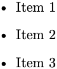
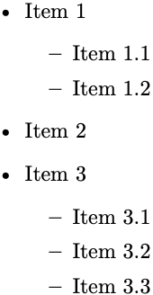
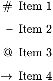
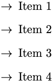
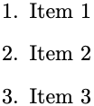
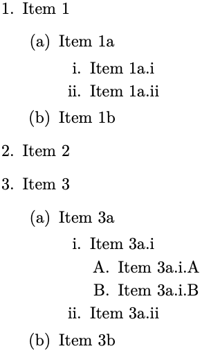
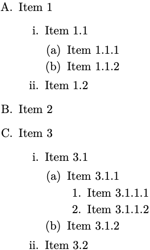

# 2. Entendendo o LaTeX

## 2.11 Listas

Listas ordenadas e não ordenadas podem ser facilmente criadas no LaTeX dentro de ambientes específicos. Listas não ordenadas são criadas dentro do ambiente `itemize` e listas ordenadas são criadas dentro do ambiente `enumerate`.

No [Exemplo 1](#exe_lista1), tem-se uma lista simples não ordenada.

!!! exemple "<a id="exe_lista1"></a>Exemplo 1: Lista não ordenada utilizando o ambiente `itemize`"

    === "Código"

        ```Latex linenums="1"
        \begin{itemize}
            \item Item 1
            \item Item 2
            \item Item 3
        \end{itemize}
        ```

    === "Resultado"

        

Listas podem ser aninhadas, de forma que subitens possam ser inseridos. Observe no [Exemplo 2](#exe_lista2) que o estilo dos subitens é alterado automaticamente:

!!! exemple "<a id="exe_lista2"></a>Exemplo 2: Lista não ordenada aninhada utilizando o ambiente `itemize`"

    === "Código"

        ```Latex linenums="1"
        \begin{itemize}
            \item Item 1
            \begin{itemize}
                \item Item 1.1
                \item Item 1.2
            \end{itemize}
            \item Item 2
            \item Item 3
            \begin{itemize}
                \item Item 3.1
                \item Item 3.2
                \item Item 3.3
            \end{itemize}
        \end{itemize}
        ```

    === "Resultado"

        

Os símbolos dos itens em uma lista ordenada podem ser facilmente modificados. No [Exemplo 3](#exe_lista_simb1), os símbolos são alterados de forma individual. Observe que é possível inserir expressões matemáticas também, as quais são apresentadas na [Seção 2.13](../matematica/#213-matematica-e-equacoes):

!!! exemple "<a id="exe_lista_simb1"></a>Exemplo 3: Lista não ordenada utilizando o ambiente `itemize` com símbolos diferentes"

    === "Código"

        ```Latex linenums="1"
        \begin{itemize}
            \item[\#]    Item 1
            \item[--]    Item 2
            \item[@]     Item 3
            \item[$\to$] Item 4
        \end{itemize}
        ```

    === "Resultado"

        

Para alterar o estilo dos símbolos de uma lista de uma só vez, basta seguir o [Exemplo 4](#exe_lista_simb2) a seguir:

!!! exemple "<a id="exe_lista_simb2"></a>Exemplo 4: Lista não ordenada utilizando o ambiente `itemize` com símbolos diferentes"

    === "Código"

        ```Latex linenums="1"
        \begin{itemize}[label=$\to$]
            \item Item 1
            \item Item 2
            \item Item 3
            \item Item 4
        \end{itemize}
        ```

    === "Resultado"

        

No [Exemplo 5](#exe_lista3) a seguir, tem-se uma lista simples ordenada. Compare com o [Exemplo 1](#exe_lista1) e observe que a única diferença entre eles está apenas no tipo de ambiente utilizado (`itemize` e `enumerate`, respectivamente).

!!! exemple "<a id="exe_lista3"></a>Exemplo 5: Lista ordenada utilizando o ambiente `enumerate`"

    === "Código"

        ```Latex linenums="1"
        \begin{enumerate}
            \item Item 1
            \item Item 2
            \item Item 3
        \end{enumerate}
        ```

    === "Resultado"

        

Assim como nas listas não ordenadas, listas ordenadas também podem ser aninhadas. Neste caso, observe que a ordem e a numeração dos subitens é incrementada automaticamente:

!!! exemple "<a id="exe_lista4"></a>Exemplo 6: Lista ordenada aninhada utilizando o ambiente `enumerate`"

    === "Código"

        ```Latex linenums="1"
        \begin{enumerate}
            \item Item 1
            \begin{enumerate}
                \item Item 1a
                \begin{enumerate}
                    \item Item 1a.i
                    \item Item 1a.ii
                \end{enumerate}
                \item Item 1b
            \end{enumerate}
            \item Item 2
            \item Item 3
            \begin{enumerate}
                \item Item 3a
                \begin{enumerate}
                    \item Item 3a.i
                    \begin{enumerate}
                        \item Item 3a.i.A
                        \item Item 3a.i.B
                    \end{enumerate}
                    \item Item 3a.ii
                \end{enumerate}
                \item Item 3b
            \end{enumerate}
        \end{enumerate}
        ```

    === "Resultado"

        

Listas ordenadas podem ser organizadas de formas diferentes. Pode-se ordená-las de forma numérica, alfabética ou de forma alfanumérica. Para alterar a forma como as listas são ordenadas, é necessário definir o estilo de ordenamento com o comando `\labelenum<nível>{<estilo>}`, onde `<nível>` pode ser `i`, `ii`, `iii` ou `vi`. O estilo, dado pelo modificador `<estilo>`, pode assumir as seguintes opções:

* `alph` Letras minúsculas (a, b, c, ...);
* `Alph` Letras maiúsculas (A, B, C, ...);
* `arabic` Numerais arábicos (1, 2, 3, ...);
* `roman` Numerais minúsculos romanos (i, ii, iii, ...);
* `Roman` Numerais maiúsculos romanos (I, II, III, ...).

Combinando os estilos listados acima com os níveis, o comando `\labelenum<nível>{<estilo>}` pode assumir algumas das seguintes construções:

* Numerais arábicos (1, 2, 3, ...) no Nível 1: `\renewcommand{\labelenumi}{\arabic{enumi}}`;
* Letras minúsculas (a, b, c, ...) no Nível 2: `\renewcommand{\labelenumii}{\alph{enumii}}`;
* Numerais romanos em caixa baixa (i, ii, iii, ...) no Nível 3: `\renewcommand{\labelenumiii}{\roman{enumiii}}`;
* Letras maiúsculas (A, B, C, ...) no Nível 4: `\renewcommand{\labelenumiv}{\Alph{enumiv}}`.

No [Exemplo 7](#exe_lista5) a seguir, altera-se o estilo dos ordenamentos dos níveis de 1 a 4, utilizando-se letras maiúsculas, números romanos em caixa baixa, letras minúsculas e numerais arábicos, respectivamente:

!!! exemple "<a id="exe_lista5"></a>Exemplo 7: Lista ordenada aninhada com níveis customizados"

    === "Código"

        ```Latex linenums="1"
        \renewcommand{\labelenumi}{\Alph{enumi}.}
        \renewcommand{\labelenumii}{\roman{enumii}.}
        \renewcommand{\labelenumiii}{(\alph{enumiii})}
        \renewcommand{\labelenumiv}{\arabic{enumiv}.}
        \begin{enumerate}
            \item Item 1
            \begin{enumerate}
                \item Item 1.1
                \begin{enumerate}
                    \item Item 1.1.1
                    \item Item 1.1.2
                \end{enumerate}
                \item Item 1.2
            \end{enumerate}
            \item Item 2
            \item Item 3
            \begin{enumerate}
                \item Item 3.1
                \begin{enumerate}
                    \item Item 3.1.1
                    \begin{enumerate}
                        \item Item 3.1.1.1
                        \item Item 3.1.1.2
                    \end{enumerate}
                    \item Item 3.1.2
                \end{enumerate}
                \item Item 3.2
            \end{enumerate}
        \end{enumerate}
        ```

    === "Resultado"

        