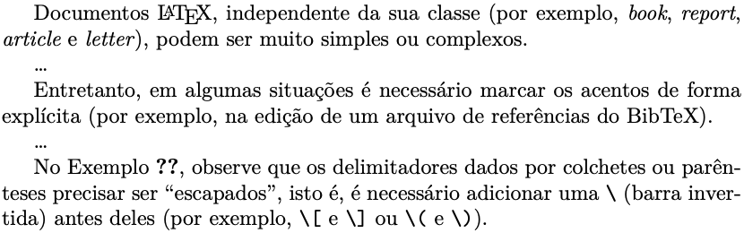
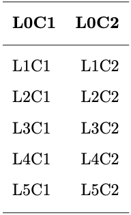
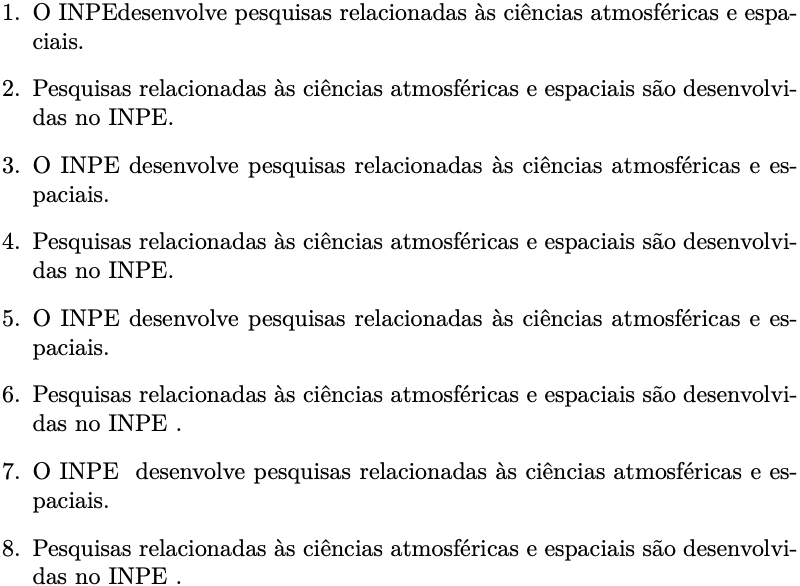
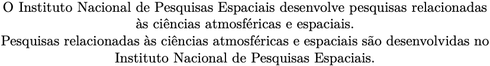
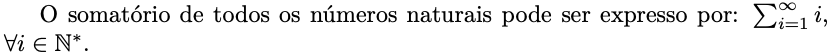

# 2. Entendendo o LaTeX

## 2.18 Macros

No LaTeX é possível definir *macros*, que são um conjunto de instruções específicas que visam facilitar a formatação do documento. Além das *macros*, é possível também redefinir comandos do LaTeX, de forma que os comandos originais sejam executados de forma mais simples e customizada.

O livro de [Knuth (1996)](#knuth/1996) oferece uma introdução concisa sobre a linguagem *macro* do LaTeX. O leitor já deve ter percebido que algumas das ocorrências da palavra "LaTeX" são mostradas na forma estilizada $\LaTeX{}$. Isto é feito através da uma *macro* que é definida pelo comando `$\LaTeX{}$`, que então produz a grafia estilizada da palavra. Esta *macro* define não apenas o estilo da fonte utilizada, mas também os espaçamentos horizontal e vertical. Aliás, todos os comandos da linguagem que já foram mostrados, são definidos por *macros*. Logo, pode-se entender que as *macros* constituem um conjunto de instruções que permitem manipular a linguagem de forma que determinadas ações sejam feitas sem a necessidade de programá-las sempre que for necessário reutilizá-las. Apesar disso, *macros* são diferentes de *scripts*, pois *scripts* são códigos independentes que são interpretados e executados linha-a-linha. No LaTeX, as *macros* são incluídas no preâmbulo documentos e são utilizadas para estruturar o documento.

O leitor perceberá a importância das *macros* quando precisar fazer uso de alguma configuração mais do que uma vez. Um exemplo bastante simples, é definir um comando (que nada mais é do que uma *macro*) para inserir uma informação que pode ser repetida em diferentes partes do texto. Suponha que queiramos que a expressão "por exemplo" seja inserida sempre que digitarmos o comando `\eg` e que a expressão "isto é" seja inserida sempre que digitar o comando `\ie`. No LaTeX os comandos `\eg` e `\ie` não existem, então podemos utilizá-los para este propósito. Veja no [Exemplo 1](#exe_macro0) como fazer isso.

!!! exemple "<a id="exe_macro0"></a>Exemplo 1: Definindo um comando simples de substituição"

    === "Código"

        ```Latex linenums="1"
        \newcommand{\eg}{por exemplo}
        \newcommand{\ie}{isto é}

        Documentos \LaTeX{}, independente da sua classe (\eg, \textit{book}, 
        \textit{report}, \textit{article} e \textit{letter}), podem ser muito simples ou complexos.

        \dots

        Entretanto, em algumas situações é necessário marcar os acentos de forma explícita (\eg, na edição de um arquivo de referências do BibTeX). 

        \dots

        No Exemplo \ref{exe_eq0}, observe que os delimitadores dados por colchetes ou parênteses precisar ser ``escapados'', \ie, é necessário adicionar uma \verb|\| (barra invertida) antes deles (\eg, \verb|\[| e \verb|\]| ou \verb|\(| e \verb|\)|). 
        ```

    === "Resultado"

        

!!! tip "Dica"

    No [Exemplo 1](#exe_macro0), observe ainda que o comando `\dots` é também uma *macro* que produz as reticências (\dots).

Considere os Exemplos [2](./tabelas.md#exe_tab2) e [3](./tabelas.md#exe_tab3} em que o espaçamento `\\[-0.5em]` é utilizado múltiplas vezes para definir a altura das linhas das tabelas mostradas. Este comando pode ser "empacotado" através da definição de uma *macro* que simplesmente irá abreviar o seu uso, no sentido de torná-lo mais simples. Para isto, veja o [Exemplo 2](#exe_macro1) a seguir.

!!! exemple "<a id="exe_macro1"></a>Exemplo 2: Definindo um simples comando de espaçamento"

    === "Código"

        ```Latex linenums="1"
        \newcommand{\recuo}{\\[-0.5em]}

        \begin{tabular}{l r}
        \hline 
        \recuo
        \textbf{L0C1} & \textbf{L0C2} \\
        \recuo
        \hline
        \recuo
        L1C1 & L1C2 \\
        \recuo
        L2C1 & L2C2 \\
        \recuo
        L3C1 & L3C2 \\
        \recuo
        L4C1 & L4C2 \\
        \recuo
        L5C1 & L5C2 \\
        \recuo
        \hline
        \end{tabular}
        ```

    === "Resultado"

        

Muitas vezes será necessário incluir um espaço em branco extra, o que pode ser obtido incluindo-se um par de `{}`'s (chaves) após o comando, e.g., como em `$\LaTeX{}$` ou `\LaTeX`, que irá produzir $\LaTeX{}$ e $\LaTeX$, respectivamente. Considere os comandos `inpe` e `inpee` do [Exemplo 3](#exe_macro2) a seguir e compare os resultados das suas aplicações, com e sem as `{}`'s: 

!!! exemple "<a id="exe_macro2"></a>Exemplo 3: Definindo um comando simples de substituição com espaço extra"

    === "Código"

        ```Latex linenums="1"
        \newcommand{\inpe}{INPE}
        \newcommand{\inpee}{INPE }

        \begin{enumerate}
            \item O \inpe desenvolve pesquisas relacionadas às ciências atmosféricas e espaciais.
            \item Pesquisas relacionadas às ciências atmosféricas e espaciais são desenvolvidas no \inpe.
            \item O \inpe{} desenvolve pesquisas relacionadas às ciências atmosféricas e espaciais.
            \item Pesquisas relacionadas às ciências atmosféricas e espaciais são desenvolvidas no \inpe{}.
            \item O \inpee desenvolve pesquisas relacionadas às ciências atmosféricas e espaciais.
            \item Pesquisas relacionadas às ciências atmosféricas e espaciais são desenvolvidas no \inpee.
            \item O \inpee{} desenvolve pesquisas relacionadas às ciências atmosféricas e espaciais.
            \item Pesquisas relacionadas às ciências atmosféricas e espaciais são desenvolvidas no \inpee{}.
        \end{enumerate}
        ```

    === "Resultado"

        

No [Exemplo 3](#exe_macro2) foram definidas macros que substituem a palavra-chave `inpe` (ou `inpee`) por INPE. Quando uma *macro* é definida e utilizada em diversas partes de um documento, a sua substituição por um outro valor pode ser rápida e facilmente realizada através do comando `\renewcommand`. Veja o [Exemplo 4](#exe_macro3) a seguir:

!!! exemple "<a id="exe_macro3"></a>Exemplo 4: Redefinindo um comando simples"

    === "Código"

        ```Latex linenums="1"
        \renewcommand{\inpe}{Instituto Nacional de Pesquisas Espaciais}

        O \inpe{} desenvolve pesquisas relacionadas às ciências atmosféricas e espaciais.

        Pesquisas relacionadas às ciências atmosféricas e espaciais são desenvolvidas no \inpe{}.
        ```

    === "Resultado"

        

A definição de *macros* a partir do comando `\newcommand{}{}` aceita a utilização de parâmetros (ou argumentos), tal como um *script*. Veja o [Exemplo 5](#exe_macro4) a seguir:

!!! exemple "<a id="exe_macro4"></a>Exemplo 5: Passando parâmetros para `macros`"

    === "Código"

        ```Latex linenums="1"
        \newcommand{\meusomatorio}[3]{\ensuremath{\sum_{#1}^{#2}{#3}}}

        O somatório de todos os números naturais pode ser expresso por: 
        \meusomatorio{i=1}{\infty}{i}, $\forall i \in \mathbb{N^*}$.
        ```

    === "Resultado"

        

No [Exemplo 5](#exe_macro4), observe que utilizou-se o comando `\newcommand{}[]{}` para se definir uma expressão para a soma de todos os números naturais não nulos. Neste caso, `\meusomatorio` define o nome do comando, `3` indica a quantidade de argumentos que este novo comando deverá receber e `\ensuremath{\sum_{#1}^{#2}{#3}}}` indica a expressão matemática a ser utilizada, i.e., `\sum`, sendo que os valores indicados por `#1`, `#2` e `#3`, são os argumentos a serem inseridos na expressão e na ordem em que devem ser informados. Além disso, observe também que a expressão definida pelo comando, é precedida pela *macro* `\ensuremath{}`, que tem a função de definir o ambiente de matemática para a expressão. Finalmente, o novo comando (`\meusomatorio{}{}{}`) pode ser utilizado em linha sem a necessidade de se utilizar delimitadores (como indicado no início da [Seção 2.13](../matematica/#213-matematica-e-equacoes)).

!!! tip "Dica"

    Para conhecer mais sobre a utilização de *macros* para a definição de comandos e ambientes, veja em [https://www.overleaf.com/learn/latex/Defining_your_own_commands](https://www.overleaf.com/learn/latex/Defining_your_own_commands).

## Referências

* <a id="knuth/1996"></a> Knuth, Donald E.: **The TeXbook**, *Addison-Wesley Professional*, 1996.