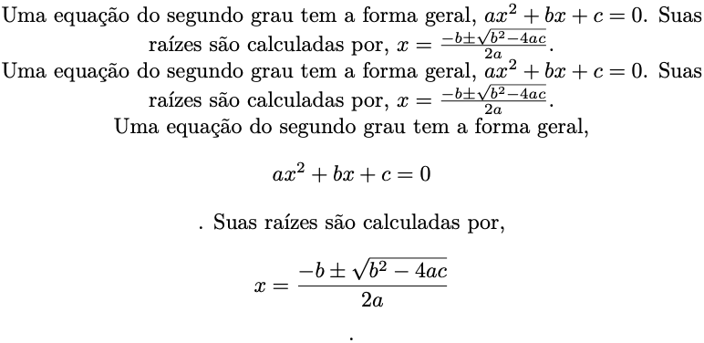
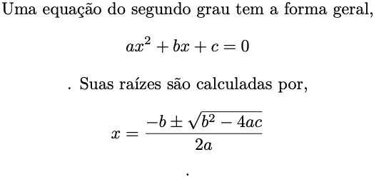
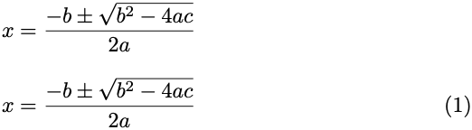
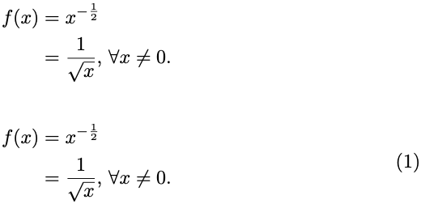
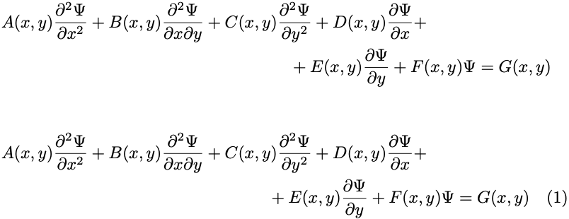
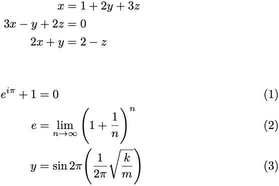
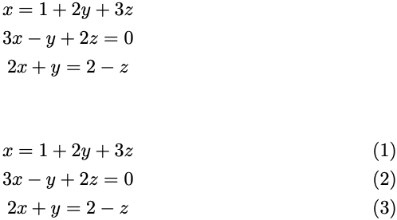

# 2. Entendendo o LaTeX

## 2.13 Matemática e equações

O modo matemático do LaTeX representa uma forma bastante conveniente de se inserir equações e símbolos matemáticos em um documento. Equações podem ser digitadas diretamente em parágrafos (em linha ou *inline*) utilizando uma dupla de `$$`'s (cifrões), `[] `'s (colchetes) ou `()`'s (parênteses) como delimitadores. Por exemplo, equação $ax^2 + bx + c = 0$ pode ser digitada como `$ax^2 + bx + c = 0$` no meio de uma frase ou parágrafo. Veja no [Exemplo 1](#exe_eq0) formas diferentes de digitar equações em linha.

!!! example "<a id="exe_eq0"></a>Exemplo 1: Inserindo equações em linha (`inline`)"

    === "Código"

        ```Latex linenums="1"
        Uma equação do segundo grau tem a forma geral, $ax^2 + bx + c =0$. Suas raízes são calculadas por, $x = \frac{-b \pm \sqrt{b^2 - 4ac}}{2a}$.
        \\
        Uma equação do segundo grau tem a forma geral, \(ax^2 + bx + c =0\). Suas raízes são calculadas por, \(x = \frac{-b \pm \sqrt{b^2 - 4ac}}{2a}\).
        \\
        Uma equação do segundo grau tem a forma geral, \[ax^2 + bx + c =0\]. Suas raízes são calculadas por, \[x = \frac{-b \pm \sqrt{b^2 - 4ac}}{2a}\].
        ```

    === "Resultado"

        <figure markdown>
        { width="500" }
        </figure>

No [Exemplo 1](#exe_eq0), observe que os delimitadores dados por colchetes ou parênteses precisam ser "escapados", i.e., é necessário adicionar uma `\` (barra invertida) antes deles (e.g., `\[` e `\]` ou `\(` e `\)`). Além disso, quando são utilizados os colchetes, as equações em linha são escritas em uma linha própria e centralizada com o texto. O resultado obtido com a digitação de equações em linha utilizando os delimitadores indicados, apresenta as equações dentro da definição de altura da linha do texto. Para fazer com que esta limitação seja contornada e dar mais espaço ao ambiente de equações em linha, utiliza-se um par de delimitadores duplos `$$`'s (dólar duplo). Veja o [Exemplo 2](#exe_eq00) a seguir:

!!! example "<a id="exe_eq00"></a>Exemplo 2: Inserindo equações em linha (`inline`)"

    === "Código"

        ```Latex linenums="1"
        Uma equação do segundo grau tem a forma geral, $$ax^2 + bx + c =0$$. Suas raízes são calculadas por, $$x = \frac{-b \pm \sqrt{b^2 - 4ac}}{2a}$$.
        ```

    === "Resultado"

        <figure markdown>
        { width="500" }
        </figure>

No LaTeX é possível inserir todos os símbolos relacionados às ciências. No Anexo B há uma lista destes símbolos, os quais podem ser utilizados para a realização dos exercícios da [Seção 2.20](../exercicios/#220-exercicios).

Para digitar equações em blocos, há ambientes próprios para casos variados, os quais são mostrados a seguir.

### 2.13.1 Ambientes de equações

Equações podem ter aspectos muito variados. Podem ser longas, ocupando uma ou mais linhas e podem conter símbolos diversos. No LaTeX, o pacote `amsmath` fornece uma série de ambientes apropriados para escrever expressões numéricas e equações de forma adequada. Para carregar este pacote, inclua o comando `\usepackage{amsmath}` no preâmbulo do documento.

Uma simples equação pode ser inserida utilizando-se o ambiente `equation`. No [Exemplo 3](#exe_eq1), observe a diferença entre os resultados obtidos com os ambientes `equation` e `equation*`.

!!! example "<a id="exe_eq1"></a>Exemplo 3: Ambientes `equation` e `equation*`"

    === "Código"

        ```Latex linenums="1"
        \begin{equation*}
        x = \frac{-b \pm \sqrt{b^{2} - 4ac}}{2a}
        \end{equation*}

        \begin{equation}
        x = \frac{-b \pm \sqrt{b^{2} - 4ac}}{2a}
        \end{equation}
        ```

    === "Resultado"

        <figure markdown>
        { width="500" }
        </figure>

No [Exemplo 3](#exe_eq1), o ambiente `equation*` evita que as equações sejam numeradas. Além disso, as equações são numeradas de acordo com a numeração da seção em que elas estiverem inseridas. 

Equações podem ser alinhadas pelo sinal de "=" (ou qualquer outro sinal) dentro do ambiente `split`. Veja no [Exemplo 4](#exe_eq2) como aplicar o ambiente `split`: 

!!! example "<a id="exe_eq2"></a>Exemplo 4: Ambientes `equation` e `split`"

    === "Código"

        ```Latex linenums="1"
        \begin{equation*}
          \begin{split}
            f(x) & = x^{-\frac{1}{2}}   \\
                 & = \frac{1}{\sqrt{x}}\text{, }\forall x \neq 0.
          \end{split}
        \end{equation*}

        \begin{equation}
          \begin{split}
            f(x) & = x^{-\frac{1}{2}}   \\
                 & = \frac{1}{\sqrt{x}}\text{, }\forall x \neq 0.
          \end{split}
        \end{equation}
        ```

    === "Resultado"

        <figure markdown>
        { width="500" }
        </figure>

No exemplo anterior, além do modo matemático puro, foram inseridos também modos de texto com o marcador `text`. Este marcador serve para digitar texto dentro do ambiente `equation` (neste caso foi digitada uma vírgula acrescida de um espaço em branco, i.e., `\text{, }`).

No [Exemplo 5](#exe_eq3), o ambiente `multiline` é utilizado para inserir equações muito longas. Neste ambiente, pode-se escolher em que parte a equação deverá ser truncada utilizando-se um par de `\\`'s (barras invertidas):

!!! example "<a id="exe_eq3"></a>Exemplo 5: Ambiente `multline`"

    === "Código"

        ```Latex linenums="1"
        \begin{multline*}
          A(x,y)\frac{\partial^2{\Psi}}{\partial{x^2}}           + 
          B(x,y)\frac{\partial^2{\Psi}}{\partial{x}\partial{y}}  +
          C(x,y)\frac{\partial^2{\Psi}}{\partial{y^2}}           +
          D(x,y)\frac{\partial{\Psi}}{\partial{x}}               + \\
        + E(x,y)\frac{\partial{\Psi}}{\partial{y}}               +
          F(x,y)\Psi = G(x,y)
        \end{multline*}

        \begin{multline}
          A(x,y)\frac{\partial^2{\Psi}}{\partial{x^2}}           + 
          B(x,y)\frac{\partial^2{\Psi}}{\partial{x}\partial{y}}  +
          C(x,y)\frac{\partial^2{\Psi}}{\partial{y^2}}           +
          D(x,y)\frac{\partial{\Psi}}{\partial{x}}               + \\
        + E(x,y)\frac{\partial{\Psi}}{\partial{y}}               +
          F(x,y)\Psi = G(x,y)
        \end{multline}
        ```

    === "Resultado"

        <figure markdown>
        { width="500" }
        </figure>

Nos Exemplos [4](#exe_eq2) e [5](#exe_eq3), observe que os ambientes `split` e `multline` funcionam de forma semelhante, com a diferença de que o ambiente `split` deve ser utilizado dentro do ambiente `equation`. Além disso, o ambiente `split` alinha as equações como em uma tabela, i.e., com o símbolo `&` (*ampersand*) separando as colunas ou partes da equação.

Para alinhar equações ou grupos de equações, pode-se utilizar o ambiente `align`. Veja os grupos de equações do [Exemplo 6](#exe_eq4):

!!! example "<a id="exe_eq4"></a>Exemplo 6: Ambiente `align`"

    === "Código"

        ```Latex linenums="1"
        \begin{align*}
          x           & = 1 + 2y + 3z \\ 
          3x -  y + 2z & = 0           \\
          2x +  y      & = 2 - z
        \end{align*}

        \begin{align}
          e^{i\pi} + 1 & = 0                                           \\
          e & = \lim_{n \to \infty}{\Bigg(1 + \frac{1}{n}\Bigg)^{n}}   \\
          y & = \sin 2\pi \Bigg(\frac{1}{2\pi}\sqrt{\frac{k}{m}}\Bigg)
        \end{align}
        ```

    === "Resultado"

        <figure markdown>
        { width="500" }
        </figure>

No [Exemplo 6](#exe_eq4), observe também que foi utilizado o marcador `Bigg` antes dos parênteses. Este marcador, no modo matemático, permite que parênteses, colchetes e chaves sejam ampliados de forma que se ajustem à altura dos símbolos das equações que estão sendo digitadas. Outros marcadores podem ser utilizados para ampliar estes sinais matemáticos na escala correta. Pode-se utilizar `big` para produzir $x=\big(\frac{1}{25}\big)^{\frac{1}{2}}$, ou `bigg` para produzir $x=\bigg(\frac{1}{25}\bigg)^{\frac{1}{2}}$, ou ainda `Big` para produzir $x=\Big(\frac{1}{25}\Big)^{\frac{1}{2}}$ e `Bigg` para se obter $x=\Bigg(\frac{1}{25}\Bigg)^{\frac{1}{2}}$.

!!! note "Nota"

    Veja mais opções de marcadores especiais para o modo matemáticos em [https://www.overleaf.com/learn/latex/Brackets_and_Parentheses](https://www.overleaf.com/learn/latex/Brackets_and_Parentheses).

Equações podem ser alinhadas utilizando-se o ambiente `gather`. Este alinhamento produz um resultado diferente daquele obtido com o ambiente `align`. Veja no [Exemplo 7](#exe_eq5) a seguir como utilizar o ambiente `gather`:

!!! example "<a id="exe_eq5"></a>Exemplo 7: Ambiente `gather`"

    === "Código"

        ```Latex linenums="1"
        \begin{gather*}
           x           = 1 + 2y + 3z \\ 
          3x -  y + 2z = 0           \\
          2x +  y      = 2 - z
        \end{gather*}

        \begin{gather}
           x           = 1 + 2y + 3z \\ 
          3x -  y + 2z = 0           \\
          2x +  y      = 2 - z
        \end{gather}
        ```

    === "Resultado"

        <figure markdown>
        { width="500" }
        </figure>

Com o ambiente `gather`, as equações são alinhadas em relação ao parágrafo, e não com relação a um elemento. Outros elementos matemáticos como sinais e símbolos em geral podem ser encontrados nas tabelas do Anexo B.
