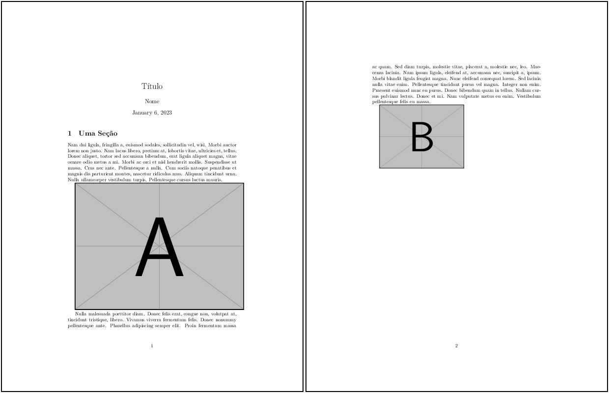

# 2. Entendendo o LaTeX

## 2.7 Medidas

As medidas na linguagem LaTeX podem ser apresentadas em unidades diversas. É comum misturá-las e isso pode ocorrer quando se reutiliza algum código encontrado na *internet*, o que é bastante comum. A [Tabela 1](#tab:medidas) a seguir, mostra as unidades de medida mais comuns da linguagem. Ressalta-se, entretanto, que a unidade padrão é o $\cdot$ (ponto) e que o comprimento padrão é, portanto, 1 `pt`:

<a id="tab:medidas"></a>

**Tabela 1:** Unidades de Medidas mais Comuns no LaTeX.

| Unidade | Abreviação | Valor em Pontos |
|---------|------------|-----------------|
| Ponto         | `pt` | 1 `pt`                     |             
| Milímetro     | `mm` | 1 `mm` = 2,84 `pts`        |
| Centímetro    | `cm` | 1 `cm` = 28,4 `pts`        |        
| Polegada      | `in` | 1 `in` = 72,27 `pts`       |         
| Paica         | `pc` | 1 `pc` = 12 `pts`          |          
| Altura de "x" | `ex` | Depende da fonte utilizada |  
| Altura de "M" | `em` | Depende da fonte utilizada |

As unidades de medidas apresentadas na [Tabela 1](#tab:medidas) mostram os valores da unidade em termos de pontos. O LaTeX utiliza o ponto como referência absoluta e a escolha por uma unidade ou outra irá depender do que se quer medir ou das medidas que se quer estabelecer. As dimensões de uma página devem ser estabelecidas em unidades fixas, e.g., a folha A4 mede 210 mm (largura) por 297 mm (altura). Por outro lado, pode ser mais adequado utilizar medidas relativas, e.g., a largura de uma figura como sendo a metade da largura de uma página A4. Dessa forma, é mais fácil definir o tamanho destes elementos.

!!! tip "Dica"

    O pacote `lengthconvert` pode ser útil na definição e converção de unidades de medidas no LaTeX. Veja a página do pacote em [https://ctan.org/pkg/lengthconvert](https://ctan.org/pkg/lengthconvert) para mais informações.

Em documentos escritos na linguagem LaTeX, é possível especificar as medidas relativas utilizando os valores nas unidades indicadas pela [Tabela 1](#tab:medidas) e também utilizando *macros* específicas para esta finalidade. Algumas destas *macros* de medidas são apresentadas na [Tabela 2](#tab:meds_padrao) abaixo.

<a id="tab:meds_padrao"></a>

**Tabela 2:** Algumas Macros de Medidas do LaTeX. **Fonte:** Adaptado de [https://www.overleaf.com/learn/latex/Lengths_in_LaTeX](https://www.overleaf.com/learn/latex/Lengths_in_LaTeX).

| Macro | Descrição |
|-------|-----------|
| `\paperwidth`   | Largura de uma página                              |
| `\paperheight`  | Altura de uma página                               |
| `\textheight`   | Altura do texto na página                          |
| `\textwidth`    | Largura do texto na página                         |
| `\parindent`    | Indentação de um parágrafo                         |
| `\parskip`      | Espaçamento extra entre parágrafos                 |
| `\baselineskip` | Distância vertical entre as linhas em um parágrafo |
| `\columnsep`    | Distância entre colunas de texto                   |
| `\columnwidth`  | Largura de uma coluna de texto                     |
| `\linewidth`    | Largura de uma linha em um ambiente local          |

No [Exemplo 1](#exe_meds1) é mostrado como definir a largura de uma figura com base na largura do texto, utilizando-se a *macro* `\textwidth`.

!!! example "<a id="exe_meds1"></a>Exemplo 1: Largura relativa de uma figura com a *macro* `textwidth`"

    === "Código"

        ```Latex linenums="1"
        \documentclass{article}
        \usepackage[utf8]{inputenc}
        \usepackage{lipsum}
        \usepackage{graphicx}

        \title{Título}
        \author{Nome}
        \date{\today}

        \begin{document}

        \maketitle

        \section{Uma Seção}

        \lipsum[2]

        \includegraphics[width=1.0\textwidth]
        {example-image-a}

        \lipsum[3]

        \includegraphics[width=0.5\textwidth]
        {example-image-b}

        \end{document}
        ```

    === "Resultado"

        

No [Exemplo 1](#exe_meds1), observe que duas figuras foram inseridas após dois parágrafos. Na primeira figura, ajustou-se a sua largura para a largura do texto (por isso a opção `width=1.0\textwidth` no comando `\includegraphics`). Na segunda figura, ajustou-se a sua largura como 50% da largura do texto na página (por isso utilizou-se a opção `width=0.5\textwidth`).

!!! note "Nota"

    A inclusão de figuras e a utilização de ambientes especiais de figuras é apresentada na [Seção 2.12](../figuras/#212-figuras).

Além das medidas padrão, o LaTeX também fornece *macros* que permitem adicionar espaçamentos (horizontais e verticais), que podem fazer uso das medidas relacionadas na [Tabela 2](#tab:meds_padrao). Veja a [Tabela 3](#tab:espacamentos) a seguir:

<a id="tab:espacamentos"></a>

**Tabela 3:** Algumas Macros de Espaçamento do LaTeX. **Fonte:** Adaptado de [https://www.overleaf.com/learn/latex/Line_breaks_and_blank_spaces](https://www.overleaf.com/learn/latex/Line_breaks_and_blank_spaces).

| Macro | Descrição |
|-------|-----------|
| `\hspace`     | Adiciona espaço horizontal (pode utilizar qualquer unidade da [Tabela 1](#tab:medidas), incluindo valores negativos) |
| `\vspace`     | Adiciona espaço vertical (pode utilizar qualquer unidade da [Tabela 1](#tab:medidas), incluindo valores negativos)   |
| `\smallskip`  | Equivalente a `\vspace{smallskipamount}`, onde `smallskipamount` é relativo ao estilo do documento                   |
| `\medskip`    | Equivalente a `\vspace{medskipamount}`, onde `medskipamount` é relativo ao estilo do documento                       |
| `\bigskip`    | Equivalente a `\vspace{bigskipamount}`, onde `bigskipamount` é relativo ao estilo do documento                       |

Exemplos de como utilizar algumas das *macros* de espaçamento listadas na [Tabela 3](#tab:espacamentos), podem ser encontrados nos Exemplos [5](./posicao_espac.md#exe_par9) e [6](./posicao_espac.md#exe_par10).

!!! tip "Dica"

    Veja mais detalhes, informações e exemplos sobre medidas e *macros* de espaçamentos do LaTeX em [https://en.wikibooks.org/wiki/LaTeX/Lengths](https://en.wikibooks.org/wiki/LaTeX/Lengths).