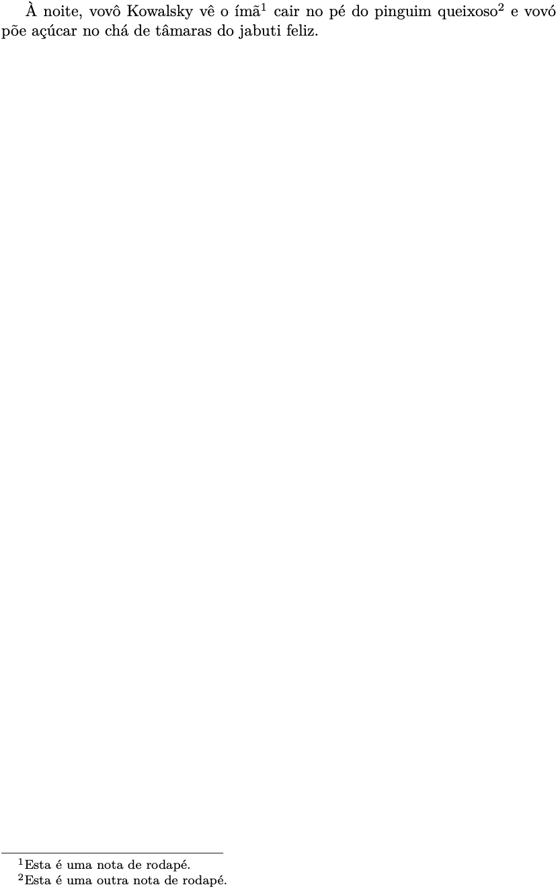
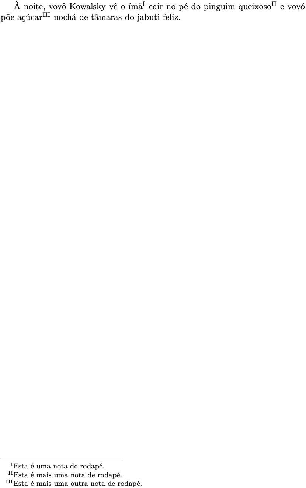
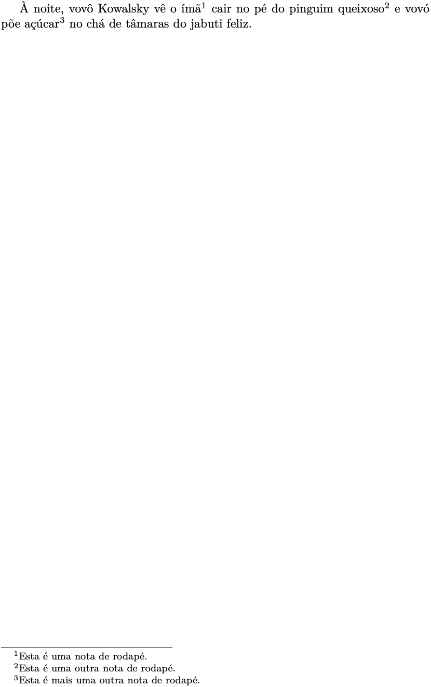

# 2. Entendendo o LaTeX

## 2.10 Notas de rodapé

Notas de rodapé podem ser inseridas com o marcador `\footnote{}` após a palavra a qual se quer referir. Nos exemplos a seguir, utiliza-se o pangrama[^1] "*À noite, vovô Kowalsky vê o ímã cair no pé do pinguim queixoso e vovó põe açúcar no chá de tâmaras do jabuti feliz*"[^2]. O [Exemplo 1](#exe_rodape1) mostra como utilizar o marcador `\footnote{}`:

!!! example "<a id="exe_rodape1"></a>Exemplo 1: Nota de rodapé, utilizando o marcador `footnote`"

	=== "Código"

		```Latex linenums="1"
		À noite, vovô Kowalsky\footnote{Esta é uma nota de rodapé.} vê o ímã cair no pé do pinguim queixoso e vovó põe açúcar no chá de tâmaras do jabuti feliz\footnote{Esta é uma outra nota de rodapé.}.
		```

	=== "Resultado"

		

[^1]: Um pangrama é uma sentença que possui todas as letras do alfabeto.
[^2]: Este pangrama contém 90 caracteres e todas as vogais latinas acentuadas, incluindo o cê-cedilha: à, á, â, é, ê, í, ó, ô, õ, ú e ç.

No [Exemplo 1](#exe_rodape1), foram incluídas duas notas de rodapé. Elas são ordenadas sequencialmente ao final da página em que foram inseridas.

Outra forma de incluir notas de rodapé, é a partir da utilização dos marcadores `footnotemark` e `footnotetext`. O primeiro, insere o marcador na posição desejada, e o segundo, insere o texto referente àquele marcador. Esta forma é mais clara, pois destacam-se os comandos e marcadores fora do parágrafo que se está escrevendo, deixando-o mais limpo. Outra aplicação útil destes marcadores é dentro do ambiente de tabelas (apresentado na [Seção 2.14](../tabelas/#214-tabelas)). Por outro lado, este par de marcadores não necessariamente utiliza um contador automático, visto que é possível indicar manualmente o índice da nota de rodapé. Veja o [Exemplo 2](#exe_rodape2) a seguir:

!!! example "<a id="exe_rodape2"></a>Exemplo 2: Nota de rodapé, utilizando os marcadores `footnotemark` e `footnotetext`"

	=== "Código"

		```Latex linenums="1"
		À noite, vovô Kowalsky vê o ímã\footnotemark[1] cair no pé do pinguim queixoso\footnotemark[2] e vovó põe açúcar no chá de tâmaras do jabuti feliz.

		\footnotetext[1]{Esta é uma nota de rodapé.}
		\footnotetext[2]{Esta é uma outra nota de rodapé.}
		```

	=== "Resultado"

		

Observe no [Exemplo 2](#exe_rodape2) que os índices 1 e 2 são indicados como argumentos dos comandos `footenotemark` e `footenotetext`. Estes argumentos devem ser numéricos e o seu estilo é apenas alterado com a definição de um novo estilo (veja como fazer isso no [Exemplo 3](#exe_rodape4) adiante).

Nos Exemplos [1](#exe_rodape1) e [2](#exe_rodape2), observe que o estilo aplicado à nota de rodapé é alfabético. É possível alterar o estilo de numeração renovando o marcador `footnote`, e.g, `\renewcommand{\thefootnote}{\roman{footnote}}`. Neste caso, a opção `Roman` indica que o estilo de numeração dos índices será dado em algarismos romanos. Este é o caso ilustrado no [Exemplo 3](#exe_rodape4) a seguir.

!!! example "<a id="exe_rodape4"></a>Exemplo 3: Nota de rodapé com referência em algarismos romanos"

	=== "Código"

		```Latex linenums="1"
		\renewcommand{\thefootnote}{\Roman{footnote}}

		À noite, vovô Kowalsky vê o ímã\footnote{Esta é uma nota de rodapé.} cair no pé do pinguim queixoso\footnote{Esta é mais uma nota de rodapé.} e vovó põe açúcar\footnote{Esta é mais uma outra nota de rodapé.} nochá de tâmaras do jabuti feliz.
		```

	=== "Resultado"

		

No [Exemplo 4](#exe_rodape5), mostra-se como alterar o estilo das notas de rodapé para algarismos arábicos utilizando a opção `arabic`.

!!! example "<a id="exe_rodape5"></a>Exemplo 4: Nota de rodapé com referência algarismos arábicos"

	=== "Código"

		```Latex linenums="1"
		\renewcommand*{\thefootnote}{\arabic{footnote}}

		À noite, vovô Kowalsky vê o ímã\footnotemark[1] cair no pé do pinguim queixoso\footnotemark[2] e vovó põe açúcar\footnotemark[3] no chá de tâmaras do jabuti feliz.

		\footnotetext[1]{Esta é uma nota de rodapé.}
		\footnotetext[2]{Esta é uma outra nota de rodapé.}
		\footnotetext[3]{Esta é mais uma outra nota de rodapé.}
		```

	=== "Resultado"

		

Outros estilos de indexação das notas de rodapé estão resumidos na [Tabela 1](#tab:estilos_notas_rodape) e podem ser utilizados para substituir a palavra `estilo` no comando `\renewcommand{\thefootnote}{\estilo{footnote}}`.

<a id="tab:estilos_notas_rodape"></a>

**Tabela 1:** Alguns estilos de notas de rodapé. **Fonte:** Adaptado de [https://www.overleaf.com/learn/latex/Footnotes](https://www.overleaf.com/learn/latex/Footnotes).

| Comando | Descrição |
|---------|-----------|
| `arabic`   | Produz índices com algarismos arábicos (e.g., 1, 2, 3, ...)                  |
| `roman`    | Produz índices com algarismos romanos em caixa baixa (e.g., i, ii, iii, ...) |
| `Roman`    | Produz índices com algarismos romanos em caixa alta (e.g., I, II, III, ...)  |
| `alph`     | Produz índices alfabéticos em caixa baixa (e.g., a, b, c, ...)               |
| `Alph`     | Produz índices alfabéticos em caixa alta (e.g., A, B, C, ...)                |
| `fnsymbol` | Produz uma sequência de símbolos                                             |