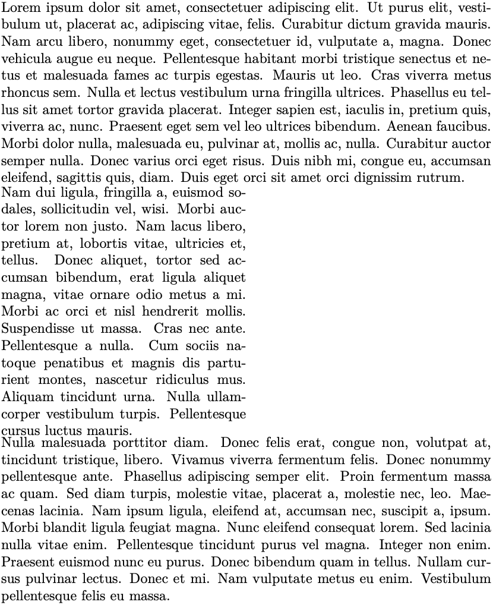
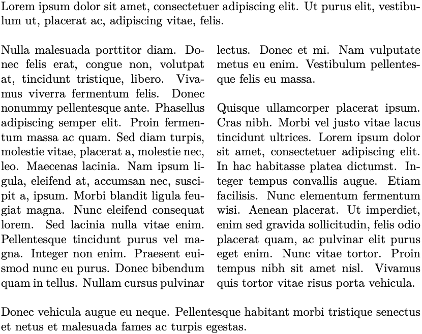
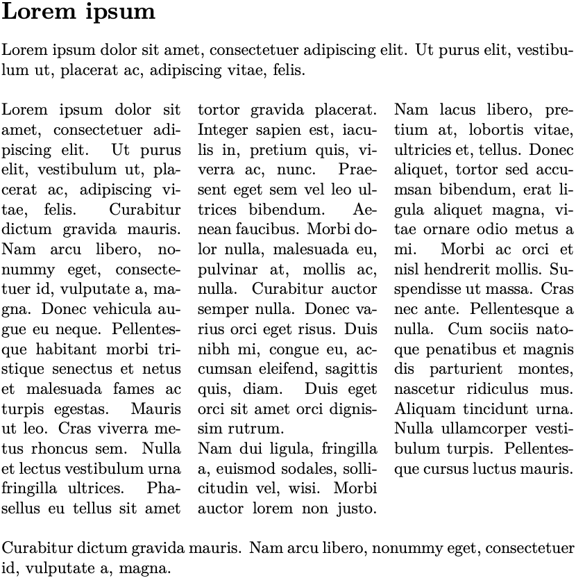
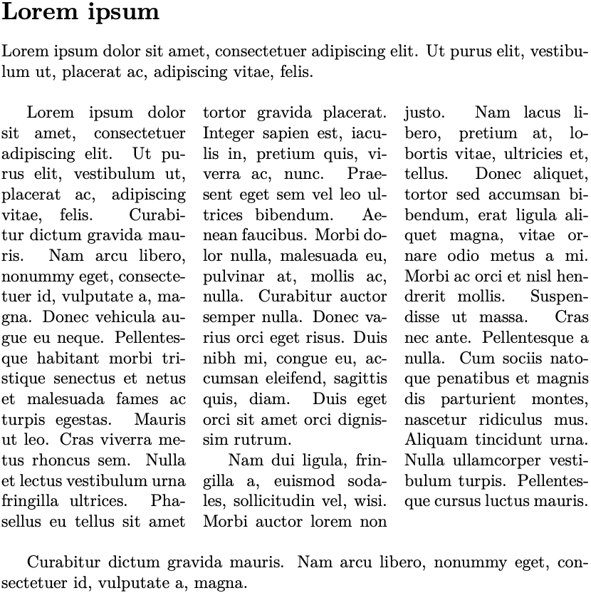
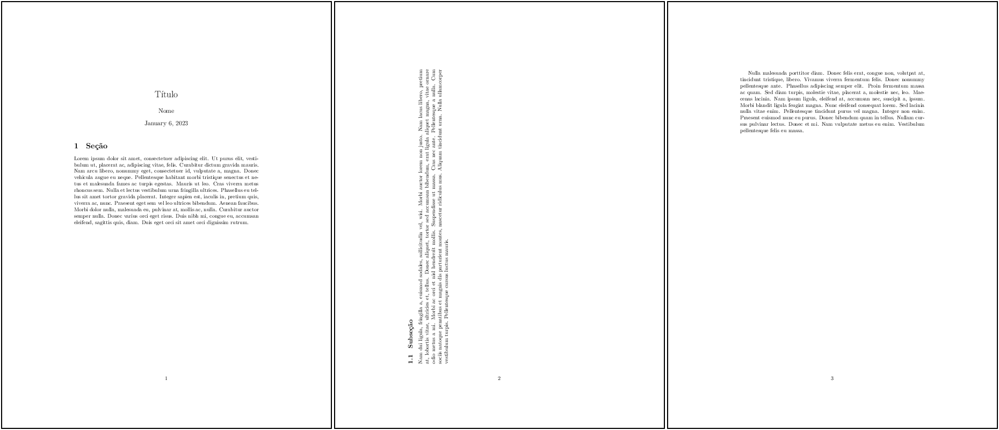
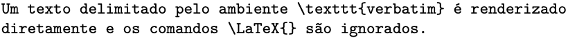
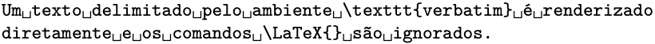
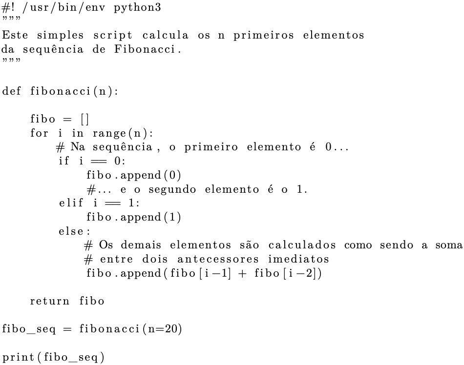
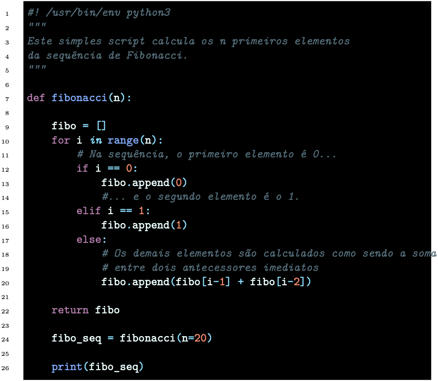
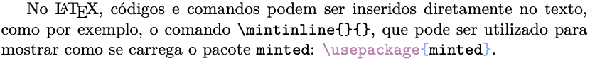

# 2. Entendendo o LaTeX

## 2.16 Outros ambientes

O LaTeX possui uma série de outros ambientes com os quais é possível apresentar e posicionar diferentes elementos textuais. É possível criar elementos flutuantes e posicioná-los em diferentes partes de uma página, bem como subdividir parágrafos em colunas, além de destacar as palavras reservadas de uma determinada linguagem de programação, incluindo os próprios comandos do LaTeX. Nas subseções a seguir, serão apresentados alguns destes ambientes.

### 2.16.1 Minipage

Dependendo do tipo de documento escrito e dos elementos textuais utilizados, como imagens e tabelas, pode-se fazer necessário alocar tais elementos em posições específicas dentro da página. Para isto, pode-se utilizar o ambiente `minipage`. Veja o [Exemplo 1](#exe:minipage) a seguir sobre a sua utilização.

!!! example "<a id="exe:minipage"></a>Exemplo 1: Texto em um ambiente `minipage`"

    === "Código"

        ```Latex linenums="1"
        \lipsum[1]

        \begin{minipage}{0.5\textwidth}

        \lipsum[2]

        \end{minipage}

        \lipsum[3]
        ```

    === "Resultado"

        

No [Exemplo 1](#exe:minipage), observe que foi inserido um parágrafo dentro do ambiente `minipage` de forma que este parágrafo possuísse apenas 50% do tamanho da largura total de uma parágrafo da página. 

### 2.16.2 Texto em colunas

Texto e outros elementos flutuantes do LaTeX podem ser inseridos no corpo do texto em colunas. Para isto, pode-se utilizar o pacote `multicol`, que fornece o ambiente `multicols`. Para iniciar uma seção de texto (e outros elementos) em 2 ou mais colunas, carregue primeiro o pacote `multicol` com o comando `\usepackage{multicol}`. Veja no [Exemplo 2](#exe:multicol) a seguir como inserir texto em duas colunas.

!!! example "<a id="exe:multicol"></a>Exemplo 2: Texto em colunas com o ambiente `multicols`"

    === "Código"

        ```Latex linenums="1"
        \lipsumsentence[1-2]
        \begin{multicols}{2}
            \lipsum[3-4]
        \end{multicols}
        \lipsumsentence[5-6]
        ```

    === "Resultado"

        

No [Exemplo 2](#exe:multicol), observe que o ambiente `multicols` possui um argumento, sendo este o valor que indicará o número de colunas a serem criadas. No ambiente `multicols`, pode-se iniciar uma seção com o texto preenchendo toda a largura da página e então inserir os parágrafos seguintes em colunas. Veja o [Exemplo 3](#exe:multicol1) a seguir.

!!! example "<a id="exe:multicol1"></a>Exemplo 3: Texto em colunas com o ambiente `multicols` e início de seção diferente"

    === "Código"

        ```Latex linenums="1"
        \begin{multicols}{3}
        [
            \section*{Lorem ipsum}
            Lorem ipsum dolor sit amet, consectetuer adipiscing elit. Ut purus elit, vestibulum ut, placerat ac, adipiscing vitae, felis.
        ]
            \lipsum[1-2]
        \end{multicols}
        \lipsumsentence[3-4]
        ```

    === "Resultado"

        

No ambiente `multicols`, é possível também ajustar o espaçamento entre as colunas, como mostrado no [Exemplo 4](#exe:multicol2). O espaçamento entre as colunas é ajustado com o comando `\setlength{\columnsep}{valor}`, onde `valor` é a medida a ser utilizada (e.g., `1cm`).

!!! example "<a id="exe:multicol2"></a>Exemplo 4: Texto em colunas com o ambiente `multicols` e espaçamento diferente"

    === "Código"

        ```Latex linenums="1"
        \lipsumsentence[1-2]
        \setlength{\columnsep}{2cm}
        \begin{multicols}{3}
            \lipsum[3]
        \end{multicols}
        \lipsumsentence[5-6]
        ```

    === "Resultado"

        

!!! note "Nota"

    Para mais informações sobre as configurações do ambiente `multicols`, tenha como referência a página [https://www.overleaf.com/learn/latex/Multiple_columns](https://www.overleaf.com/learn/latex/Multiple_columns).

### Modos retrato e paisagem

No LaTeX a maioria das classes dos documentos é definida no modo retrato (i.e., com a dimensão da altura maior do que a dimensão da largura). É possível definir páginas independentes no modo paisagem (i.e., com a dimensão da largura maior do que a dimensão da altura). Isto pode ser especialmente útil para se alocar diagramas ou tabelas largas no corpo do texto.

Para determinar páginas individuais no modo paisagem, é necessário carregar o pacote `lscape` no preâmbulo do documento. Para isto, basta inserir o comando `\usepackage{lscape}` nesta seção. Com o pacote carregado, para iniciar uma página no modo paisagem, basta utilizar o ambiente `landscape`. Veja o [Exemplo 5](#exe_paisagem) a seguir:

!!! example "<a id="exe_paisagem"></a>Exemplo 5: Páginas nos modos retrato e paisagem"

    === "Código"

        ```Latex linenums="1"
        \documentclass{article}

        \usepackage[utf8]{inputenc}

        \usepackage{lipsum}
        \usepackage{lscape}

        \title{Título}
        \author{Nome}
        \date{\today}

        \begin{document}

        \maketitle

        \section{Seção}

        \lipsum[1]

        \newpage

        \begin{landscape}
        \subsection{Subseção}
        \lipsum[2]
        \end{landscape}

        \newpage

        \lipsum[3]

        \end{document}
        ```

    === "Resultado"

        

!!! tip "Dica"

    Se você estiver utilizando o compilador PdfLaTeX, será necessário utilizar o pacote `pdflscape` ao invés do pacote `lscape`.

### Listing

Muitas vezes, dependendo do tipo de documento que se está produzindo, faz-se necessária a inserção de códigos que representam um determinado processo. Um exemplo, é quando se quer mostrar um código escrito em alguma linguagem de programação. O `LaTeX` possui alguns pacotes que fornecem ambientes específicos para destacar o trecho de código inserido. O ambiente `verbatim` é o mais simples de ser utilizado, e pode ser aplicado para destacar algum tipo de texto. O ambiente `verbatim` possui a propriedade de "escapar" os comandos da linguagem LaTeX. Veja no [Exemplo 6](#exe_list1) a utilização do ambiente `verbatim`.

!!! example "<a id="exe_list1"></a>Exemplo 6: Texto em colunas com o ambiente `multicols` e espaçamento diferente"

    === "Código"

        ```Latex linenums="1"
        \begin{verbatim}
        Um texto delimitado pelo ambiente \texttt{verbatim} é renderizado 
        diretamente e os comandos \LaTeX{} são ignorados.
        \end{verbatim}
        ```

    === "Resultado"

        


No [Exemplo 7](#exe_list2) abaixo, utiliza-se o mesmo ambiente do anterior, mas com a diferença de um "\*" no início do ambiente. Nesta forma, o ambiente `verbatim` realça os espaços entre as palavras.

!!! example "<a id="exe_list2"></a>Exemplo 7: Exemplo de uso do ambiente `verbatim` para destacar texto"

    === "Código"

        ```Latex linenums="1"
        \begin{verbatim*}
        Um texto delimitado pelo ambiente \texttt{verbatim} é renderizado 
        diretamente e os comandos \LaTeX{} são ignorados.
        \end{verbatim*}
        ```

    === "Resultado"

        

É possível também utilizar o ambiente `verbatim` *inline*, ou seja, diretamente dentro de um parágrafo, o que pode ser útil quando se necessita destacar algum comando (e.g., quando o contexto requerer isso). Para utilizar o ambiente `verbatim` *inline*, utilize o comando `\verb{}` precedendo o comando desejado: o comando `\verbLaTeX` produz `\LaTeX{}`. Outra forma comum que também pode ser utilizada para destacar textos e comandos da linguagem LaTeX, é: o comando `\mintinline{latex}{{\tt destque}}` produz `{\tt destaque}` ou o comando `\mintinline{latex}{\texttt{destaque}}` produz `\texttt{destque}`.

O pacote `listings` é o mais simples de ser utilizado, mas aceita diferentes opções, que permitem realçar as palavras reservadas da linguagem, além de mostrar a numeração das linhas e criar uma caixa ao redor do código fonte mostrado. No [Exemplo 8](#exe_list3), é mostrado um *script* escrito em linguagem *Python* com algumas opções do pacote `listings`.

!!! example "<a id="exe_list3"></a>Exemplo 8: Exemplo da apresentação de um *script* escrito em linguagem *Python* utilizando o pacote `listings`"

    === "Código"

        ```Latex linenums="1"
        \begin{lstlisting}
        #! /usr/bin/env python3
        """
        Este simples script calcula os n primeiros elementos
        da sequência de Fibonacci.
        """

        def fibonacci(n):

            fibo = []
            for i in range(n):
                # Na sequência, o primeiro elemento é 0...
                if i == 0:
                    fibo.append(0)
                    #... e o segundo elemento é o 1.
                elif i == 1:
                    fibo.append(1)
                else:
                    # Os demais elementos são calculados como sendo a soma
                    # entre dois antecessores imediatos
                    fibo.append(fibo[i-1] + fibo[i-2])

            return fibo

        fibo_seq = fibonacci(n=20)

        print(fibo_seq)
        \end{lstlisting}
        ```

    === "Resultado"

        

Outro ambiente que pode ser usado para listar *scripts* e programas é o `minted`. Veja o [Exemplo 9](#exe_list4) a seguir:

!!! example "<a id="exe_list4"></a>Exemplo 9: Exemplo da apresentação de um *script* escrito em linguagem Python utilizando o pacote `minted`"

    === "Código"

        ```Latex linenums="1"
        \begin{minted}[bgcolor=white,
                       frame=lines,
                       linenos,
                       bgcolor=MaterialBlack]{python}
        #! /usr/bin/env python3
        """
        Este simples script calcula os n primeiros elementos
        da sequência de Fibonacci.
        """

        def fibonacci(n):

            fibo = []
            for i in range(n):
                # Na sequência, o primeiro elemento é 0...
                if i == 0:
                    fibo.append(0)
                    #... e o segundo elemento é o 1.
                elif i == 1:
                    fibo.append(1)
                else:
                    # Os demais elementos são calculados como sendo a soma
                    # entre dois antecessores imediatos
                    fibo.append(fibo[i-1] + fibo[i-2])

            return fibo

            fibo_seq = fibonacci(n=20)

            print(fibo_seq)
        \end{minted}
        ```

    === "Resultado"

        

No [Exemplo 9](#exe_list4), foram utilizadas opções específicas para realçar as palavras reservadas da linguagem *Python*. Outras opções do pacote `minted`, incluem a numeração das linhas, esquemas de cores além da configuração da cor de fundo entre outros atributos.

Códigos e outros tipos de inserções podem também ser feitos em linha (*inline*), diretamente no texto com o pacote `minted`. Para isto, pode-se utilizar o comando `\mintinline{}{}` ou o comando `\verb`. Veja o [Exemplo 10](#exe_inline) a seguir:

!!! example "<a id="exe_inline"></a>Exemplo 10: Inserção de código em linha com os comandos `mintinline` e `verb`"

    === "Código"

        ```Latex linenums="1"
        No \LaTeX{}, códigos e comandos podem ser inseridos diretamente no
        texto, como por exemplo, o comando \verb|\mintinline{}{}|, que 
        pode ser utilizado para mostrar como se carrega o pacote {\tt minted}:
        \mintinline{latex}{\usepackage{minted}}.
        ```

    === "Resultado"

        

No [Exemplo 10](#exe_inline), observe que o comando `\mintinline{}{}` recebe dois argumentos: o primeiro, indica a linguagem para qual será dado destaque, e o segundo, indica o conteúdo. Neste caso, utilizou-se o comando `\mintinline{latex}{\usepackage{minted}}` para se mostrar como carregar o pacote `minted`.

!!! note "Nota"

    Para saber mais sobre o pacote `minted` e suas opções, veja a página [https://www.ctan.org/pkg/minted](https://www.ctan.org/pkg/minted).