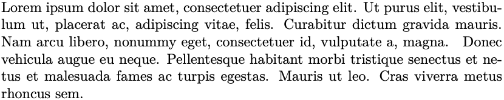
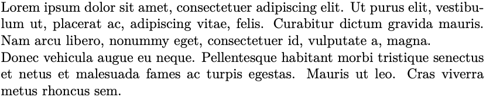
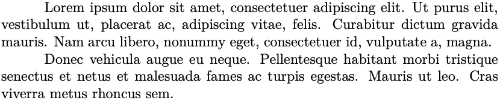
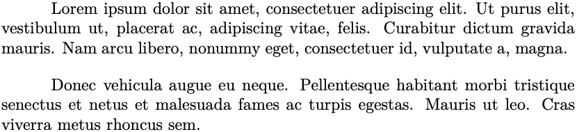
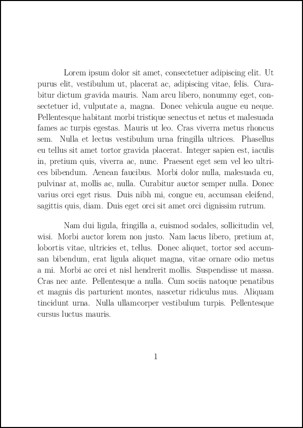
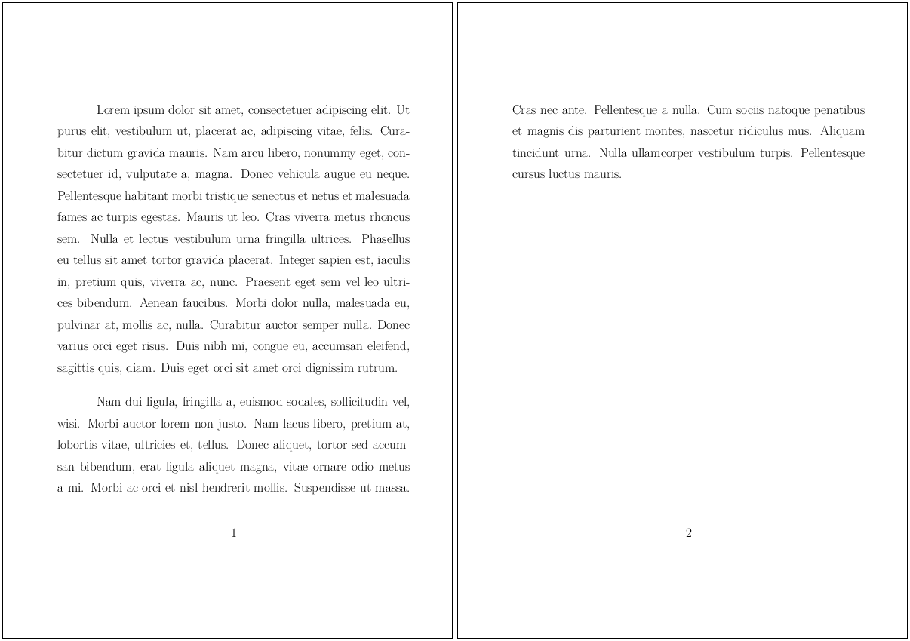
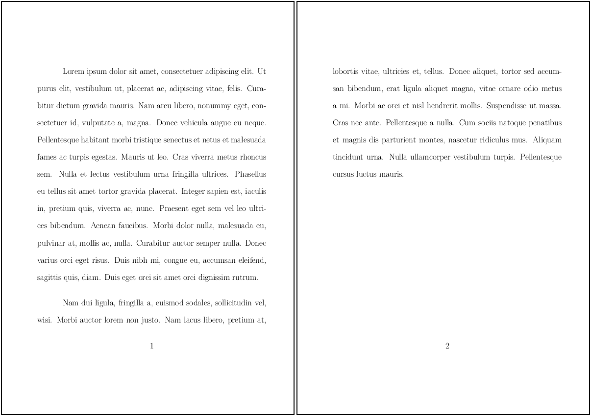

# 2. Entendendo o LaTeX

## 2.8 Parágrafos

Os parágrafos no LaTeX são blocos de texto separados por um determinado espaçamento. Para iniciar um parágrafo, basta pular uma linha. Uma outra forma de separar parágrafos, é através da utilização de `\textbackslash\textbackslash`'s (duas barras invertidas). Observe as diferenças entre os Exemplos [1](#exe_par1) a [4](#exe_par4) a seguir.

!!! example "<a id="exe_par1"></a>Exemplo 1: Parágrafos sem quebra de linha"

    === "Código"

        ```Latex linenums="1"
        \lipsumsentence[1-4] 
        \lipsumsentence[5-8]
        ```

    === "Resultado"

        

No [Exemplo 1](#exe_par1), as sentenças inseridas pelo comando `\lipsumsentence` são apresentadas em forma de bloco, formando um parágrafo contínuo, i.e., sem quebra de linha. Para separar as sentenças geradas pelos comandos, pode-se simplesmente pular uma linha. Veja no [Exemplo 2](#exe_par2) a seguir:

!!! example "<a id="exe_par2"></a>Exemplo 2: Parágrafos com quebra de linha, separados por uma linha em branco"

    === "Código"

        ```Latex linenums="1"
        \lipsumsentence[1-4]  

        \lipsumsentence[5-8]
        ```

    === "Resultado"

        

Semelhante ao [Exemplo 2](#exe_par2), em que foi utilizado um espaço em branco para separar as sentenças no parágrafo, pode-se utilizar uma dupla de barras invertidas (`\textbackslash\textbackslash`). Veja no [Exemplo 3](#exe_par3) a seguir:

!!! example "<a id="exe_par3"></a>Exemplo 3: Parágrafos com quebra de linha, separados por duas barras invertidas (`\textbackslash\textbackslash`)"

    === "Código"

        ```Latex linenums="1"
        \lipsumsentence[1-4] \\ 
        \lipsumsentence[5-8]
        ```

    === "Resultado"

        

Outra forma de se pular linhas, é através a utilização do comando `\newline`. Veja o [Exemplo 4](#exe_par4) e compare com os dois exemplos anteriores:

!!! example "<a id="exe_par4"></a>Exemplo 4: Parágrafos separados pelo comando (`newline`)"

    === "Código"

        ```Latex linenums="1"
        \lipsumsentence[1-4]
        \newline
        \lipsumsentence[5-8]
        ```

    === "Resultado"

        

Outros aspectos importantes no tratamento de parágrafos, inclui o recuo e a distância entre os parágrafos, além do espaçamento entre as linhas. O recuo dos parágrafos e o espaçamento entre eles é ajustado através dos comandos `\parindent` e `\parskip`, respectivamente. Veja o [Exemplo 5](#par:recuo) a seguir sobre como utilizar o comando `\parindent`:

!!! example "<a id="par:recuo"></a>Exemplo 5: Novo parágrafo iniciado pelo comando `par`, com recuo especial"

    === "Código"

        ```Latex linenums="1"
        \setlength{\parindent}{3em}

        \lipsumsentence[1-4] \par
        \lipsumsentence[5-8]
        ```

    === "Resultado"

        

No [Exemplo 6](#par:espac), mostra-se como aumentar o espaçamento entre os parágrafos. Compare o resultado deste exemplo com o [Exemplo 5](#par:recuo) anterior.

!!! example "<a id="par:espac"></a>Exemplo 6: Novo parágrafo iniciado pelo comando `par`, com recuo (`parindent`) e espaçamento (`parskip`) especiais"

    === "Código"

        ```Latex linenums="1"
        \setlength{\parindent}{3em}
        \setlength{\parskip}{1em}

        \lipsumsentence[1-4] \par
        \lipsumsentence[5-8]
        ```

    === "Resultado"

                

Em editores WYSIWYG, pode-se ajustar a altura das linhas em um parágrafo com espaçamentos diferentes. No LaTeX isto pode ser feito com o ajuste do comando `\baselinestretch`. Por padrão, a altura das linhas em um documento LaTeX é de {1pt}, que corresponde ao espaçamento simples. Outros valores de espaçamentos podem também ser utilizados. Os Exemplos [7](#par:simples), [8](#par:meio), [9](#par:duplo) a seguir, mostram como ajustar o espaçamento das linhas com o comando `\baselinestretch`.

!!! example "<a id="par:simples"></a>Exemplo 7: Espaçamento entre linhas simples (`baselinestretch, 1.0`)"

    === "Código"

        ```Latex linenums="1"
        \documentclass[17pt]{extarticle}
        \usepackage[utf8]{inputenc}

        \usepackage{lipsum}

        \renewcommand{\baselinestretch}{1.0}

        \begin{document}

        \setlength{\parindent}{3em}
        \setlength{\parskip}{1em}

        \lipsum[1] \par
        \lipsum[2]

        \end{document}
        ```

    === "Resultado"

                

No [Exemplo 8](#par:meio), o espaçamento entre linhas equivalente ao espaçamento médio (ou linha 1,5), pode ser obtido utilizando-se o comando `\renewcommand{\baselinestretch}{1.3}`:

!!! example "<a id="par:meio"></a>Exemplo 8: Espaçamento entre linhas médio (`baselinestretch, 1.3`)"

    === "Código"

        ```Latex linenums="1"
        \documentclass[17pt]{extarticle}
        \usepackage[utf8]{inputenc}

        \usepackage{lipsum}

        \renewcommand{\baselinestretch}{1.3}

        \begin{document}

        \setlength{\parindent}{3em}
        \setlength{\parskip}{1em}

        \lipsum[1] \par
        \lipsum[2]

        \end{document}
        ```

    === "Resultado"

                

No [Exemplo 9](#par:duplo), o espaçamento entre linhas equivalente ao espaçamento duplo, pode ser obtido utilizando-se o comando `\renewcommand{\baselinestretch}{1.6}`:

!!! example "<a id="par:duplo"></a>Exemplo 9: Espaçamento entre linhas duplo (`baselinestretch, 1.6`)"

    === "Código"

        ```Latex linenums="1"
        \documentclass[17pt]{extarticle}
        \usepackage[utf8]{inputenc}

        \usepackage{lipsum}

        \renewcommand{\baselinestretch}{1.6}

        \begin{document}

        \setlength{\parindent}{3em}
        \setlength{\parskip}{1em}

        \lipsum[1] \par
        \lipsum[2]

        \end{document}
        ```

    === "Resultado"

                

!!! note "Nota"
 
    Nos exemplos acima, observe que o comando `\renewcommand{\baselinestretch}` deve ser adicionado ao preâmbulo do documento e que o valor do espaçamento não possui unidade.

Parágrafos podem também conter recuos e outros tipos de espaçamentos, os quais são mostrados na [Seção 2.19](../posicao_espac/#29-posicao-e-espacamento) a seguir.