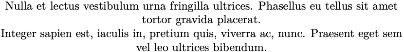

# 2. Entendendo o LaTeX

## 2.9 Posição e espaçamento

Boa parte dos elementos de um texto podem ser posicionados à esquerda, ao centro, à direita ou de forma justificada (que é o padrão). O LaTeX possui marcadores especiais para estes posicionamentos, que podem ser utilizados não apenas nos parágrafos, mas também com figuras e tabelas. O [Exemplo 1](#exe_par5) mostra o posicionamento de um parágrafo ao centro.

!!! example "<a id="exe_par5"></a>Exemplo 1: Parágrafos centralizados, utilizando o ambiente `center`"

    === "Código"

        ```Latex linenums="1"
        \begin{center}
        \lipsumsentence[9-10] \\ 
        \lipsumsentence[11-12]
        \end{center}
        ```

    === "Resultado"

        

Ao invés de utilizar o ambiente `center`, é possível utilizar também o marcador `centering`. Veja como utilizá-lo no [Exemplo 2](#exe_par6), e compare com o resultado do [Exemplo 1](#exe_par5). 

!!! example "<a id="exe_par6"></a>Exemplo 2: Parágrafos centralizados, utilizando o marcador `centering`"

    === "Código"

        ```Latex linenums="1"
        \centering
        \lipsumsentence[9-10] \\ 
        \lipsumsentence[11-12]
        ```

    === "Resultado"

        

Para alinhar o parágrafo à esquerda, utiliza-se o ambiente `flushleft`. Veja o [Exemplo 3](#exe_par7) a seguir:

!!! example "<a id="exe_par7"></a>Exemplo 3: Parágrafos alinhados à esquerda, utilizando o ambiente `flushleft`"

    === "Código"

        ```Latex linenums="1"
        \begin{flushleft}
        \lipsumsentence[9-10] \\ 
        \lipsumsentence[11-12]
        \end{flushleft}
        ```

    === "Resultado"

        

Semelhante ao [Exemplo 3](#exe_par7), o alinhamento à direita, é feito com o ambiente `flushright`. Veja o Exemplo \ref{exe_par8} a seguir:

!!! example "<a id="exe_par8"></a>Exemplo 4: Parágrafos alinhados à direita, utilizando o ambiente `flushright`"

    === "Código"

        ```Latex linenums="1"
        \begin{flushright}
        \lipsumsentence[9-10] \\ 
        \lipsumsentence[11-12]
        \end{flushright}
        ```

    === "Resultado"

        

!!! tip "Dica"

    Para conhecer mais opções de posicionamento, veja também o pacote `ragged2e` em [https://ctan.org/pkg/ragged2e](https://ctan.org/pkg/ragged2e).

No LaTeX, espaçamentos horizontais e verticais são dados pelos marcadores `\vspace{}` e `\hspace{}`, respectivamente.

No [Exemplo 5](#exe_par9), mostra-se como aumentar a distância entre dois parágrafos em `1cm` com o marcador `vspace`:

!!! example "<a id="exe_par9"></a>Exemplo 5: Espaçamento vertical, utilizando o comando `vspace`"

    === "Código"

        ```Latex linenums="1"
        \lipsumsentence[9-10] 
        \vspace{1cm}
        \lipsumsentence[11-12]
        ```

    === "Resultado"

        

De forma semelhante, o [Exemplo 6](#exe_par10) mostra como aumentar o recuo do parágrafo em `2cm` com o marcador `hspace`:

!!! example "<a id="exe_par10"></a>Exemplo 6: Espaçamento horizontal, utilizando o comando `hspace`"

    === "Código"

        ```Latex linenums="1"
        \hspace{2cm}\lipsumsentence[9-10] \\ 
        \lipsumsentence[11-12]
        ```

    === "Resultado"

        

Embora as *macros* `vspace` e `hspace` possam ser utilizadas para aumentar o espaçamento e o recuo dos parágrafos, prefira utilizá-los no espaçamento entre corpos flutuantes ou entre imagens e entre elementos de tabela, dentro de ambientes. Para parágrafos, utilize os comandos `\parskip` ([Exemplo 5](./paragrafos.md#par:recuo)) e `\parindent` ([Exemplo 6](./paragrafos.md#par:espac)).