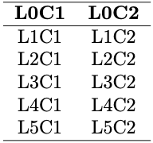
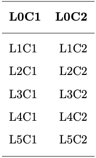
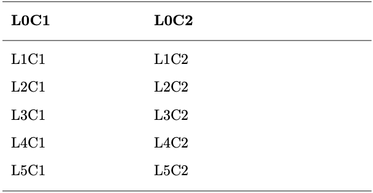
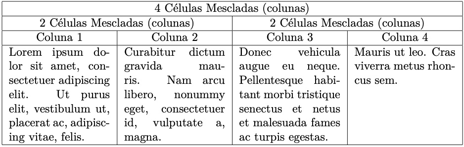
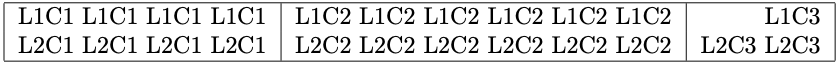
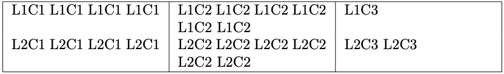
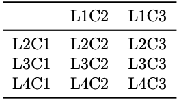
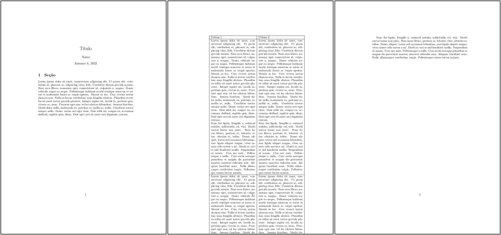
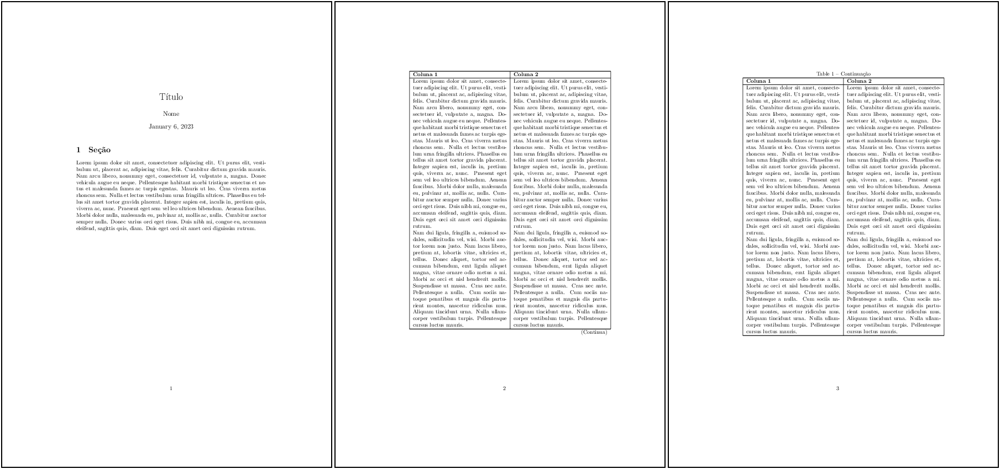

# 2. Entendendo o LaTeX

## 2.14 Tabelas

Tabelas são os elementos do texto que resumem e organizam informações. No LaTeX, tabelas são escritas em ambientes específicos, que podem, dependendo da necessidade, ajustar automaticamente o seu conteúdo aos limites das dimensões do texto. Antes de apresentar os ambientes mais comuns de tabelas, salienta-se que a construção de tabelas pode se tornar uma tarefa um pouco mais complicada do que parece, principalmente se a tabela em questão possuir muitas células mescladas. Portanto, recomenda-se a construção tabelas simples e clara.

O ambiente `tabular` é um ambiente simples para a construção de tabelas. A sua utilização é apresentada no [Exemplo 1](#exe_tab1).

!!! exemple "<a id="exe_tab1"></a>Exemplo 1: "

    === "Código"

        ```Latex linenums="1"
        \begin{tabular}{c c}
        \hline 
        \textbf{L0C1} & \textbf{L0C2} \\
        \hline
        L1C1 & L1C2 \\
        L2C1 & L2C2 \\
        L3C1 & L3C2 \\
        L4C1 & L4C2 \\
        L5C1 & L5C2 \\
        \hline
        \end{tabular}
        ```

    === "Resultado"

        

Na tabela do [Exemplo 1](#exe_tab1), tem-se apenas duas colunas e algumas linhas. Para separar o conteúdo, utilizou-se apenas linhas horizontais (produzidas pelos comandos `hline`) para separar o cabeçalho, i.e., os nomes das colunas, do conteúdo. Observe que a tabela produzida possui as linhas muito próximas, e este espaçamento pode ser melhorarado com a utilização do comando `\\[-0.5em]`. Lembre-se que a instrução `\\` pula uma linha; o argumento desta instrução, i.e., `[-0.5em]` indica que o espaço de uma linha deve ser recuado em `-0.5em`. Na [Tabela 1](../medidas/#tab:medidas) está indicado que a unidade `em` refere-se à altura do caractere "M" da fonte em uso, isso garante que o espaçamento será sempre consistente independente do estilo da fonte em uso. Veja o [Exemplo 2](#exe_tab2) a seguir:

!!! exemple "<a id="exe_tab2"></a>Exemplo 2: Exemplo de uma tabela simples com o ambiente `tabular` e linhas mais altas"

    === "Código"

        ```Latex linenums="1"
        \begin{tabular}{l r}
        \hline 
        \\[-0.5em]
        \textbf{L0C1} & \textbf{L0C2} \\
        \\[-0.5em]
        \hline
        \\[-0.5em]
        L1C1 & L1C2 \\
        \\[-0.5em]
        L2C1 & L2C2 \\
        \\[-0.5em]
        L3C1 & L3C2 \\
        \\[-0.5em]
        L4C1 & L4C2 \\
        \\[-0.5em]
        L5C1 & L5C2 \\
        \\[-0.5em]
        \hline
        \end{tabular}
        ```

    === "Resultado"

        

No [Exemplo 2](#exe_tab2), observe a instrução `{l r}`. Como a tabela do exemplo possui apenas duas colunas, indica-se com um par de colchetes o seu alinhamento, logo após o início do ambiente `tabular`. Neste caso, o conteúdo da coluna da esquerda encontra-se alinhado à esquerda, enquanto que o conteúdo da coluna da direita, encontra-se alinhado à direita (por isso `l r`). Isto deve ser feito para a quantidade de colunas que a tabela possuir. Se uma tabela no ambiente `tabular`, possuir 5 colunas, deve-se especificar o alinhamento desejado para as colunas, e.g., `{l r l l c}`. Portanto, para alinhar o conteúdo à esquerda, utilize `l` (do inglês *left*), para alinhar à direita utilize `r` (do inglês *right*) e para centralizar o conteúdo (tal como no [Exemplo 1](#exe_tab1)), utilize `c` (do inglês *center*).

Além de alterar o espaçamento vertical dentro de uma tabela, pode-se também alterar a largura das colunas. Para isso, pode-se utilizar o comando `p{u.}`, onde `u.` corresponde a alguma medida. Veja o [Exemplo 3](#exe_tab3) a seguir:

!!! exemple "<a id="exe_tab3"></a>Exemplo 3: Exemplo de uma tabela simples com o ambiente `tabular` e colunas mais largas"

    === "Código"

        ```Latex linenums="1"
        \begin{tabular}{p{3cm}  p{5cm}}
        \hline 
        \\[-0.5em]
        \textbf{L0C1} & \textbf{L0C2} \\
        \\[-0.5em]
        \hline
        \\[-0.5em]
        L1C1 & L1C2 \\
        \\[-0.5em]
        L2C1 & L2C2 \\
        \\[-0.5em]
        L3C1 & L3C2 \\
        \\[-0.5em]
        L4C1 & L4C2 \\
        \\[-0.5em]
        L5C1 & L5C2 \\
        \\[-0.5em]
        \hline
        \end{tabular}
        ```

    === "Resultado"

        

!!! note "Nota"

    No [Exemplo 3](#exe_tab3), o conteúdo das colunas foi marcado como `p` (do inglês *paragraph*). Nessa forma mais simples de se especificar a largura das colunas, não é possível posicionar o texto de outra forma, i.e., centralizado ou alinhado à direita ou esquerda.

Assim como as tabelas produzidas em editores WYSIWYG, no LaTeX também é possível mesclar células (na direção das colunas ou das linhas). Para isso, utilizam-se os comandos `\multicolumn` para mesclar colunas e `\multirow` para mesclar linhas. Veja o [Exemplo 4](#exe_tab4) a seguir:

!!! exemple "<a id="exe_tab4"></a>Exemplo 4: Exemplo de uma tabela simples com o ambiente `tabular` e células mescladas com o comando `multirow`"

    === "Código"

        ```Latex linenums="1"
        \begin{tabular}{|p{3cm}|p{3cm}|p{3cm}|p{3cm}|}
        \hline
        \multicolumn{4}{|c|}{4 Células Mescladas (colunas)} \\
        \hline
        \multicolumn{2}{|c|}{2 Células Mescladas (colunas)} &
        \multicolumn{2}{c|}{2 Células Mescladas (colunas)} \\
        \hline 
        \multicolumn{1}{|c|}{Coluna 1} & 
        \multicolumn{1}{c|}{Coluna 2} & 
        \multicolumn{1}{c|}{Coluna 3} & \multicolumn{1}{c|}{Coluna 4} \\
        \hline
        \lipsumsentence[1-2] & \lipsumsentence[3-4] & \lipsumsentence[5-6] & 
        \lipsumsentence[7-8] \\
        \hline
        \end{tabular}
        ```

    === "Resultado"

        

Na tabela do [Exemplo 4](#exe_tab4), tem-se uma tabela mais complexa, em que colunas estão mescladas de formas diferentes. Além disso, diferentemente dos exemplos anteriores, a tabela apresentada possui limitadores verticais que são desenhados utilizando-se o símbolo `|` (*pipe*)[^6], como argumento do comando que inicia o ambiente `tabular`: `|p{3cm}|p{3cm}|p{3cm}|p{3cm}|`. Observe também que a tabela desenhada possui o total de quatro colunas, cujas larguras podem ser especificadas (no exemplo, cada uma com `3cm`). Outro detalhe a ser observado neste exemplo, é a forma como o conteúdo é alinhado dentro das células. Neste caso, o alinhamento é dado por um argumento do comando `multicolumn`: `{4}{|c|}`, onde 4 indica a quantidade de células a serem mescladas e `|c|` indica que o conteúdo das células a serem mescladas será centralizado e delimitado por *pipes* nos limites laterais da célula.

[^6]: Pode-se também utilizar *pipes* duplos.

### 2.14.1 Tabelas ajustáveis

Dependendo da necessidade, ambientes especiais de tabelas podem ser necessários. Alguns ambientes de tabelas mais comuns são `tabular`, `tabularx` e `booktabs`, os quais possuem características e propriedades específicas.

Tabelas ajustáveis podem ser necessárias quando se deseja que a largura das colunas sejam automaticamente ajustadas. No caso do ambiente `tabular`, o LaTeX tenta ajustar a largura da tabela de acordo com a quantidade de informações contida nas células. Se as células contiverem muita informação, a tabela poderá ficar com uma largura maior do que a largura do texto ou mesmo da página. Veja no [Exemplo 5](#exe_tab5) a utilização básica do ambiente `tabular`.

!!! exemple "<a id="exe_tab5"></a>Exemplo 5: Exemplo de uma tabela simples utilizando o ambiente `tabular`"

    === "Código"

        ```Latex linenums="1"
        \begin{tabular}{|l|c|r|}
        \hline
        L1C1 L1C1 L1C1 L1C1 & L1C2 L1C2 L1C2 L1C2 L1C2 L1C2 & L1C3      \\
        L2C1 L2C1 L2C1 L2C1 & L2C2 L2C2 L2C2 L2C2 L2C2 L2C2 & L2C3 L2C3 \\
        \hline
        \end{tabular}
        ```

    === "Resultado"

        

No [Exemplo 5](#exe_tab5) a quantidade de informação nas células não é suficiente para fazer com que a largura da tabela extrapole os limites da página, mas isto é perfeitamente possível dentro do ambiente `tabular`. Para evitar esta situação, o ambiente `tabularx` é mais apropriado, visto que com ele pode-se definir uma largura fixa (por meio de um valor ou de uma *macro*) e o conteúdo das células é ajustado dentro destes limites. No [Exemplo 6](#exe_tab7) mostra-se o que se obtém com a utilização do ambiente `tabularx`.

!!! exemple "<a id="exe_tab7"></a>Exemplo 6: Exemplo de uma tabela simples utilizando o ambiente `tabularx`"

    === "Código"

        ```Latex linenums="1"
        \begin{tabularx}{\textwidth}{|X|X|X|}
        \hline
        L1C1 L1C1 L1C1 L1C1 & L1C2 L1C2 L1C2 L1C2 L1C2 L1C2 & L1C3      \\
        L2C1 L2C1 L2C1 L2C1 & L2C2 L2C2 L2C2 L2C2 L2C2 L2C2 & L2C3 L2C3 \\
        \hline
        \end{tabularx}
        ```

    === "Resultado"

        

No [Exemplo 6](#exe_tab7), as colunas da tabela estão ajustadas com a mesma largura. Isso é possível através da opção `X`, utilizada como opção do comando `tabularx`, como em `\begin{tabularx}{\textwidth}{|X|X|X|}`.

O pacote `booktabs` permite utilizar linhas mais grossas através dos marcadores `\toprule`, `\midrule` e `\bottomrule`. Para utilizar o pacote, é necessário carregá-lo no preâmbulo do documento com o comando `\usepackage{booktabs}`. Veja o [Exemplo 7](#exe_tab8) a seguir e compare o resultado com as tabelas dos exemplos anteriores que utilizaram o marcador `\hline` para separar as linhas das tabelas:

!!! exemple "<a id="exe_tab8"></a>Exemplo 7: Exemplo de uma tabela simples utilizando o ambiente `tabular` e os marcadores `toprule`, `midrule` e `bottomrule`"

    === "Código"

        ```Latex linenums="1"
        \begin{tabular}[t]{lcc}
        \toprule
             & L1C2 & L1C3 \\
        \midrule
        L2C1 & L2C2 & L2C3 \\
        L3C1 & L3C2 & L3C3 \\
        L4C1 & L4C2 & L4C3 \\
        \bottomrule
        \end{tabular}
        ```

    === "Resultado"

        

Os ambientes `tabular` e `tabularx` possuem algum controle sobre a largura da tabela de acordo com a quantidade de informação dentro das células. Por outro lado, tabelas muito longas, e.g., que podem ocupar várias páginas, podem não ser adequadamente acomodadas com estes ambientes. Para isso, recomenda-se a utilização do pacote `longtable` que permite o LaTeX realizar a quebra automática de linha dentro de uma tabela. Considere o [Exemplo 8](#ltable1) a seguir, em que uma tabela longa é inserida dentro de um ambiente `tabularx`:

!!! exemple "<a id="ltable1"></a>Exemplo 8: Uma tabela longa utilizando o ambiente `tabularx`"

    === "Código"

        ```Latex linenums="1"
        \documentclass{article}
        \usepackage[utf8]{inputenc}
        \usepackage{tabularx}
        \usepackage{lipsum}

        \title{Título}
        \author{Nome}
        \date{\today}

        \begin{document}

        \maketitle

        \section{Seção}

        \lipsum[1]

        \begin{tabularx}{\textwidth}{|X|X|}
        \hline
        Coluna 1     & Coluna 2     \\
        \hline
        \lipsum[1-2] & \lipsum[1-2] \\
        \hline
        \lipsum[1-2] & \lipsum[1-2] \\
        \hline
        \end{tabularx}

        \lipsum[2]

        \end{document}
        ```

    === "Resultado"

        

Compare o [Exemplo 8](#ltable1) com o [Exemplo 9](#ltable2) a seguir, em que a mesma tabela longa é apresentada, porém com o auxílio do pacote `longtable`.

!!! exemple "<a id="ltable2"></a>Exemplo 9: Uma tabela longa utilizando o ambiente `longtable`"

    === "Código"

        ```Latex linenums="1"
        \documentclass{article}

        \usepackage[utf8]{inputenc}
        \usepackage{lipsum}
        \usepackage{longtable}

        \title{Título}
        \author{Nome}
        \date{\today}

        \begin{document}

        \maketitle

        \section{Seção}

        \lipsum[1]

        \begin{center}
        \begin{longtable}{
            @{\extracolsep{\fill}}|p{6cm}|p{6cm}|
        }   
        \hline
        \textbf{Coluna 1} & \textbf{Coluna 2} \\
        \hline
        \endfirsthead
        \multicolumn{2}{c}
        {\tablename\ \thetable\ -- Continuação} \\
        \hline
        \textbf{Coluna 1} & \textbf{Coluna 2} \\
        \hline
        \endhead
        \hline \multicolumn{2}{r}{(Continua)} \\
        \endfoot
        \hline
        \endlastfoot
        \lipsum[1-2] & \lipsum[1-2] \\
        \hline
        \lipsum[1-2] & \lipsum[1-2] \\
        \end{longtable}
        \end{center}

        \end{document}
        ```

    === "Resultado"

        

Seguindo o código apresentado no [Exemplo 9](#ltable2), pode-se confeccionar as Tabelas [1](./pacotes.md#tab:pacotes) e [2](./pacotes.md#tab:pacotes_uteis) do Apêndice A.

!!! note "Nota"

    Editores *online* podem ser utilizados para construir tabelas simples no LaTeX. Observe que tabelas muito complexas podem ser difíceis de manipular e atualizar. Veja os *sites* [https://www.tablesgenerator.com/](https://www.tablesgenerator.com/) e [https://www.latex-tables.com](https://www.latex-tables.com) para mais informações.