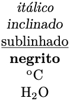
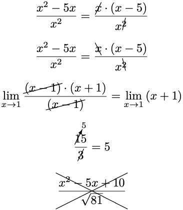
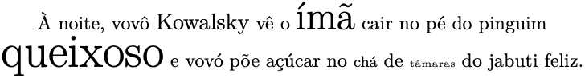
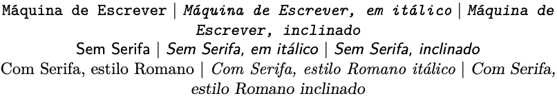

# 2. Entendendo o LaTeX

## 2.4 Tipos, tamanhos e estilos de letras

O texto básico pode ser marcado em estilos comuns, como o *itálico*, o sublinhado, o *negrito*, o texto <sup>sobrescrito</sup> e o texto <sub>subscrito</sub>. Veja no [Exemplo 1](#exe_estilos) a seguir:

!!! exemple "<a id="exe_estilos"></a>Exemplo 1: Marcações mais comuns em fontes"

    === "Código"

        ```Latex linenums="1"
        \textit{itálico}       \\
        \textsl{inclinado}     \\
        \underline{sublinhado} \\
        \textbf{negrito}       \\
        \textsuperscript{o}C   \\
        H\textsubscript{2}O
        ```

    === "Resultado"

        

No [Exemplo 1](#exe_estilos), observe as diferenças entre o texto itálico produzido com o marcador `\textit` e o texto inclinado produzido pelo marcador `\textsl`. No primeiro caso, as fontes produzidas são naturais, ou seja, há uma variação em itálico do tipo de fonte em uso. No segundo caso, a fonte em uso é renderizada a partir da inclinação da fonte natural. 

!!! note "Nota"

    Dependendo do tipo de fonte utilizado, as diferenças entre os tipos itálico e inclinado podem ser mais evidentes. Veja mais no [Exemplo 6](#exe_font).

Outros estilos também podem ser utilizados, mas podem depender de outros pacotes. Dois pacotes que fornecem estilos de marcações sobre as palavras, são o `ulem` e o `cancel`. Para utilizá-los, deve-se antes carregar os pacotes necessários com os comandos `\usepackage{ulem}` e `\usepackage{cancel}`, os quais devem ser inseridos no preâmbulo do documento. 

Com o pacote `ulem`, pode-se riscar as palavras (forma mais comum). Veja no [Exemplo 2](#exe_ulem):

!!! exemple "<a id="exe_ulem"></a>Exemplo 2: Marcação em texto com o pacote `ulem`"

    === "Código"

        ```Latex linenums="1"
        \sout{palavra riscada}
        ```

    === "Resultado"

        

Diferente do que se obtém com o pacote `ulem`, com o pacote `cancel` pode-se riscar expressões matemáticas. Veja o [Exemplo 3](#exe_cancel) a seguir (mais exemplos de expressões matemáticas e ambientes específicos são apresentados na [Seção ](../matematica/#213-matematica-e-equacoes)):

!!! exemple "<a id="exe_cancel"></a>Exemplo 3: Marcação em expressões matemáticas com o pacote `cancel`"

    === "Código"

        ```Latex linenums="1"
        $$\frac{x^{2} - 5x}{x^{2}} = \frac{\cancel{x} \cdot (x - 5)}{x^{\cancel{2}}}$$

        $$\frac{x^{2} - 5x}{x^{2}} = \frac{\bcancel{x} \cdot (x - 5)}{x^{\bcancel{2}}}$$

        $$\lim_{x \to 1}{\frac{\cancel{(x - 1)} \cdot (x + 1)}{\cancel{(x - 1)}}} = \lim_{x \to 1}{(x + 1)}$$

        $$\frac{\cancelto{5}15}{{\cancel{3}}} = 5$$

        $$\xcancel{\frac{x^{2} - 5x + 10}{\sqrt{81}}}$$
        ```

    === "Resultado"

        

No LaTeX, ao longo de um parágrafo, é possível alterar o tamanho da fonte. O padrão do LaTeX compreende 10 tamanhos diferentes, os quais são mostrados no [Exemplo 4](#exe_tamfonte).

!!! exemple "<a id="exe_tamfonte"></a>Exemplo 4: Tamanhos de fontes"

    === "Código"

        ```Latex linenums="1"
        {\Huge Huge}                 \\
        {\huge huge}                 \\
        {\LARGE LARGE}               \\
        {\Large Large}               \\
        {\large large}               \\
        {\normalsize normalsize}     \\
        {\small small}               \\
        {\footnotesize footnotesize} \\
        {\scriptsize scriptsize}     \\
        {\tiny tiny}
        ```

    === "Resultado"

        

Para alterar o tamanho de uma fonte localmente, basta utilizar os marcadores do [Exemplo 4](#exe_tamfonte) como `\large palavra`. Veja no [Exemplo 5](#exe_tamfontefrase) como misturar diferentes tamanhos de fonte em uma mesma frase:

!!! exemple "<a id="exe_tamfontefrase"></a>Exemplo 5: Texto com diferentes tamanhos de fontes"

    === "Código"

        ```Latex linenums="1"
        À noite, vovô {\large Kowalsky} vê o {\huge ímã} cair no pé do pinguim {\Huge queixoso} e vovó põe açúcar no {\footnotesize chá} de {\tiny tâmaras} do jabuti feliz.
        ```

    === "Resultado"

        

No LaTeX é possível também alterar o tipo da fonte. Alguns estilos incluem fontes no estilo máquina de escrever, sem serifa e com serifa. No [Exemplo 6](#exe_font) é mostrado como alterar o estilo das fontes.

!!! exemple "<a id="exe_font"></a>Exemplo 6: Estilos de fontes"

    === "Código"

        ```Latex linenums="1"
        \texttt{Máquina de Escrever} | \texttt{\textit{Máquina de Escrever, em itálico}} | \texttt{\textsl{Máquina de Escrever, inclinado}}

        \textsf{Sem Serifa} | \textsf{\textit{Sem Serifa, em itálico}} | \textsf{\textsl{Sem Serifa, inclinado}}

        \textrm{Com Serifa, estilo Romano} | \textrm{\textit{Com Serifa, estilo Romano itálico}} | \textrm{\textsl{Com Serifa, estilo Romano inclinado}}
        ```

    === "Resultado"

        