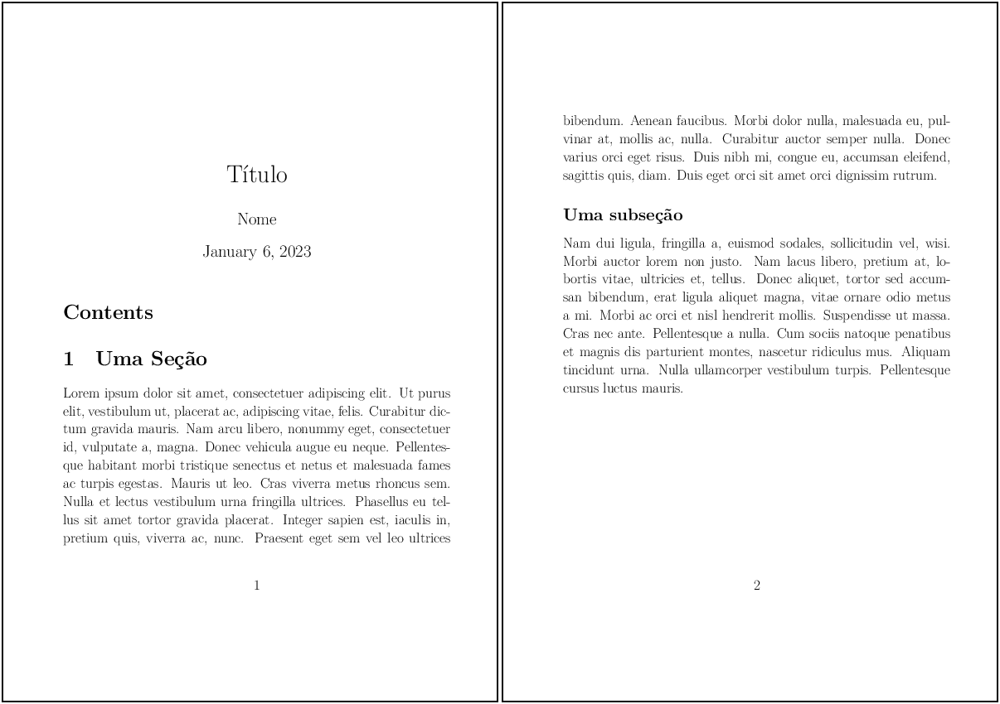

# 2. Entendendo o LaTeX

## 2.5 Títulos e seções

No LaTeX, é possível organizar o texto utilizando seções em até 7 níveis, os quais estão sumarizados na [Tabela 1](#tab:tit_secs) a seguir.

<a id="tab:tit_secs"></a>

**Tabela 1:** Títulos e Seções de um documento LaTeX. **Fonte:** Adaptado de [https://www.overleaf.com/learn/latex/Sections_and_chapters](https://www.overleaf.com/learn/latex/Sections_and_chapters).


| Seção | Comando | Nível |
|-------|---------|-------|
| Parte        | `\part`        | -1 |
| Capítulo     | `\chapter`     | 0  |
| Seção        | `\section`     | 1  |
| Subseção     | `\subsection`  | 2  |
| Parágrafo    | `\par`         | 3  |
| Subparágrafo | `\subpar`      | 4  |

Na [Seção 2.1](../intro_latex/#21-introducao-ao-latex) foram mostradas as classes mais comuns disponíveis para documentos LaTeX. Observe que as partes de conteúdo marcadas como `part` e `chapter` estão disponíveis apenas para as classes `report` e `book`. Uma das vantagens da edição de documento na linguagem LaTeX é que a numeração de partes, figuras, tabelas, equações etc é automática. Isto significa que sempre que se iniciar um novo capítulo ou seção, a numeração é automaticamente incrementada. Se o texto for reorganizado, de forma que uma seção ou capítulo é transferido para outra posição no texto, eles são automaticamente renumerados, respeitando a ordem em que são apresentados. Entretanto, é possível omitir a numeração destes elementos textuais através da inserção de um * (asterisco). Veja o efeito disto no [Exemplo 1](#exe_secsnum) a seguir.

!!! exemple "<a id="exe_secsnum"></a>Exemplo 1: Numeração automática dos elementos textuais"

    === "Código"

        ```Latex linenums="1"
        \documentclass[17pt]{extarticle}
        \usepackage[utf8]{inputenc}
        \usepackage{lipsum}
        \usepackage{extsizes}

        \title{Título}
        \author{Nome}
        \date{\today}

        \begin{document}

        \maketitle

        \tableofcontents

        \section{Uma Seção}

        \lipsum[1]

        \subsection*{Uma subseção}

        \lipsum[2]

        \end{document}
        ```

    === "Resultado"

        

No [Exemplo 1](#exe_secsnum) observe que o sumário foi inserido no corpo do texto utilizando-se o comando `\tableofcontents`. Este comando é responsável por adicionar os capítulos, seções, subseções e outras partes do texto ao sumário. Observe também que a subseção marcada por `\subsection*{Uma subseção}` não foi adicionada ao sumário porque ela foi marcada com `\subsection*` ou invés de `\subsection`. O asterisco pode ser utilizado com a mesma finalidade em outros ambientes, como figuras, tabelas e equações. Além disso, note que o comando `\maketitle` é responsável por posicionar o título, o nome do autor e a data no início do documento. Dependendo da classe de documentos utilizada, o aspecto e a posição do título e do sumário (e de outras listas que se fizerem necessárias) poderão ser diferentes.

!!! note "Nota"

    O pacote `extsizes` foi utilizado no [Exemplo 1](#exe_secsnum) com o objetivo de se aumentar globalmente o tamanho da fonte no documento do exemplo. Observe que com o uso deste pacote o nome da classe do documento é `extarticle` ao invés de `article`, como no caso do [Exemplo 1](./intro_latex.md#exe_doc). Veja mais sobre o pacote `extsize` no endereço [https://ctan.org/pkg/extsizes](https://ctan.org/pkg/extsizes).